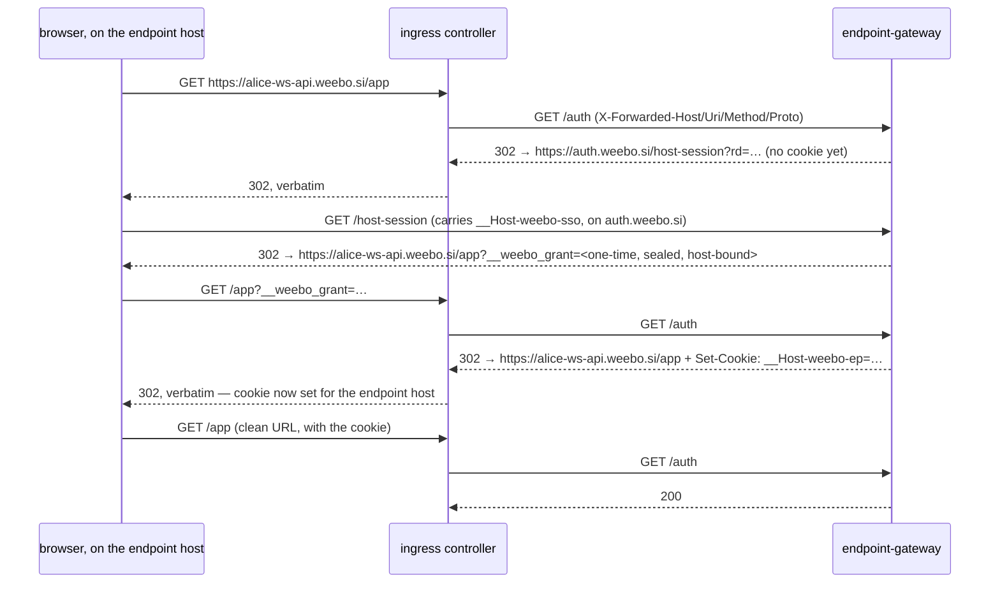
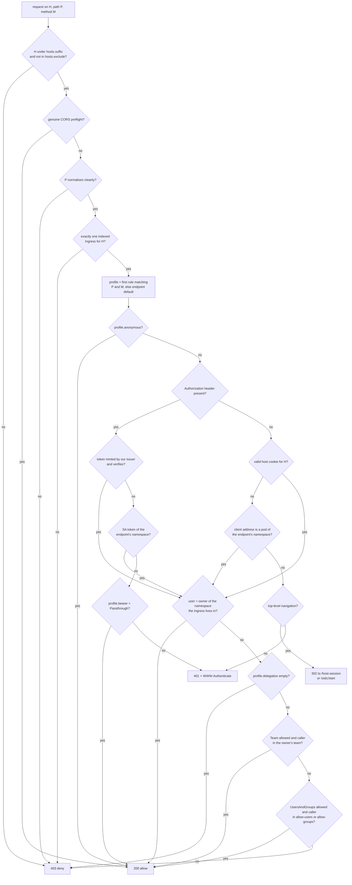

# RFC 0009 — endpoint-auth

## Summary

Workspace endpoints exposed on their own FQDN (`<user>-<workspace>-<endpoint>.<suffix>`) are
reachable by anyone who can resolve the name. This RFC puts an authenticating, authorising gate in
front of every one of them: a single Rust binary — `endpoint-gateway` — that is both the OIDC
relying party (the job `oauth2-proxy` would do) and the per-request authorisation decision, and an
operator feature `endpointAuth` that attaches that gate to every routing object in an Eclipse Che
workspace namespace — whether DevWorkspace Operator generated it or the developer wrote it
themselves — and refuses to let it be detached. The default is whatever the admin granted the
team: owner-only, or reachable by the whole team without either side writing anything. A developer
then widens or narrows access per path, to named users or groups, within the limits their team was
granted; an admin can pin one named user below those limits without touching anyone else. How the gate is attached is a port with one implementation per router —
Traefik first, community `haproxy-ingress` and Nginx behind the same contract, and OpenShift's
`Route` through a second attachment mode, because a router with no external-auth hook has to be
served by carrying the traffic rather than by answering a question. The design does not depend on
which controller the cluster runs; it does not pretend the difference is free either.

Two constraints shape every decision below. The gate is built **for Eclipse Che**: it reads what
Che and DevWorkspace Operator already write — the namespace annotation that names the owner, the
labels DWO stamps on the `Ingress` it generates, the OIDC client Che already owns — and asks a
developer to restate none of it. And it must not become **the reason a developer cannot work**: a
`curl`, an SPA's `fetch`, an HMR WebSocket, a phone on a demo URL, a CI job and an expired session
each get a stated answer here rather than an accidental one. That second constraint has its own
section, *Developer continuity*, and it is as load-bearing as the security argument.

## Motivation

1. **A workspace endpoint on its own FQDN is unauthenticated, and nothing upstream fixes that.**
   Only endpoints that opt into `urlRewriteSupported: true` travel through the Che gateway, which
   is where the `oauth2-proxy` + `kube-rbac-proxy` owner check lives. Everything exposed on a
   dedicated subdomain — the normal case for an application being developed — bypasses it. The
   devfile's `secure: true` reads like the fix and is not one: upstream states plainly that setting
   it adds no authentication (eclipse-che#22676). So today the control a reader assumes exists does
   not, and the attribute that advertises it is a no-op.

2. **The threat is internal, not external.** East–west isolation between workspace namespaces is
   already in place, so dev 2 cannot reach dev 1's pods through the cluster network. The remaining
   path is the front door: dev 2 resolves dev 1's endpoint FQDN and walks in through the ingress
   controller, with all the credentials the app holds — a database seeded with real data, an admin
   panel behind a dev-mode login, a `/debug` route nobody meant to ship.

3. **The obvious composition does not compose.** `oauth2-proxy` authenticates; it cannot answer
   "is *this* user allowed on *this* host", because that answer lives in the `Ingress` object's
   namespace and annotations. Bolting a second service behind it means two hops, two configs, two
   sets of headers to reconcile, and a shared-domain session cookie handed to every workspace
   application on the suffix — see *Security considerations*, the cookie is the interesting part.

4. **A developer must be able to share an endpoint without asking an admin.** Demoing a branch to
   a colleague, letting a designer click through, pointing a teammate's client at your API: if the
   only way to do that is a ticket, the control gets worked around rather than used.

5. **Wiring this with Kyverno would add an engine to carry one mutation.** This repo already
   rejected Kyverno for `dwoc-pin` (RFC 0002) and for the network-policy baseline (RFC 0004), and
   already owns the three pieces this needs: a mutating webhook, a reconciler, and `policy-guard`.
   A sixth feature is a known shape here; a policy engine is a new operational dependency whose
   own `generate`/`mutate` rules would then need guarding too.

6. **A control that stops a developer working is a control that gets removed.** A workspace
   endpoint is not browsed, it is *developed against*: the SPA on one endpoint calls the API on
   another with `fetch`, the HMR socket reconnects every save, `curl` and Postman hit it all day,
   a phone loads the demo URL, a CI job posts to it. A gate that only knows how to redirect a
   browser turns every one of those into an unexplained failure — an opaque CORS error, a hung
   WebSocket, a `302` where JSON was expected. Each has an answer in *Developer continuity*, and
   the answers are part of the contract rather than of the implementation, because this is the
   half of the design that decides whether the feature survives its first week.

### What exists today

Nothing on the FQDN path. `che-gateway` protects subpath endpoints and the IDE; dedicated ingresses
carry no authentication annotation at all. Developers protect what they remember to protect, with
whatever the framework offers.

**Outcome we are buying:** a request to any workspace endpoint FQDN arrives at the application only
if the caller proved a cluster identity — a browser session, a token this cluster's identity
provider minted, or the workspace pod it is calling from — **and** is the workspace's owner or
someone the owner named. Nothing a developer
does to their devfile removes the gate; the only thing they control is who else gets through it.
Applications keep their own authentication working unchanged underneath, and every client a
developer already uses — browser, `curl`, CI, a WebSocket, a phone on the demo URL — keeps working
with at most a token they already have.

## Guide-level explanation

### What the admin installs

One `Deployment` of `endpoint-gateway` (three replicas, a PDB, anti-affinity — *Failure mode* says
why that is not over-provisioning) plus one `Ingress` for it on a dedicated host, and one feature
block:

```yaml
apiVersion: hardening.weebo.io/v1alpha1
kind: WeeboSiConfig
metadata:
  name: cluster
spec:
  teams: # chassis-level, RFC 0002 — identity only, no policy
    - name: team-1
      namespaceSelector:
        matchLabels: { hardening.weebo.io/team: "1" }
  features:
    endpointAuth:
      mode: Enforce # Off | DryRun | Enforce — chassis semantics, RFC 0002
      gateway:
        externalUrl: https://auth.weebo.si # where a browser is sent to sign in
        service: { name: endpoint-gateway, namespace: weebo-si-hardening, port: 4180 }
        dialect: Traefik # Traefik | Nginx | HAProxy | Custom — see Dialects
        enforcement: Enforce # Observe | Enforce — the gate's own verdict, see Rollout
        allowedMiddlewares: [] # Traefik only: entries an Ingress may name *after* ours
      breakGlassIdentities: [] # may set hardening.weebo.io/endpoint-auth: bypass on one Ingress
      owner:
        namespaceAnnotation: che.eclipse.org/username
        # the SA that creates and reconciles the workspace Ingresses
        devworkspaceOperatorIdentity: "system:serviceaccount:devworkspace-controller:devworkspace-controller-serviceaccount"
      hosts:
        suffix: .weebo.si # the only hosts this feature governs
        ownership: # how a host names the user who owns it — first match wins
          - template: "{user}-{workspace}-{endpoint}" # Che's default shape
          - template: "dev.{user}-{workspace}"
        exclude: # hosts the gate never attaches to
          - che.weebo.si # che-gateway: authenticates already
          - auth.weebo.si # the gateway's own host
      catalog:
        - key: private # the owner, and nobody else
          delegation: []
        - key: team # the owner and everyone in the owner's team
          delegation: [Team]
        - key: shared # ...plus whoever the owner names
          delegation: [Team, UsersAndGroups]
        - key: open # no authentication at all; `delegation` is rejected here
          anonymous: true
      default: private # a namespace belonging to no team
      overrides: # ordered, first match wins; an override may only narrow
        - match: { users: [contractor-*] }
          allowed: [private]
          default: private
          delegation: [] # this user may not share an endpoint at all, whatever the profile says
      endpointSelection:
        annotation: hardening.weebo.io/access
        onUnknownKey: Default # Default | Deny — RFC 0002 semantics
      selfOrigin: # a workspace calling its own endpoint is its own owner
        podNetwork: Auto # Auto | On | Off — Auto trusts the client address only while the probe says it can
        serviceAccountToken: true # ...or the caller presents that workspace's SA token
        trustedProxy:
          mode: Auto # Auto | Static | Off
          service: { name: traefik, namespace: traefik } # Auto: the /auth peer must be one of its endpoints
          cidrs: [] # Static: a host-network controller, or a mesh hop in between
        probe:
          enabled: true # turn off where the gateway cannot reach its own public URL
          intervalSeconds: 900
          url: "" # defaults to gateway.externalUrl
      grants:
        team-1:
          allowed: [private, team, shared]
          default: team # singular: an endpoint resolves to exactly one profile
```

Five fields are worth the sentence they cost.

**`delegation` is a list, not a mode**, and `[]` says "the owner and nobody else" where the first
draft said `Off` — which, unquoted, YAML 1.1 reads as the boolean `false`. An empty list cannot be
misread by a parser or by a person.

**`[Team]` is the answer to "my colleagues should just be able to open it".** A team is already
defined once, chassis-level, as a set of namespaces (RFC 0002); a namespace already names its
owner; so **a team's members are the owners of its namespaces**, computed from the informer cache
with no new source of truth, no IdP group to keep aligned and nothing for a developer to maintain.
With `default: team` a workspace is reachable by the team the day it starts, and the developer
never writes an annotation at all. A caller who owns no namespace belongs to no team — a person
who has never opened a workspace is not a colleague the cluster knows about.

**`overrides` is per-user what `grants` is per-team**, for the case a team cannot express: this
contractor's endpoints stay owner-only whatever their team may do. It is an ordered list, first
match wins like `spec.teams`, it matches on `users` (with a trailing-`*` prefix form) or on a
`namespaceSelector`, and **it may only narrow**: the effective set is the team's `allowed`
intersected with the override's, so an override can never be the way somebody gets *more* than
their team was granted. `delegation: []` in an override is the hard form — that user may not share
an endpoint at all, whichever catalogue key they reach.

**`default`** is mandatory because RFC 0002 makes every feature answer for a namespace in no team,
and the answer here is the closed one. And **`hosts.exclude`** is where the Che gateway's own
ingress is named, rather than being matched by a hard-coded string in the operator — a cluster
that renamed it stays protected instead of double-gating its IDE.

The gateway's own configuration — issuer, client, claims, cookies — is a file next to it. It reuses
**the OIDC client Che already uses**, so the username it sees is the username Che put in the
namespace annotation, with no mapping table in between:

```yaml
listen: "[::]:4180"
issuer: "https://sso.weebo.si/realms/weebo"
client_id: "che-client" # same client as Che; secret from the environment
redirect_url: "https://auth.weebo.si/oidc/callback"
claims:
  username: preferred_username # must be the claim Che derives its username from
  groups: groups
hosts: # rendered from the WeeboSiConfig by the chart — one source of truth, two readers
  suffix: ".weebo.si" # the only hosts a login may be redirected back to
  ownership:
    - { template: "{user}-{workspace}-{endpoint}" }
    - { template: "dev.{user}-{workspace}" }
  exclude: ["che.weebo.si", "auth.weebo.si"]
session:
  sso_ttl: 12h # the cookie on auth.weebo.si, host-only
  host_ttl: 1h # the per-host cookie, bound to one endpoint host
  host_sliding: true # re-minted in the background past half-life; a working day never expires mid-task
  max_groups: 64 # only groups some endpoint names are sealed; this caps even those
backchannel_logout:
  enabled: true # revokes a session cluster-wide when the IdP says it ended
  store: { configmap: endpoint-auth-revocations } # in the gateway's own namespace
revalidation:
  mode: WhenNoBackchannel # Always | WhenNoBackchannel | Never
  interval: 1h # a session in use re-proves itself against the IdP this often; idle costs nothing
logging:
  denials: All # every refusal, with its reason
  allows: FirstPerHostSession # one line when a session first reaches a host, not per request
  allow_sample: 0 # 1-in-N per-request allow lines, for debugging only
bearer:
  verify_own_issuer: true # a token from `issuer` is *verified* and authorised like a cookie
  service_account_token: true # a Kubernetes SA token is resolved with a TokenReview
  foreign: Reject # Reject | Passthrough — what happens to any other Authorization header
self_origin:
  pod_network: Auto # Auto | On | Off
  client_ip_header: X-Real-Ip # set by the controller from the TCP peer, never by the client
  trusted_proxy: { mode: Auto, service: { name: traefik, namespace: traefik } }
  probe: { enabled: true, interval_seconds: 900 } # url defaults to the gateway's own external URL
preflight: true # a genuine CORS preflight is answered without a login redirect
challenge:
  navigation: Redirect # a top-level browser navigation is sent to sign in
  non_navigation: Status401 # everything else gets 401 + WWW-Authenticate, never a 302
rules:
  max_per_endpoint: 16
  reject_unnormalised_path: true # a path that does not survive normalisation is denied
errors:
  reveal_owner: true # the 403 names the owner so the caller knows whom to ask
```

`bearer` is where the difference between a gate and a suggestion is decided. The obvious rule —
pass any request carrying an `Authorization` header through untouched, on the grounds that a
caller with its own credential is the application's business — means
`curl -H 'Authorization: Bearer x'` reaches any endpoint in the cluster, against applications the
*Motivation* describes as having no authentication of their own. So instead: a token **from our own
issuer** is verified and then authorised exactly like a cookie — same owner check, same delegation,
same path rules — which is what makes `curl` and CI work without a browser. Anything else is
rejected by default — `foreign` is the cluster-wide default and a path rule may override it with
`bearer: Passthrough`, which is the escape hatch for an application that genuinely authenticates
its own tokens and wants the gate out of the way on the paths where that is true.

`challenge` is the other half of that: the gate must never answer an `XMLHttpRequest` with a
redirect to an identity provider, because the browser turns that into an opaque CORS failure and
the developer sees a bug in their own code. See *Developer continuity*.

### Calling your own endpoint from your own workspace

The case that has to work without anyone signing in to anything: the developer's own code, running
in their own workspace pod, calling their own endpoint. A build step fetching its API, a Playwright
run against the public URL, a `curl` in the terminal panel, a worker polling the service it is
developed against. There is nobody at a browser to redirect, and asking a developer to paste a
token into their own application's configuration to reach their own application is the kind of
friction that ends with the feature switched off.

Three answers, in the order a developer should reach for them:

1. **`localhost:8080` never leaves the pod.** No ingress, no controller, no gate — it is not that
   the gate allows it, it is that the gate is not on that path at all. For one container talking to
   itself this stays the right answer and always was.
2. **The in-cluster Service DNS**, `alice-ws-api.user-alice.svc:8080`, is east–west traffic between
   pods of one namespace, which [RFC 0004](./0004-network-profiles.md)'s baseline already governs.
   Also not this feature's path.
3. **The public FQDN works too, unauthenticated, from that workspace's own pods** — because a
   request whose client address is a pod in the endpoint's namespace *is* the owner. That is the
   part this section adds, and the part below specifies.

The third is not a convenience carved out of the security model; it is the same model applied
honestly. Whoever runs code in alice's workspace pod is alice, or is someone who has already
compromised the process serving the endpoint — they hold the application, its database credentials
and its `localhost`. Requiring them to authenticate to reach the front door of a house they are
standing inside protects nobody.

```console
# in the workspace terminal, no token, no browser, no annotation
$ curl https://alice-ws-api.weebo.si/api/items
[{"id":1,…}]
```

### What the developer writes

Nothing, to be protected — that is the default. To share, one annotation on the endpoint, which
DevWorkspace Operator copies onto the generated `Ingress`:

```yaml
components:
  - name: app
    container:
      endpoints:
        - name: api
          targetPort: 8080
          exposure: public
          annotations:
            hardening.weebo.io/access: shared # a catalogue key their team was granted
            hardening.weebo.io/allow-users: "bob,carol"
            hardening.weebo.io/allow-groups: "team-payments"
```

Often not even that. Where the team grant's `default` is `team`, a colleague opens the URL and it
works — the developer wrote nothing, and the two of them never spoke to an admin. `allow-users` is
for the person outside the team: the designer, the client, the colleague on another squad.

One endpoint is rarely one audience, and a single verdict for a whole host is the thing that makes
people turn a control off. Two directions, both needed:

- **Widening**, for callers that cannot sign in: the probe hitting `/healthz`, the third party
  posting to `/api/webhooks/stripe`.
- **Narrowing**, which only matters once delegation exists: having shared the endpoint with a
  colleague, the owner still does not want them in the framework's own back doors — `/actuator/`,
  a database console, a seeded `/dev/reset`. Narrowing is invisible to the owner and the whole
  point for the delegate.

So the profile is refined per path, in an ordered list, each entry naming a catalogue key the team
was granted:

```yaml
hardening.weebo.io/rules: |
  - { path: /healthz,          match: exact,  access: open }
  - { path: /api/webhooks/,    match: prefix, access: open, methods: [POST] }
  - { path: /actuator/,        match: prefix, access: private }
  - { path: /,                 match: prefix, access: shared }
```

First match wins, in the order written. A request matching no rule falls to the endpoint's
`hardening.weebo.io/access`, and a missing final catch-all is therefore not a hole. The list is
bounded (`rules.max_per_endpoint`, default 16) and validated at admission: an unparseable list, an
ungranted key, or a rule whose `access` is `open` when the team holds no `open` grant is rejected
with the reason, not silently dropped. A rule may also carry `bearer: Passthrough`, which is how
an application that authenticates its own API tokens keeps doing so on the paths where that is
true, and only there.

#### An endpoint you wrote yourself

Not every endpoint comes from a devfile. A developer who writes their own `Ingress` — a second
hostname for one service, a manifest they are developing, something DWO does not model — gets the
gate for free and configures it the same way:

```yaml
apiVersion: networking.k8s.io/v1
kind: Ingress
metadata:
  name: my-preview
  namespace: user-alice
  annotations:
    hardening.weebo.io/access: team # same catalogue keys, same grant
spec:
  rules:
    - host: dev.alice-payments.weebo.si # must match a hosts.ownership pattern for alice
```

Nothing else changes: the mutating webhook attaches the gate, the guard pins it, and the object
stays **theirs** — backend, paths, TLS and their own annotations are all still editable, because
they wrote it and no devfile will reconcile it back. The only refusal they can meet is a host that
does not belong to their namespace, and the message names the patterns that would have worked.

#### Two ways in, and which one takes effect when

The annotation above is written in the devfile, and DevWorkspace Operator copies endpoint
annotations onto the `Ingress` it generates — **at workspace start**. So a devfile edit needs a
workspace restart to reach the gate, which is the normal Che loop for anything in a devfile and
not a surprise, but it is the wrong loop for "add my colleague, they are waiting".

The `Ingress` is therefore also editable directly, and `policy-guard` allows exactly that and
nothing else (see *Operator-side*):

```console
$ kubectl annotate ingress alice-ws-api -n user-alice \
    hardening.weebo.io/allow-users=bob,carol --overwrite
ingress.networking.k8s.io/alice-ws-api annotated      # in effect on the next request
```

The cost of having two write paths is stated rather than hidden: **the devfile wins at the next
workspace start.** A direct annotation is a live change to a running workspace, not a permanent
one; DWO regenerates the `Ingress` from the devfile when the workspace restarts and the delegation
goes back to what the devfile says. The rule to give a developer is one line — share now with
`kubectl annotate`, share for good in the devfile — and the gateway logs which of the two the
verdict came from so the surprise is diagnosable.

### What everyone sees

Owner, first visit of the day: one redirect to `auth.weebo.si`, back, and the application. Later
visits to any other endpoint of theirs: one silent redirect, no login screen.

A colleague who was not named:

```text
403 — you are signed in as bob, but this endpoint belongs to alice and is shared
with team-1, which you are not in.
Ask alice to add you: hardening.weebo.io/allow-users on the endpoint.
```

A developer with no browser in the loop — a `curl`, a CI job, a `pytest` suite against their own
endpoint — brings the token they already have from the cluster's identity provider, and the gate
treats it exactly like the cookie:

```console
$ curl -H "Authorization: Bearer $(oidc-token weebo)" https://alice-ws-api.weebo.si/api/items
[{"id":1,…}]
```

The same call without a token, or with one this issuer did not mint, is refused with a sentence
that says which of the two it was:

```text
401 — this endpoint requires a weebo identity.
Browser: open the URL and sign in. Script: Authorization: Bearer <token from https://sso.weebo.si>.
```

An XHR whose session has just expired sees that same `401` — never a `302` to the identity
provider, which the browser would report to the developer as a CORS error in their own code.

The gateway itself being down, which is the failure a developer will meet before any of the
others. That page comes from the ingress controller rather than from the gateway — it is by
definition not answering — so the chart ships it as an error-page middleware pinned into the
chain next to the gate (*Failure mode* has the wiring), and the default controller `500` is what
a cluster gets if the admin skips it:

```text
503 — endpoint-gateway is unavailable, so this endpoint cannot be authorised.
This is the platform, not your workspace. Status: https://status.weebo.si
```

A developer trying to opt out:

```console
$ kubectl annotate ingress alice-ws-api -n user-alice \
    nginx.ingress.kubernetes.io/auth-url- --overwrite
error: admission webhook "ingresses.hardening.weebo.io" denied the request:
  user-alice/Update removes hardening.weebo.io/endpoint-auth managed annotations
```

A developer asking for more than their team was granted:

```console
Warning  EndpointAccessDenied  ingress/alice-ws-api  requested access profile "open" is not in
  team-1's grants; falling back to "private"
```

## Design

### Contract

#### The gate is forward-auth, not a proxy

`endpoint-gateway` never carries application traffic. The workspace `Ingress` keeps pointing at the
workspace `Service`; the ingress controller asks the gateway, per request, whether to proceed.
WebSockets, streamed bodies, large uploads and `Upgrade` handshakes stay on the path they are on
today, and a bug in this brick cannot corrupt an application response.

**With one exception, named here rather than buried**: on a router with no external-auth hook —
the OpenShift router, and any future one like it — there is no question to ask, and the gate
attaches by carrying the traffic instead. That is the `ReverseProxy` mode under *Attaching the
gate*, it applies to `Route` objects on OpenShift, and every sentence above is false for it. The
decision is identical; only the shell around it differs.

#### HTTP surface

| Path                              | Method | Meaning                                                                                      |
| --------------------------------- | ------ | -------------------------------------------------------------------------------------------- |
| `/auth`                           | any    | The forward-auth decision. `200` allow, `302`/`401` sign-in needed, `403` denied.            |
| `/oidc/start`                     | GET    | Begins the authorization-code + PKCE exchange; state is bound to the target host.            |
| `/oidc/callback`                  | GET    | The only registered redirect URI. Mints the SSO cookie, returns to the target host.          |
| `/host-session`                   | GET    | Exchanges the SSO cookie for a **one-time grant** redirected back to the endpoint host.      |
| `/sign_out`                       | POST   | Clears the SSO cookie. `GET` renders the confirmation form that posts to it.                 |
| `/oidc/backchannel-logout`        | POST   | The IdP's OIDC back-channel logout. Revokes a session cluster-wide, for every replica.       |
| `/selftest`                       | GET    | Reports what the gate observed for this request. Reachable only from the gateway's own pods. |
| `/healthz`, `/readyz`, `/metrics` | GET    | Liveness, informer-cache readiness, Prometheus.                                              |

`/selftest` exists for the probe under *Checking that assumption* and answers nothing to anyone
else: it requires a request signed with the session key and, per the same rule it is verifying, a
`/auth` peer the gateway recognises. It reports observations, never secrets — the address the gate
saw, and whether it matched a pod.

`/auth` accepts **any** method, and never reads the method it was called with: Traefik replays the
original request's method to the auth server while `auth_request` in Nginx always uses `GET`, so a
gate that branched on it would decide differently on two dialects. The method under decision is
`X-Forwarded-Method` — the one the controller states — and never the transport's own.

`/sign_out` is `POST` because a `GET` that destroys a session is reachable from any page on the
suffix with one `` tag; the cost of the form is one click and the bug class goes away.

**How a caller is challenged is decided by the request, not by configuration.** Three shapes, not
two:

| The request is                                                              | The gate answers                                                      |
| --------------------------------------------------------------------------- | --------------------------------------------------------------------- |
| a top-level navigation (`Sec-Fetch-Mode: navigate`, or `Accept: text/html`) | `302` to sign in — the flow a person expects                          |
| **framed** (`Sec-Fetch-Dest: iframe` / `frame`)                             | `200`-shaped HTML page: "open in a new tab to sign in", with the link |
| anything else — `fetch`, XHR, a WebSocket upgrade, `curl`                   | `401` + `WWW-Authenticate: Bearer realm="weebo", authorization_uri=…` |

The middle row is Eclipse Che's, and it is not an edge case. Che's dashboard and the IDE's
endpoints view open a workspace endpoint **in an iframe inside the IDE's own origin**, and an
identity provider answers a framed login with `X-Frame-Options`/`frame-ancestors` — so a `302`
there produces a blank panel, no message, and a developer with no way to guess that the thing they
must do is authenticate. A small page with a link is the whole fix, and it is the difference
between "the preview is broken" and one click.

The `401` row exists for the same reason one level down: a redirect answered to an
`XMLHttpRequest` becomes an opaque CORS failure attributed to the developer's own code.
These rules are the difference between "my session expired" and "my app is broken".

**Plain HTTP is not supported, and says so.** Every cookie this design mints carries `__Host-`,
which requires `Secure`, so an endpoint served over `http://` cannot hold a session at all. Rather
than fail in a way that looks like a bug, `X-Forwarded-Proto: http` gets a `421` with a page naming
the reason, and the condition is surfaced three times before anyone meets it: the mutating webhook
returns an **admission warning** on a routing object with no TLS — which `kubectl` prints and DWO
logs — the reconciler records a `Warning` event on the object so the Che dashboard can show it, and
`weebo_si_endpoint_auth_insecure_hosts` counts them for the admin. A control that requires TLS and
only mentions it in an RFC is a control that will be reported as broken.

#### Which `Ingress` answers for a host, and why that question is a security boundary

The decision reads owner and delegation from "the `Ingress` for host `H`". Kubernetes does not make
that phrase unambiguous: nothing stops a second `Ingress`, in a second namespace, from naming the
same host. If the gateway resolved `H` to whichever object it happened to find, dev 2 would open a
hole in dev 1's endpoint with one manifest in their own namespace:

```yaml
# in namespace user-bob — an Ingress for a host that belongs to alice
spec:
  rules: [{ host: alice-ws-api.weebo.si }]
metadata:
  annotations: { hardening.weebo.io/access: open }
```

Traefik would keep routing traffic to alice's service (the routers collide, and the winner is
decided by rule ordering, not by us) while the *verdict* came from bob's object. A complete bypass,
performed with a manifest the cluster considers valid. Three things close it, and all three are
Che-specific in a way that is worth taking advantage of rather than reinventing:

1. **The namespace decides candidacy; provenance decides how much of the object is frozen.** The
   catalogue indexes an `Ingress` — or, on OpenShift, a `Route` — when it lives in an **Eclipse
   Che workspace namespace** and its host is under `hosts.suffix`. Nothing else in the cluster is
   touched: a namespace with no Che owner has no endpoints to govern.

   Indexing only objects carrying `controller.devfile.io/devworkspace_id` would be the obvious
   rule and it has a hole the size of the feature: a developer who preferred no gate would write
   their own `Ingress` for their own `Service` and get an ungated FQDN — the devfile route
   protected and the `kubectl` route not, which is the one asymmetry a control with no opt-out must
   not have. Provenance still matters, but it answers a different question:

| Provenance                                           | Gated | Object shape                                     |
| ---------------------------------------------------- | ----- | ------------------------------------------------ |
| **DWO-generated** — carries the devworkspace label   | yes   | belongs to the devfile; frozen except delegation |
| **User-authored** — anything else in a Che namespace | yes   | belongs to its author; they may edit it freely   |

   A developer writing their own routing object therefore **gets the gate with no opt-in at all**,
   which is both the answer to "I made this `Ingress` myself and I want the authentication" and
   the closing of the bypass above. What they keep is authorship: the gate's own annotations are
   pinned, and everything else about the object — backend, paths, TLS, their own annotations — is
   theirs to change, because they wrote it and no devfile is going to reconcile it back.
2. **The host must belong to the namespace that claims it**, and the shape of a host is
   configuration rather than a constant. Che's default endpoint FQDN is
   `<user>-<workspace>-<endpoint>` under the suffix, but a cluster may well want
   `dev.<user>-<workspace>` or `dev.<user>-<workspace>-<endpoint>`, so `hosts.ownership` is a list
   and a host belongs to a namespace when **any** entry matches:

   ```yaml
   hosts:
     suffix: .weebo.si
     ownership:
       - template: "{user}-{workspace}-{endpoint}" # Che's default
       - template: "dev.{user}-{workspace}"
       - regex: '^preview-(?P<user>[a-z0-9]+)\.' # when a template cannot say it
   ```

   **Templates are the first-class form, and the recommendation**, because they are checked in the
   safe direction: the namespace's own `che.eclipse.org/username` is substituted into `{user}` and
   the result is compared to the host. A regex has to do the opposite — extract a username *from*
   the host — and a username containing a `-`, which Che permits, then makes
   `alice-b-ws-api` ambiguous between two readings. Where a regex is unavoidable it must be
   anchored and carry a named `user` capture, both checked at config load; the `regex` crate's
   linear-time guarantee is what makes accepting an admin-supplied pattern on the admission path
   defensible at all.

   A host matching no entry belongs to nobody: admission refuses it, and the gateway denies, with
   the pattern list named in the message so the answer is "add a template", not "why".
3. **Ambiguity is `deny`, never "pick one".** If two indexed objects still claim one host, the
   catalogue returns a conflict, the gateway answers `403`, and
   `weebo_si_endpoint_auth_host_conflicts` goes above zero with the host in a `WARN`. A control
   that resolves a tie by sort order is a control whose verdict an attacker chooses.

**One object, one endpoint, one host — confirmed and then enforced.** Eclipse Che's DevWorkspace
Operator publishes one routing object per exposed endpoint, which is what makes
`hardening.weebo.io/access` and the delegation annotations meaningful: they are per-object, and
per-object equals per-endpoint. The design depends on that, so it does not merely assume it — an
indexed object carrying more than one host is a **conflict**, denied and counted like any other,
rather than silently applying one endpoint's delegation to another's traffic. If DWO ever groups
endpoints, this feature fails closed and loudly on the first grouped object instead of leaking a
share across endpoints, and the migration is a per-host annotation key
(`hardening.weebo.io/access.<endpoint>`) rather than a redesign.

The same scoping is what makes `hosts.exclude` a second line of defence rather than the only one:
`che.weebo.si` does not live in a workspace namespace, so the Che gateway's own ingress is outside
this feature even if someone deletes it from the list.

#### How a host session is minted

The two-cookie design in *Two cookies, on purpose* is only implementable if a cookie for
`alice-ws-api.weebo.si` can be set while the browser is talking to that host — the gateway's own
host cannot set it. Forward-auth is what makes this work, and it is worth writing the sequence
down because it is the part most easily got wrong:



**The cookie is minted on a redirect, not on an allow**, and that is a deliberate choice rather
than an extra hop. A forward-auth `200` is an instruction to the controller to proceed to the
upstream; what a dialect does with headers on that response is to *the upstream request*, so a
`Set-Cookie` there reaches the application rather than the browser — Traefik needs
`addAuthCookiesToResponse` to do anything else, and not every dialect has an equivalent. A
non-`2xx` is returned to the client, so redeeming the grant with a `302` to the clean URL sets the
cookie *and* strips the parameter in the same response, on every dialect that satisfies the
contract below.

Three properties this sequence has to have, each of which is a test in the conformance suite: the
grant is **single-use, sealed, bound to one host and one path, and valid for 30 seconds**, so a
leaked URL in a `Referer` or a shell history buys nothing; `__weebo_grant` never reaches the
application; and the `Set-Cookie` survives the controller, which is the requirement the contract
below states and the reason the Nginx dialect needs the treatment it gets.

If the browser has no SSO cookie either, `/host-session` sends it through `/oidc/start` first and
the sequence resumes where it left off. A developer signing in once therefore pays one visible
login and, on every other endpoint that day, three redirects nobody notices.

#### Attaching the gate: one contract, several dialects

The controller in front of workspace endpoints is not something this design should depend on.
Traefik is what the reference cluster runs, community `haproxy-ingress` and OpenShift are both
targets this repo already carries elsewhere, and the next one is not knowable now — so *how the
gate is attached* is a port, not a branch, in the same spirit as
[RFC 0003](./0003-preauth-proxy.md): the binary speaks one vocabulary and the deployment names the
product.

That port has to be wider than this RFC first drew it, for a reason OpenShift forces: **not every
router can be asked a question.** The OpenShift HAProxy router has no external-auth hook at all —
no `auth-url`, no forward-auth, no middleware chain — and on OpenShift DevWorkspace Operator
publishes `Route` objects rather than `Ingress`. A port that assumes forward-auth on an `Ingress`
therefore covers Traefik, Nginx and community `haproxy-ingress`, and covers OpenShift not at all.
So a dialect declares three things about itself and answers four:

```rust
// domain/port/gate_attachment.rs
pub enum AttachmentMode {
    /// The router asks the gateway per request; traffic never touches it.
    ForwardAuth,
    /// The router has no auth hook: the route is pointed at the gateway, which
    /// decides and then proxies to the workspace Service.
    ReverseProxy,
}

pub trait GateAttachment {
    fn mode(&self) -> AttachmentMode;
    /// The routing object this dialect attaches to: `ingresses` or `routes`.
    fn target_kind(&self) -> GroupVersionKind;
    /// Annotations to set on that object so the controller consults the gateway.
    fn annotations(&self, gw: &GatewayRef) -> BTreeMap<String, String>;
    /// For ReverseProxy: how the object's backend is repointed, and where the
    /// original backend is recorded so the gateway can reach it.
    fn retarget(&self, obj: &RoutingObject, gw: &GatewayRef) -> Option<Retarget>;
    /// Auxiliary objects the controller needs, owned and reconciled by the operator.
    fn companions(&self, gw: &GatewayRef, ns: &str) -> Vec<CompanionObject>;
    /// The kinds `policy-guard` must therefore protect, and the fields it must pin.
    fn guarded_kinds(&self) -> &[GuardedKind];
}
```

`guarded_kinds()` is the part that is easy to forget and expensive to omit: a dialect that puts the
gate in a side object has moved the thing a developer can edit, and the guard has to follow it
there. It now carries **which fields** as well as which kinds, because a `ReverseProxy` dialect
needs the route's backend pinned and not only its annotations — a developer who repoints
`spec.to` back at their own `Service` has removed the gate by editing a field no annotation guard
would look at. The guard learns both from the dialect rather than from a hard-coded list.

**The domain does not know which mode it is in.** `decide()` answers the same question either way;
what changes is the shell around it — an `/auth` handler in one case, a proxy handler that calls
the same use case and then forwards in the other. That is the property that keeps OpenShift from
forking the design, and it is worth one test asserting the two shells produce the same verdict for
the same request.

**The contract every `ForwardAuth` dialect must satisfy**, identically, or it is not supportable.
A `ReverseProxy` dialect satisfies properties 2 to 4 by construction — it writes the response
itself — and still owes properties 1 and 5, since it too must know the request's real host and
client address. Five properties, not one:

1. **Inbound.** `X-Forwarded-Host`, `X-Forwarded-Uri`, `X-Forwarded-Method`, `X-Forwarded-Proto`
   reach `/auth` verbatim, set by the controller itself and not reachable by anything the
   developer can put in front of the gate.
2. **Outbound on `200`.** `X-Auth-Request-User` / `-Groups` / `-Email` are copied to the upstream,
   overwritten rather than merged so a caller cannot present them itself.
3. **A `3xx` from `/auth`, `Set-Cookie` included, reaches the browser unaltered.** This is not a
   convenience: it is the only mechanism by which a cookie gets minted for an endpoint host, so a
   dialect that drops it cannot implement *How a host session is minted* at all. Traefik returns a
   non-`2xx` auth response verbatim and needs nothing extra; `auth_request` in Nginx synthesises
   its own redirect from `auth-signin` and drops the subrequest's headers, so that dialect lifts
   the cookie with `auth_request_set` and re-emits it with `add_header`.
4. **The non-`2xx` body and status reach the client unchanged**, so the `401`, the `403` naming
   the owner, and the `WWW-Authenticate` header are what the developer actually sees rather than
   the controller's generic error page.

Properties 3 and 4 are the ones an author forgets, and forgetting them yields a two-cookie design
whose cookie has no way to be set and a set of helpful error messages nothing displays.

| Dialect          | Mode           | Target      | How it attaches                                                                                     | Status       |
| ---------------- | -------------- | ----------- | --------------------------------------------------------------------------------------------------- | ------------ |
| `Traefik`        | `ForwardAuth`  | `ingresses` | `traefik.ingress.kubernetes.io/router.middlewares` → one shared `forwardAuth` `Middleware`          | phase 1      |
| `HaproxyIngress` | `ForwardAuth`  | `ingresses` | `haproxy-ingress.github.io/auth-url` and `auth-headers-succeed`, the community controller's own     | phase 2      |
| `Nginx`          | `ForwardAuth`  | `ingresses` | `auth-url` **carrying the request in nginx variables**, plus `auth-response-headers`, `auth-signin` | phase 2      |
| `OpenShiftRoute` | `ReverseProxy` | `routes`    | `spec.to` repointed at the gateway; the original backend recorded in a managed annotation           | phase 2      |
| `Custom`         | `ForwardAuth`  | `ingresses` | an operator-written annotation template, `${gateway_url}` and friends substituted                   | escape hatch |

**`HAProxy` splits into two names on purpose**, because a single row would hide the difference
that decides whether the dialect is buildable at all. Community `haproxy-ingress` has an
`auth-url` annotation and is an ordinary `ForwardAuth` dialect; the **OpenShift router** is also
HAProxy and has no external-auth hook of any kind. Calling both "HAProxy" in one table is how an
RFC promises something nobody can implement.

**`OpenShiftRoute`, and what the reverse-proxy mode costs.** On OpenShift there is no question to
ask the router, so the operator repoints the `Route` at the gateway and records the real backend —
`{service, port}` — in `hardening.weebo.io/upstream`, pinned by the guard like every other managed
field. The gateway then runs the same `decide()` and, on `allow`, proxies to that backend.

**It cannot repoint the `Route` at the gateway's own `Service`, and that is the one place this
dialect is genuinely more expensive.** A `Route`'s `spec.to` is a local object reference: it names
a `Service` in the `Route`'s own namespace and there is no cross-namespace form. So
`companions()` is not empty here — it returns, per workspace namespace, a selector-less `Service`
plus an `EndpointSlice` the controller reconciles from the gateway's own endpoints. That is
exactly the situation *Drawbacks* predicted in the abstract when question 4 chose one shared
Traefik `Middleware` over a per-namespace copy: **a dialect needing a companion object in the
user's namespace brings the problem back in its original form.** The answer is the same one:
`guarded_kinds()` grows `services` and `endpointslices` *for this dialect only*, the guard learns
it from the dialect rather than from a list someone has to remember to update, and a developer
editing the companion is refused the way they are refused an annotation edit. It is more objects
and more reconciliation than Traefik needs, and it is the price of a router that cannot be asked a
question.

Five consequences, stated rather than discovered:

- **This brick is on the data path on OpenShift.** The sentence *The gate is forward-auth, not a
  proxy* holds for three dialects out of four, and the fourth pays for it: WebSocket upgrades,
  streamed responses and large uploads go through the gateway, so it needs body-size and idle
  timeouts aligned with the router's, `Connection: Upgrade` handling, and a capacity budget in
  bandwidth rather than in decisions per second.
- **A bug here can corrupt an application response**, which on the forward-auth dialects it
  structurally cannot. That difference belongs in the risk register, not in a footnote.
- **The cookie mint gets simpler, not harder**: the gateway owns the response, so `Set-Cookie` on
  a `302` is its own to send and contract properties 3 and 4 are satisfied by construction.
- **The guard's job grows one field and two kinds.** `spec.to` and `spec.port` are pinned by value;
  a developer repointing the route back at their own `Service` would otherwise remove the gate with
  an edit no annotation check would see. The companion `Service` and its `EndpointSlice` are
  managed objects in a namespace their user can write, so they are guarded like any other — this
  is the one dialect where RFC 0008's original three-row table applies unchanged, to the
  companions, beside this RFC's own table on the `Route`.
- **The gateway must reach workspace pods across namespaces.** A prerequisite outside this brick,
  and the mirror of the one self-origin needs: RFC 0004's baseline has to admit ingress from the
  gateway to workspace pods on this dialect, where on a forward-auth dialect it never touches
  them.

TLS on OpenShift stays the router's: the `Route` keeps its `edge`/`reencrypt` termination, and the
gateway speaks plain HTTP inside the cluster to the workspace `Service`, exactly as the workspace
`Service` is reached today.

The `Custom` dialect exists so that a fourth controller does not need a release of this operator:
the admin writes the annotations that controller wants, plus any companion object, in the
`WeeboSiConfig`. **The template declares the annotation keys it owns**, because the guard pins
those keys by value and cannot discover them by reading a rendered string; a template writing a
key it did not declare is rejected at config validation rather than becoming an unguarded
annotation. Beyond that it is deliberately unvalidated, and enabling it raises a
`Degraded` condition on the `WeeboSiConfig` naming the dialect as unverified — the feature runs,
and the object says out loud that its gate rests on an admin's assertion rather than on a test run.
The conformance suite is a release gate for the built-in dialects only; for `Custom`, allowing the
dialect *is* the assertion that it conforms, and the `Degraded` condition is what keeps that
assertion visible six months later.

Two things keep this honest rather than aspirational. First, a **dialect conformance suite**: one
test per dialect, run against the real controller, asserting the four inbound headers arrive
verbatim, the three outbound headers reach the upstream, a spoofed `X-Auth-Request-User` is
overwritten, a forged `X-Real-Ip` naming another namespace's pod is ignored, a `Set-Cookie` on a
`302` reaches the browser, a `401` body and its `WWW-Authenticate` arrive unaltered, and a `403`
from the gateway actually blocks. A dialect that
does not pass is not shipped.

Second, the Nginx dialect. `auth_request` alone passes only `X-Original-URL` and
`X-Original-Method`, so the four inbound headers have to be reconstructed — and the obvious way,
an `auth-snippet` built from `$host`, `$request_uri` and `$request_method`, is not available on a
default install: `allow-snippet-annotations` has been `false` by default since ingress-nginx 1.9,
for its own good reasons. Requiring a cluster to turn it back on to use this feature would be
trading one hardening control for another. So the dialect carries the request **in the auth URL
instead**, where ingress-nginx interpolates nginx variables without any snippet:

```yaml
nginx.ingress.kubernetes.io/auth-url: >-
  http://endpoint-gateway.weebo-si-hardening.svc:4180/auth?host=$host&uri=$request_uri&method=$request_method&proto=$scheme
nginx.ingress.kubernetes.io/auth-response-headers: X-Auth-Request-User,X-Auth-Request-Groups,X-Auth-Request-Email
```

`/auth` therefore accepts its four inputs from either the headers or those query parameters,
**never mixing the two**: a dialect declares which transport it uses, and a request arriving with
both is rejected rather than merged, because "the header says one path and the query says another"
is the path-confusion bug this design spends a whole section closing. `Set-Cookie` propagation
still needs `auth_request_set` plus `add_header` in the controller's own configuration snippet at
the `ConfigMap` level, which is admin-owned and not developer-reachable — that is the Nginx
dialect's real prerequisite, and it is one line in a `ConfigMap` rather than a cluster-wide
snippet policy.

**Traefik specifics**, as the first implementation of that port. The gate is a `Middleware`
(`traefik.io/v1alpha1`) referenced from the `Ingress` by
`traefik.ingress.kubernetes.io/router.middlewares`. This cluster runs Traefik with
`providers.kubernetesCRD.allowCrossNamespace: true`, so the operator keeps **one `Middleware`, in
its own namespace**, referenced by every workspace `Ingress` as
`weebo-si-endpoint-auth@kubernetescrd`. `companions()` is therefore empty for this dialect and
`guarded_kinds()` is `[ingresses]` alone — unlike `OpenShiftRoute`, which cannot be: there is no
object in a namespace the developer can edit,
which is a better outcome than the per-namespace copy this RFC first proposed.

That setting has a price, and it lands on the guard rather than on the design. With cross-namespace
references allowed, the middleware chain on a workspace `Ingress` is an attacker-controlled list
unless something pins it — and the chain runs **before** `forwardAuth`, so a `headers` middleware
prepended by the developer can set `X-Forwarded-Uri` to a path covered by an `open` rule while the
router still serves the real one. That is a complete bypass of this feature, performed with one
annotation, by the person the feature constrains.

So the guard pins the value, not merely its presence — row 6 of *The guard rule*: the chain must be
exactly the gateway's middleware, optionally followed by entries from an admin-configured
`gateway.allowedMiddlewares` list. Anything else is denied at admission. The rule to remember: the
contract above is only trustworthy because nothing runs in front of the gate that we did not put
there.

#### Self-origin: two ways a workspace proves it is itself

Both are **identities, not exemptions** — they resolve to the endpoint's owner and then take the
ordinary road through the owner check, the delegation check and the path rules. A `private`
endpoint stays private; its owner simply also reaches it from its own pod. Nothing here can widen
access beyond what the owner already has, which is the property that makes the whole mechanism
safe to have on by default.

**By pod network address** (`selfOrigin.podNetwork`). The gateway keeps a second informer over
DWO-labelled pods and indexes `pod IP → namespace`. If the client address of a request is a pod in
the namespace the endpoint's `Ingress` lives in, the caller is the owner. Three conditions, and
none of them is optional:

- **The address is the one the controller observed, never one the client stated.** The gate reads
  `self_origin.client_ip_header` — `X-Real-Ip` on both Traefik and Nginx, set from the TCP peer —
  and never the first entry of an `X-Forwarded-For`, which any caller can write. If the controller
  is configured to trust client-supplied forwarded headers, **this mechanism is an escalation
  rather than a convenience**: bob's pod would claim alice's pod address and inherit alice's
  ownership. The dialect contract therefore gains a fifth property, and the conformance suite
  gains the test that sends a forged `X-Real-Ip` from one namespace against another's endpoint and
  requires it to fail.
- **The index is live, and a miss is a miss.** A deleted pod leaves the index with its deletion
  event; an address that resolves to nothing, or to a node rather than a pod, is simply not an
  identity and the request falls through to the ordinary flow. That is the fail-safe direction:
  the mechanism failing means someone signs in, never that someone gets in.
- **The client address has to survive the trip.** A pod reaching its own endpoint's public FQDN
  leaves the cluster and comes back, and a `LoadBalancer` doing SNAT replaces the pod address with
  a node's. Where that happens the gate sees a node, finds no pod, and falls back. The fix is
  cluster configuration rather than code — split-horizon DNS pointing the suffix at the ingress
  controller's in-cluster address, or `externalTrafficPolicy: Local` — and the gateway says which
  world it is in rather than leaving an admin guessing:
  `weebo_si_endpoint_auth_self_origin_total{result}` counts `owner`, `unknown_address` and
  `disabled`, and a cluster where `unknown_address` is every request has SNAT in the path.

#### Checking that assumption rather than configuring it

The third condition above — the controller states the client address rather than repeating it — is
the one thing in this design that cannot be read off the wire. An `X-Real-Ip` the controller
derived from the TCP peer and an `X-Real-Ip` a caller sent and the controller copied are byte for
byte the same header. So the gateway does not try to infer it. It does two things instead, and
both are switchable off, because neither is applicable in every cluster.

**Who the proxy is, detected rather than configured** (`selfOrigin.trustedProxy`). The `/auth`
call's own TCP peer is not spoofable, so with `mode: Auto` the gateway requires it to be an
endpoint of the ingress controller's `Service` — read from `EndpointSlice`, which is why this is
detection rather than a CIDR list an admin maintains and reality drifts away from. `Static` takes
explicit CIDRs, for a controller on the host network or a mesh hop in between, where the endpoint
addresses are not what arrives. `Off` skips the check, for a topology where the peer is
structurally meaningless — and costs the guarantee that the headers came from the controller at
all, which is why it is a value an admin has to write down.

**Whether the header is trustworthy, probed rather than assumed** (`selfOrigin.probe`). The
gateway is itself behind the same controller, so it asks: a request to its own public URL carrying
a forged `X-Real-Ip`, answered by a `/selftest` route that reports back what the gate observed. If
the forged address survives the trip, the controller is repeating what callers tell it and the
pod-network mechanism is an escalation rather than a convenience. The same round trip answers the
SNAT question in the other direction — whether the gateway's own pod address arrived intact — so
one probe settles both halves of *the client address has to survive the trip* and one gauge
reports it. It runs at startup, then on `intervalSeconds`, because a controller's configuration
can change under a running gateway.

| `podNetwork` | Probe result                   | Client-address identity | Condition                                   |
| ------------ | ------------------------------ | ----------------------- | ------------------------------------------- |
| `Auto`       | headers are the controller's   | on                      | none                                        |
| `Auto`       | forgery survived               | **off**                 | `Degraded`, naming the forged address       |
| `Auto`       | probe disabled, or not yet run | **off**                 | `Degraded`: `Auto` has nothing to go on     |
| `On`         | probe disabled                 | on                      | `Degraded`: rests on an admin's assertion   |
| `On`         | forgery survived               | **off**                 | `Degraded`: evidence outranks the assertion |
| `Off`        | any                            | never                   | none                                        |

The rule that table encodes, and the only one worth remembering: **an admin's assertion outranks
the absence of evidence, never evidence to the contrary.** `On` exists for the cluster where the
probe cannot run and someone has checked by hand; it does not exist to overrule a probe that has
positively watched a forged address come back. It is the same shape as the `Custom` dialect
upstream in this RFC — the feature runs, and the object says out loud what it is resting on.

**Where the probe is not applicable**, which is why it has a switch:

- The gateway cannot reach its own public URL — a closed egress baseline, or split-horizon DNS
  that resolves the suffix somewhere the probe would not measure.
- `probe.url`'s host is served by a different entrypoint than the workspace endpoints are, so what
  the probe measures is not what the gate will meet. `auth.weebo.si` is under the same suffix and
  usually the same entrypoint and wildcard certificate, which is why it is the default rather than
  the only option; where it is not, `probe.url` points at a host that is, or the probe goes off and
  `podNetwork: On` becomes the honest setting.
- A cluster that has decided self-origin by address is not for it at all, and runs
  `podNetwork: Off` with the service-account token as the single path.

Auto-detection here can only ever **confirm or revoke**, never enable: no probe result and no
admin assertion means the client address is not an identity. The failure direction is a developer
signing in, which is the cheap half of a deliberately asymmetric pair — getting it wrong the other
way hands one namespace's ownership to another.

**By workspace service-account token** (`selfOrigin.serviceAccountToken`). The network-independent
answer, for the clusters the third condition rules out and for any caller that would rather be
explicit. DevWorkspace Operator already projects the workspace's service-account token into the
container, so the credential exists with nothing to provision:

```console
$ curl -H "Authorization: Bearer $(cat /var/run/secrets/kubernetes.io/serviceaccount/token)" \
    https://alice-ws-api.weebo.si/api/items
```

The gateway resolves it with a `TokenReview`, reads `system:serviceaccount:<namespace>:<name>`,
and accepts it only when `<namespace>` is the endpoint's own. It is the bearer branch of the
decision, one step further down: our issuer first, then this, then `profile.bearer`. `TokenReview`
results are cached against the token's hash until its `exp`, so a polling loop costs one API call,
not one per request — and a token from another namespace resolves to a subject that is not the
owner, which is a `403` and not a special case.

**What this does not extend.** A pod in bob's namespace is bob, on alice's endpoint, and gets the
`403` it would have got from a browser. Delegation is unaffected: self-origin proves *the owner*,
never a delegate. And it grants a workspace pod nothing it did not already have, since the same
pod reaches the same application on `localhost` — which is the one-sentence version of why this is
sound.

**One prerequisite outside this brick:** the network baseline must let a workspace pod reach the
ingress controller. Any cluster where a workspace can already fetch an external URL satisfies it;
a fully closed egress baseline needs one rule, and RFC 0004's catalogue is where it belongs.

#### The decision

For host `H`, normalised path `P` and method `M`:



Two branches carry more weight than their size suggests.

**`genuine CORS preflight`** is not "`M` is `OPTIONS`". An `OPTIONS` with no
`Access-Control-Request-Method` is an ordinary request that some frameworks route to ordinary
handlers, and allowing every `OPTIONS` would hand those handlers away. The test is the pair of
preflight headers, and the allow is for the preflight alone — the real request that follows it is
decided on its own merits, as it must be, since a preflight carries no credentials by
construction and could never be authorised anyway.

**Explicit credentials beat implicit ones, and self-origin is checked last.** A request that
brings a cookie or a token is decided on it, even from inside the owner's own pod — so a developer
testing what a colleague will see can do it from their workspace terminal by presenting that
colleague's session, and gets the same answer the colleague would. Pod origin only applies when
nothing else was offered.

**A verified bearer is an identity, not an exemption.** A token this issuer minted takes the same
road as a cookie: owner check, delegation, path rules. That is what makes `curl`, CI and a test
suite work against a `private` endpoint without weakening it, and it is why the branch rejoins the
graph at `G` rather than at `OK`. The claims read are the same two (`claims.username`,
`claims.groups`), so a token and a browser session produce the same verdict for the same person —
a property the conformance suite asserts rather than assumes. Only a token from *somewhere else*
reaches `profile.bearer`, and its default is `401`.

#### Path normalisation, because that is where forward-auth gates are bypassed

The gate and the application must agree on what path a request has, or the gate answers about one
path while the application serves another — the classic forward-auth bypass, and the reason
`reject_unnormalised_path` defaults to on. Before matching, `P` is percent-decoded once, `.` and
`..` segments are resolved, repeated slashes collapse, and a `;`-parameter segment is stripped. If
the result differs from the raw path in a way that changes which rule matches, or if decoding
yields a second `%`, the request is denied rather than matched — a caller with a legitimate need
for `/a%2Fb` is a bug report, not a security exception.

Two corollaries in the contract: prefix rules are matched on segment boundaries (`/actuator/` does
not match `/actuatorial`), and a trailing-slash difference never changes the verdict — `/actuator`
and `/actuator/` resolve to the same rule.

#### What gets logged, because 200 assets is 200 decisions

A decision per HTTP request means a page load is a burst of a few hundred, and a log line per
decision turns the audit trail into an incident of its own — at which point someone lowers the
level and there is no audit trail at all. The policy is therefore **log the exception, count the
norm**:

| Event                                   | Where it goes                                              |
| --------------------------------------- | ---------------------------------------------------------- |
| Every denial, with its reason           | a log line, always, at `INFO`                              |
| A session's **first** request on a host | one log line — "alice reached alice-ws-api at 09:12"       |
| Every other allow                       | a counter, not a line                                      |
| Per-request allow lines                 | `logging.allow_sample`, `0` by default, for debugging only |

That gives roughly one allow line per user per host per session instead of one per asset, keeps
the refusal stream — the part a security review reads — complete and cheap, and leaves the rest to
`weebo_si_endpoint_auth_decisions_total`. Denials are naturally rare when the feature works, which
is what makes "always" affordable; if they are not rare, the volume is itself the signal.

No line ever carries a cookie, a token, an `Authorization` header or a grant. A decision line
carries username, host, verdict and reason, and nothing that would let its reader replay anything.

#### Nothing here is restart-time configuration

This is the substantive difference from the `oauth2-proxy` it replaces, and worth stating as a
property rather than leaving implicit. `oauth2-proxy` is configured by flags at boot, for one
upstream, with `--skip-auth-route` regexes fixed for the process lifetime; protecting N workspace
endpoints means N deployments, or one deployment reconfigured and restarted every time a developer
changes a devfile. Here, one process serves every host in the cluster, and every input to the
decision — owner, profile, delegation, path rules — is read from the informer cache at decision
time. A developer editing the `Ingress` annotation changes behaviour on the next request, with no
restart of anything, no rollout, and no admin in the loop.

The honest boundary of that claim, since *Two ways in* already drew it: the **devfile** path is
still a Che path, and DWO re-reads a devfile when the workspace starts. Nothing in this brick
holds configuration across a restart; what needs the restart is DWO's own copy of the annotation
onto the `Ingress`. The gate is live-configured either way.

The invariant a reviewer should check: **the cookie proves identity, never authorisation.** Every
request re-derives owner and delegation from the `Ingress` currently in the informer cache, so
removing a name from `allow-users` takes effect on the next request rather than at the next session
expiry, and a session obtained on one host grants nothing on another.

#### Two cookies, on purpose

| Cookie             | Set on             | Scope                                           | Contents                                     |
| ------------------ | ------------------ | ----------------------------------------------- | -------------------------------------------- |
| `__Host-weebo-sso` | `auth.weebo.si`    | host-only, `HttpOnly`, `Secure`, `SameSite=Lax` | the identity, signed and encrypted           |
| `__Host-weebo-ep`  | each endpoint host | host-only, `HttpOnly`, `Secure`, `SameSite=Lax` | identity **plus the host it was minted for** |

Both carry the `__Host-` prefix rather than `__Secure-`, and that is the point rather than a
detail: `__Host-` makes "no `Domain` attribute, `Path=/`, `Secure`" a rule the *browser* enforces,
so the host-binding this design rests on cannot be undone by a bug in one code path that sets a
cookie. An invariant a client refuses to break beats an invariant we remember not to break.

No cookie is ever issued with a parent-domain scope. A workspace application therefore receives
only a cookie minted for its own host, and one that names that host in its signed payload — so
replaying it against another developer's endpoint fails the binding check even before the ownership
check runs. This is the single most important departure from `oauth2-proxy`'s `--cookie-domain`
model and the reason the two roles live in one binary: the SSO cookie never leaves the gateway's
own host.

**The host cookie slides, up to a point.** Past half of `host_ttl` a valid cookie is re-minted on
the way through, so an endpoint in use never expires under the person using it — bounded by
`revalidation.interval`, past which the identity itself has to be re-proved rather than merely
extended (see *Revocation*) — which matters because expiry
mid-task is the failure that costs a developer a form they had filled in, and because the security
value of a short `host_ttl` is not in logging out an active user but in bounding how long a stolen
cookie lives after use stops. Revocation does not depend on the TTL at all: *the cookie proves
identity, never authorisation*, so a removed `allow-users` entry takes effect on the next request
regardless.

#### Revocation, and the hour a stateless session would otherwise owe you

A sealed, self-contained cookie is what makes the gateway stateless and a replica restart
invisible. It is also what makes a session outlive the account behind it: nothing re-contacts the
identity provider after login, so disabling a user in Keycloak would leave them working until
`sso_ttl` — up to twelve hours, and the host cookies re-minted from that SSO cookie would not
re-check either. For a control whose purpose is "only the right person reaches this endpoint",
twelve hours is not a rounding error, and "we will shorten the TTL" is a worse answer than the
problem.

So the gateway implements **OIDC back-channel logout**, and the session carries the `sid` claim it
needs to be addressable:

- The IdP `POST`s a signed logout token to `/oidc/backchannel-logout`. It is verified like any
  other token from the issuer — signature, `iss`, `aud`, the `events` claim naming the logout
  event, `sid` or `sub` present, `jti` checked against a replay cache — and anything failing that
  is a `400`, never a revocation.
- The revoked `sid` (or every session of a `sub`) is written to a `ConfigMap` in the operator's
  namespace, and every replica watches it with the informer machinery already there. That is the
  one place this design gives up statelessness, deliberately and in the smallest possible way:
  **the shared store is the API server**, entries carry the expiry they revoke until and are
  swept, so the set is bounded by "sessions revoked in the last `sso_ttl`" rather than growing
  forever.
- Propagation is informer lag, typically under a second, and the same for every replica — which is
  the property a per-replica in-memory set could not give, and the reason this is not one.

The gateway therefore holds exactly one write verb in the cluster, on one named `ConfigMap` in its
own namespace. That is the cost, and it is worth naming because *Privileges* previously said
"no write verb anywhere".

**And where back-channel logout is not available, the session re-proves itself instead.** Not every
identity provider sends the event, and "then `sso_ttl` is the bound" is not an answer for a
control whose whole subject is who may reach an endpoint. So the second mechanism, on by default
exactly when the first is absent (`revalidation.mode: WhenNoBackchannel`):

- The SSO cookie seals the **refresh token** — and only the SSO cookie, which is host-only on the
  gateway's own host and never reaches a workspace application. The host cookie carries no
  refresh token at all, for the same reason.
- A session in use past `revalidation.interval` is re-proved at the token endpoint on its next
  trip through `/host-session`. Refresh succeeds: the session continues, **and its claims are
  renewed** — which is also how a group added at the identity provider reaches the decision within
  the hour rather than at the next login. Refresh fails, because the user was disabled or their
  IdP session ended: the session dies there.
- **Lazily, on use, never on a timer.** An idle session costs zero calls to the identity provider,
  and a cluster of two hundred developers costs at most two hundred refreshes an hour — one per
  active session per replica, since the "validated at" note is a per-replica in-memory fact rather
  than a cookie rewrite the `Set-Cookie`-on-`200` constraint would not allow.
- **The sliding host cookie is capped by this interval.** *Two cookies* promises a session in use
  never expires under the person using it; revalidation promises identity is re-proved hourly. The
  two conflict at exactly one point, and it resolves in favour of the second: sliding extends a
  host cookie freely up to `identity_validated_at + interval`, and no further. What a developer
  meets at that boundary is the ordinary challenge — invisible for a navigation, a `401` for an
  XHR, which *Developer continuity* already owes an answer for.

Neither mechanism available is a state the gateway refuses to be silent about: if the issuer's
discovery document does not advertise `backchannel_logout_supported` **and**
`revalidation.mode: Never`, it raises a `Degraded` condition naming `sso_ttl` as the real
revocation bound, because that is a number an admin should choose rather than inherit.

One thing neither solves, stated so nobody assumes otherwise: a **bearer token** is revoked by its
own `exp` and by whatever the issuer does about it, not by us — which is an argument for short
access-token lifetimes at the identity provider, not for machinery here.

#### Group claims, and why the cookie only carries some of them

Sealing every group a user belongs to into a cookie is how `oauth2-proxy` deployments discover the
4 KB per-cookie browser limit — silently, because a browser that dislikes a cookie simply does not
store it, and what a developer sees is a login loop. The gateway therefore seals **only the groups
that any endpoint in the cluster actually names** in an `allow-groups` annotation. That set is
already in the informer cache, it is typically a handful of entries, and everything outside it
cannot change any verdict, which is what makes the filtering sound rather than merely clever.

The subtlety this buys, and it must be documented because it is the kind of thing that produces a
mystifying `403` six months later: **the interesting set changes when an endpoint does.** A user
who signed in before a group was named anywhere holds a cookie that does not mention it, and would
be denied on an endpoint that has since started to require it. So the sealed session carries the
**generation** of the interesting set, and a request that would be denied *only* because its
cookie predates the current generation triggers one silent re-authentication (`prompt=none`)
rather than a `403`. If the identity provider session is alive, nobody notices; if it is not, the
ordinary challenge applies. Denial remains the fallback, never the first answer.

Two bounds stay in the contract: the filtered set is capped (`session.max_groups`, default 64) and
a session hitting the cap is logged, and the gateway refuses to mint a session whose sealed form
exceeds 3 KB — failing at mint time with a diagnosable error beats failing at store time with
silence.

#### Ownership and delegation

| Input           | Source                                                                              | Trusted because                                                                           |
| --------------- | ----------------------------------------------------------------------------------- | ----------------------------------------------------------------------------------------- |
| is an endpoint  | a routing object in a Che workspace namespace, on a host under `hosts.suffix`       | the namespace label Che writes, which a workspace user cannot set on their own namespace  |
| provenance      | label `controller.devfile.io/devworkspace_id` — present or absent                   | written by DevWorkspace Operator; decides what is frozen, never whether the gate applies  |
| owner           | annotation `che.eclipse.org/username` on the `Ingress`'s namespace                  | written by Che, and workspace users cannot annotate their own namespace object            |
| host ownership  | the host's user prefix matches that annotation                                      | checked at admission, so a namespace cannot claim another user's FQDN                     |
| access profile  | `hardening.weebo.io/access` on the `Ingress`, resolved through the team's grant     | validated at admission; an ungranted key follows `endpointSelection.onUnknownKey`         |
| delegation      | `hardening.weebo.io/allow-users`, `hardening.weebo.io/allow-groups`                 | the owner's own namespace; delegation can only widen access to what the owner already has |
| team            | `spec.teams`, chassis-level, first match wins                                       | admin-written, RFC 0002                                                                   |
| team membership | the owners of the namespaces that team's selector matches                           | derived, not declared: only an admin labels a namespace into a team                       |
| override        | `overrides`, matched on username or `namespaceSelector`, intersected with the grant | admin-written, and may only narrow — never a path to more than the team was granted       |
| self-origin     | the controller-observed client address, or a workspace SA token via `TokenReview`   | a pod of that namespace already holds the application it is calling — see *Self-origin*   |

The selection chain is RFC 0002's, with the first step moved down one level because the grain here
is an endpoint rather than a workspace: **the `Ingress` annotation** (which DWO copied from the
devfile endpoint, or a developer set directly), then **the namespace annotation** as a per-user
default, then **the grant's `default`**, then — for a namespace in no team — the feature's own
`default`. A requested key the team does not hold follows `onUnknownKey`: `Default` degrades and
flags, `Deny` refuses the write at admission. Degrading is the default here for the same reason it
is in `dwoc-pin`, and it is safe in a way it would not be elsewhere: the fallback is *more* closed
than the request, never less.

#### Operator-side: mutate, reconcile, guard

The feature acts on `Ingress` in workspace namespaces in three places, all existing machinery:

1. **Mutating admission** (`weebo-si-webhook`) on `CREATE`/`UPDATE`: writes the dialect's
   forward-auth annotations plus `hardening.weebo.io/endpoint-auth: managed`, and normalises the
   developer's delegation annotations (trim, dedupe, apply `onUnknownKey` to a key the team was
   not granted). This is the rule Kyverno would otherwise hold.
2. **Reconcile** (`weebo-si-controller`): sweeps existing ingresses on config change and on a
   resync, so the feature covers what was created before it was switched on.
3. **Validating admission** (`weebo-si-policy-guard`): host ownership, and the write rules below.

#### Webhook configuration

Two rules, both new, both narrowed by the same `objectSelector` — and that selector is the single
decision that makes a `failurePolicy: Fail` on `ingresses` defensible:

|                      | Mutating                                                                                                                                                  | Validating                                      |
| -------------------- | --------------------------------------------------------------------------------------------------------------------------------------------------------- | ----------------------------------------------- |
| Path                 | `/mutate/v1/ingresses`, `/mutate/v1/routes`                                                                                                               | `/validate/v1/ingresses`, `/validate/v1/routes` |
| Rules                | `CREATE`, `UPDATE` on `networking.k8s.io/v1` `ingresses` and, where the dialect targets them, `route.openshift.io/v1` `routes`, `scope: Namespaced`       | `CREATE`, `UPDATE`, `DELETE`, same resources    |
| `objectSelector`     | none — see below                                                                                                                                          | none                                            |
| `namespaceSelector`  | Che workspace namespaces (`.Values.endpointAuth.namespaceLabel`, default `app.kubernetes.io/part-of: che.eclipse.org`), minus the chassis exclusion label | the same                                        |
| `failurePolicy`      | `.Values.endpointAuth.failurePolicy`, `Fail`                                                                                                              | `Fail`                                          |
| `timeoutSeconds`     | `5`                                                                                                                                                       | `5`                                             |
| `reinvocationPolicy` | `IfNeeded` — the patch is idempotent, so reinvocation costs nothing                                                                                       | n/a                                             |
| `sideEffects`        | `None`                                                                                                                                                    | `None`                                          |
| Gate                 | one rule per kind, rendered from the configured dialect's `target_kind()`                                                                                 | the same                                        |

**One rule per kind, gated on the dialect**, for RFC 0008's reason: a cluster whose apiserver does
not serve `route.openshift.io/v1` must not carry a webhook rule for it, and a vanilla cluster
running Traefik should not be asked about `Route`s that do not exist. The chart renders the rules
the configured dialect declares and no others — which also means switching a cluster from
`Traefik` to `OpenShiftRoute` is a chart value, not a code path.

**Reinvocation and DWO's own writes.** DevWorkspace Operator owns these objects and rewrites them
on its own schedule. If it uses `Update` rather than server-side apply, its write drops our
annotations — and the same admission re-adds them, because the patch is idempotent and the rule
covers `UPDATE`. The feature is therefore self-healing against the exact field-manager asymmetry
RFC 0008 had to correct in `kubearmor-policy`, and for a better reason than luck: nothing here
ever needs `force`, because the guard refuses the edits that would create a competing field
manager in the first place.

**The narrowing is the namespace, not the object.** An `objectSelector` on the DWO label would be
tighter and would leave a developer's own `Ingress` outside the webhook and therefore outside the
gate — the bypass *Which object answers for a host* closes. RFC 0008's rule applies here without
an exception: a guard that must refuse *unmanaged creates* cannot use an ownership selector.

The blast-radius argument survives intact, because the `namespaceSelector` does the same work: a
webhook in front of **every** `Ingress` in the cluster, failing closed, is an outage of every
`kubectl apply` touching ingress in every namespace the day the operator is unhealthy — but scoped
to Che workspace namespaces, a failure can only affect workspace endpoints. DevWorkspace Operator
retries its creation with backoff, so what a developer meets is an endpoint that appears late, not
a workspace that fails to start; and a developer's own `kubectl apply` in their own namespace is
refused with an error naming the webhook, which is a bad minute rather than a mystery. That is the
fail-closed argument this feature can actually afford.

The label is a value rather than a constant because a Che installation can be told to label
workspace namespaces differently, and because a cluster that gets it wrong should discover it as
"the feature covers nothing", visible in `weebo_si_endpoint_auth_cache_synced` and in a startup
check that counts the namespaces the selector matches — not as silent absence.

`DELETE` is validated but **allowed** for the endpoint's own user, which is a deliberate departure
from RFC 0004's "deleting the baseline is the cheapest bypass". The asymmetry is real: deleting a
`NetworkPolicy` removes a restriction and leaves the workload reachable, while deleting the
`Ingress` removes the gate *and the route it sits on* in the same object. There is nothing left to
reach. DWO recreates it, mutated, on its next pass.

#### The guard rule, and why it is not a row in RFC 0008's table

RFC 0008 settled how a new guarded kind joins: a rule in the chart and a variant in
`GuardedResource`. This feature cannot use that path, and saying so plainly is cheaper than
discovering it in review of the implementation. `PolicyGuard::evaluate` decides from
`target_is_managed` alone and is required by RFC 0008 to reach the same verdict for every
resource — `resource` is "a metric label and a log field, never a branch". What this feature needs
is a **field-level** verdict: this annotation may change, that one may not, and this third one may
only hold one specific value. Feeding `ingresses` to the existing table would not merely be
imprecise, it would be wrong in both directions — row 2 would deny the very delegation edit
*Two ways in* promises a developer, and row 3 would deny DevWorkspace Operator's own `CREATE`,
which stops every workspace endpoint in the cluster from existing.

So this is a **third kind of guard rule** living in the same crate, the way RFC 0007's registry
guard is a second kind, with its own subject — one subject for both routing kinds:

```rust
pub struct EndpointRoutingWrite {
    pub namespace: NamespaceName,
    pub actor: String,
    pub operation: WriteOperation,
    /// Which routing kind this is — `Ingress` or `Route`. A metric label, never a branch.
    pub kind: RoutingKind,
    /// Who authored the object: DWO from a devfile, or the namespace's own user.
    pub provenance: Provenance,
    /// Annotation keys whose value differs between old and new.
    pub changed_annotations: BTreeSet<String>,
    /// What the dialect says the managed annotations *and fields* must hold.
    pub expected_managed: BTreeMap<ManagedField, String>,
    /// What the submitted object actually holds for them.
    pub submitted_managed: BTreeMap<ManagedField, String>,
    pub host: Host,
    pub namespace_owner: Option<Username>,
}

/// An annotation key, or — for a ReverseProxy dialect — a field path such as `spec.to`.
pub enum ManagedField { Annotation(String), Path(&'static str) }
```

`provenance` **is** a branch, unlike `kind`, and the distinction is worth being explicit about
since RFC 0008 forbids the other one. `kind` must not branch because the guard's claim is that it
protects the operator's objects identically whatever they are made of. `provenance` changes what
the object *is*: a DWO-generated object's shape is a projection of a devfile and belongs to the
platform, while a user-authored one was typed by the person whose namespace it is. Freezing the
second the way we freeze the first would mean a developer cannot change the backend of an
`Ingress` they wrote themselves — a control forbidding people to edit their own work, which is how
controls get removed.

`ManagedField` is what lets one table serve both modes. A `ForwardAuth` dialect populates it with
annotation keys; `OpenShiftRoute` adds `spec.to` and `spec.port`, because on that dialect the gate
*is* the backend and repointing the backend is how you remove it. `kind` follows RFC 0008's rule
for `resource`: a label and a log field, never a branch — the verdict is the same verdict for an
`Ingress` and for a `Route`.

The table, in order:

| #   | Actor / write                                                                            | Verdict | Why                                                                               |
| --- | ---------------------------------------------------------------------------------------- | ------- | --------------------------------------------------------------------------------- |
| 1   | the operator's own identity                                                              | allow   | it is the writer of the managed annotations                                       |
| 2   | `owner.devworkspaceOperatorIdentity`                                                     | allow   | DWO creates and reconciles these objects; denying it breaks every workspace       |
| 3   | an identity in `breakGlassIdentities`                                                    | allow   | the stated escape hatch, see *Developer continuity*                               |
| 4   | anyone else, a write carrying the **devworkspace label**                                 | deny    | forging a DWO object is how a namespace claims a policy it did not earn           |
| 5   | anyone else, `CREATE` without that label, host owned by the namespace                    | allow   | a developer's own endpoint — it is gated by the mutation, not refused             |
| 6   | anyone else, `UPDATE` where `submitted_managed != expected_managed`                      | deny    | gate pinned **by value** — annotations, and `spec.to` on a `ReverseProxy` dialect |
| 7   | anyone else, `UPDATE` of a **DWO-generated** object, beyond the delegation and rule keys | deny    | that shape is a projection of the devfile, not of `kubectl`                       |
| 8   | anyone else, `UPDATE` of a **user-authored** object                                      | allow   | they wrote it; only the managed fields are not theirs                             |
| 9   | anyone else, `DELETE`                                                                    | allow   | the route dies with the gate; DWO recreates what DWO owns                         |

Rows 4 to 9 are only ever reached by a subject Kubernetes RBAC already lets write in that
namespace — in Che, its own user. The guard narrows that authority; it does not re-implement it,
and "an `Ingress` they own" is therefore a property of the namespace they are writing in rather
than a fourth check.

Row 2 is the one an implementer must not optimise away, row 5 is the one that makes the feature
usable by someone who writes their own manifests, and row 6 is the one an attacker reads first. Together with the host-ownership check they are the whole guard: **a developer may say who
may reach their endpoint, and nothing else about how the request is authorised.**

Row 6 is also where `allowCrossNamespace` is paid for. On Traefik the pinned value is the whole
middleware chain — exactly `weebo-si-endpoint-auth@kubernetescrd`, optionally followed by entries
from `gateway.allowedMiddlewares` — because the chain runs **before** `forwardAuth` and a
`headers` middleware prepended by the developer could set `X-Forwarded-Uri` to a path covered by
an `open` rule while the router still serves the real one. Pinning presence would catch none of
that.

The Che gateway's own ingress is out of scope twice over, which is the right number of times for
something whose failure mode is a second login in front of the IDE: it carries no
workspace namespace, so neither webhook rule selects it, and its host is in `hosts.exclude`, so the
gateway would refuse to govern it even if one did.

### Developer continuity

A gate in front of every workspace endpoint is on the critical path of the working day. This
section is the contract for that, at the same level as the security contract, because a control
that costs a developer an afternoon is a control that gets an exception, then a `namespaceSelector`
excluding a team, then nothing. Every row is a conformance test, not an intention.

| What a developer is doing                        | What the gate does                                                                 |
| ------------------------------------------------ | ---------------------------------------------------------------------------------- |
| Opening their endpoint in a browser              | Three redirects, no login screen after the first sign-in of the day                |
| SPA on one endpoint calling their API on another | Same registrable domain, so the host cookie rides on the `fetch`; no CORS change   |
| HMR / WebSocket reconnect on every save          | Decided on the upgrade request, from the same cookie; `Upgrade` is never proxied   |
| Calling the endpoint from their own workspace    | Nothing to do: the pod's own address is the owner; `localhost` never leaves anyway |
| Same, on a cluster that SNATs the client address | The workspace SA token DWO already mounts, in one `Authorization` header           |
| `curl`, Postman, `pytest`, CI                    | `Authorization: Bearer` with a token from the cluster IdP, verified and authorised |
| An app that has its own token auth               | `bearer: Passthrough` on the paths where that is true                              |
| A session expiring mid-task                      | Sliding re-mint past half-life; an XHR gets `401`, never a redirect                |
| A probe, an uptime check, a third-party webhook  | An `open` path rule scoped to that path and method                                 |
| Working in the IDE                               | Untouched: the Che gateway is out of scope twice over                              |
| Opening an endpoint in the IDE's preview iframe  | A page with a sign-in link, never a redirect the IdP will refuse to be framed in   |
| An endpoint served over plain HTTP               | Refused, with the reason, and warned about at admission rather than at runtime     |
| Their account disabled while they work           | Cut off within informer lag, not at the end of a twelve-hour session               |
| The gateway being down                           | An error page that says so, plus a break-glass that is one annotation              |

Four of those deserve the detail:

**The `401`-not-`302` rule is the one that saves the most time.** Redirecting an XHR to an identity
provider produces, in a browser, an opaque CORS failure attributed to the developer's own code.
They will read their fetch wrapper, their CORS config and their framework's router before they
suspect a platform component they were never told about. `401` with `WWW-Authenticate` is a thing
every HTTP client already knows how to report.

**Losing a `POST` body to an expiry is the failure people remember.** Sliding the host cookie past
half-life means an endpoint in continuous use never expires under the person using it; a submit
after a long lunch still fails, and fails as a `401` the application can surface rather than as a
redirect that discards the body silently.

**A latency budget, because 200 assets is 200 decisions.** Traefik's `forwardAuth` calls the
gateway once per HTTP request, with no cache, so a page load is a burst. The decision is an
in-memory cache lookup plus a cookie open: the budget is **p99 under 5 ms** in-cluster, tracked by
`weebo_si_endpoint_auth_decision_seconds`, and the deployment starts at three replicas with an
HPA on request rate rather than at a fixed size. If that budget is ever missed, the answer is
capacity or a `Cache-Control` on the decision — never a longer session.

**Break-glass is a stated procedure, not an improvisation.** An admin annotating one `Ingress`
with `hardening.weebo.io/endpoint-auth: bypass` — a write only the operator's own identity and an
admin in `breakGlassIdentities` may make, per the guard table above — drops the gate for that one
endpoint: the mutation honours the annotation by attaching nothing and the reconciler leaves it
alone, so it survives the next DWO pass instead of being quietly undone. It raises a `Degraded`
condition naming the endpoint and counts in `weebo_si_endpoint_auth_bypassed`. It exists so that
"the platform is blocking one developer" has an answer measured in seconds, and it is visible
enough that nobody leaves it on.

### Architecture

Hexagonal, both sides, against the three criteria in [`../architecture/hexagonal.md`](../architecture/hexagonal.md):
there is a real branching decision, it touches the Kubernetes API and an identity provider, and the
decision must be testable without either.

`crates/weebo-si-endpoint-auth`:

- `domain` — `EndpointIdentity`, `AccessProfile`, `Delegation`, `HostBinding`, and the pure function
  `decide(request: AuthRequest, endpoint: EndpointPolicy, identity: Option<EndpointIdentity>) -> Decision`.
  No `kube`, no `axum`, no `openidconnect`. This is where the flowchart above lives and where the
  table-driven tests point.
- `domain/port` — `EndpointCatalog` (host → `EndpointPolicy`, or a conflict), `IdentityProvider`
  (code exchange), `TokenVerifier` (verify a bearer against the issuer's keys), `WorkloadIdentity`
  (client address → namespace, SA token → namespace), `SessionCodec` (seal/open a session or a
  one-time grant for a given host).
- `application` — `authorize_request`, `begin_login`, `complete_login`, `mint_host_session`,
  `redeem_grant`.
- `adapters/inbound` — the `axum` router listed under *HTTP surface*.
- `adapters/outbound` — `kube` informer over `Ingress` + `Namespace` implementing `EndpointCatalog`;
  a second `kube` informer over DWO-labelled `Pod`s plus a cached `TokenReview` client implementing
  `WorkloadIdentity`; `openidconnect` implementing `IdentityProvider` and `TokenVerifier`; AES-GCM
  implementing `SessionCodec`.

`WorkloadIdentity` is a port rather than two fields on the request for the reason the domain cares
about: `decide()` must be able to answer "this caller is the owner, by origin" in a table-driven
test with no cluster, no CNI and no SNAT in the way.

`TokenVerifier` is a port of its own rather than a method on `IdentityProvider` for a reason the
domain cares about: verifying a bearer must not be able to reach the network on the request path.
The adapter holds a JWKS cache refreshed in the background, so a decision is a signature check
against keys already in memory, and an identity provider that is down cannot stop a `curl` that
already has a valid token.

`bins/endpoint-gateway` is the composition root only — flags, config load, wiring, `main`. The
front-matter names `crates/weebo-si-endpoint-auth` as the brick because that is where every
decision lives; the binary is its shell.

Operator-side changes are a feature module in the existing crates, not a new brick:
`weebo-si-crd` gains `features.endpointAuth`, `weebo-si-webhook` gains the `Ingress` mutation,
`weebo-si-controller` gains the reconciler and the shared `Middleware`, and
`weebo-si-policy-guard` gains a second subject type — `EndpointRoutingWrite` — beside
`GuardedWrite`, for the reason argued under *The guard rule*.

### Data and state

The gateway is **stateless, with one deliberate exception**. Sessions are self-contained sealed
cookies; there is no session store to lose, and a replica restart signs nobody out. The exception
is the revocation set of *Revocation*, which must be shared across replicas to mean anything and
therefore lives in a `ConfigMap` the API server holds and every replica watches — bounded by
`sso_ttl`, swept, and reconstructible only in the sense that a lost one fails **open for revoked
sessions until they expire**, which is why it is a `ConfigMap` and not a cache.

Four in-memory caches, all rebuildable:

| Cache           | Contents                                               | Lost means                                     |
| --------------- | ------------------------------------------------------ | ---------------------------------------------- |
| informer        | `Ingress`/`Route` in Che namespaces + `Namespace`      | `/readyz` fails until resynced; verdict `deny` |
| pod index       | address → namespace, DWO-labelled pods only            | self-origin falls back to signing in           |
| `TokenReview`   | token hash → subject, until the token's `exp`          | one API call per token, not per request        |
| revocations     | the `ConfigMap`'s revoked `sid`s, via informer         | revoked sessions work until `sso_ttl`          |
| JWKS            | the issuer's signing keys, refreshed in the background | bearer verification waits for one fetch        |
| redeemed grants | the one-time grant ids still inside their short TTL    | a replayed grant could be redeemed twice       |

The third one is the only one with a caveat worth stating: it is per-replica, so a grant redeemed
on replica A is not known to replica B. A one-time grant is therefore *at-most-once per replica*
rather than globally, which is why it is sealed, bound to one host and one path, and valid for
30 seconds — the window is one redirect, and what the second redemption would yield is a cookie
for an identity the holder of the grant already had. A shared store would buy strictly nothing and
cost the stateless property.

Until the informer has synced, `/readyz` fails and the decision is `deny` — a cold replica must not
answer "allow" from an empty cache, which is also why the readiness probe and not just the
liveness probe is wired to it.

Keys: one symmetric key for `SessionCodec`, from a `Secret` provisioned by Vault/ESO. Rotation
accepts the previous key for the length of `sso_ttl`, so a rotation costs no logins.

## Security considerations

- **Privileges.** Read-only on `ingresses` — and `routes` where the dialect targets them — plus
  `namespaces`, `pods` and `endpointslices`, cluster-wide. `create` on `tokenreviews`, which is a
  `SubjectAccessReview`-class API granting nothing beyond an answer to "whose token is this". And
  `get`/`list`/`watch`/`update` on **one named `ConfigMap` in its own namespace**, the revocation
  set of *Revocation* — the only write verb the gateway holds anywhere, `resourceNames`-scoped to
  a single object, and what it buys an attacker is the power to revoke sessions, which is a denial
  of service against themselves. `pods` could be narrowed to DWO-labelled pods by a field selector
  but not by RBAC, which is a limitation of Kubernetes rather than a choice; `endpointslices` is
  read only to learn which addresses are the ingress controller's, and only under
  `trustedProxy.mode: Auto`. It reads no `Secret` in a workspace namespace; a full compromise
  leaks the endpoint topology and lets an attacker mint sessions, which is exactly the authority
  it already has.
- **Trust boundary.** Everything on `/auth` is attacker-controlled except what the ingress
  controller sets. `X-Forwarded-Host` is therefore only trusted because the controller
  sets it itself and the chain in front of the gate is pinned; the gateway additionally refuses any
  host not under `hosts.suffix`. Inbound `X-Auth-Request-*` are overwritten, never merged, and
  a request carrying both the header transport and the query transport of a dialect's inputs is
  refused rather than reconciled.
- **Host collision.** Nothing in Kubernetes makes one `Ingress` the answer for one host, so an
  `Ingress` in a second namespace naming a first namespace's FQDN would otherwise supply the
  verdict for an endpoint it does not own — a complete bypass written in valid YAML. Closed three
  ways in *Which object answers for a host*: only objects in a Che workspace namespace are indexed,
  admission refuses a host that no `hosts.ownership` pattern ties to that namespace's owner, and a
  surviving ambiguity is `deny` rather than a choice.
- **Cross-host session replay.** The reason for the two-cookie design: an application in dev 2's
  workspace receives a session cookie minted for its own host only, bound to that host in the
  signed payload. It is useless against dev 1's endpoints, and the SSO cookie it would need to mint
  a new one is never sent to it.
- **Self-origin is the mechanism most worth attacking, and it rests on one assumption.** Trusting a
  client address means trusting that the ingress controller states it rather than repeats it. If
  the controller is configured to honour client-supplied `X-Forwarded-For`, any pod claims any
  address and inherits any namespace's ownership — so that configuration is property 5 of the
  dialect contract, a conformance test, and, because it cannot be read off a header, something the
  gateway **probes rather than assumes**: it revokes the mechanism on its own when it watches a
  forged address come back, and never enables it on the absence of a signal. Two smaller edges: an address that resolves to nothing is not an identity (the
  failure direction is "sign in", never "come in"), and address reuse after a pod dies is bounded
  by informer lag because the index is the live informer rather than a periodic snapshot. What the
  mechanism grants is also bounded by construction — it resolves to the owner and to no one else,
  and the pod it trusts already holds the application on `localhost`.
- **Open redirect.** `/oidc/start` stores the target in the OIDC `state`, sealed, and validates it
  against `hosts.suffix` on the way back. A `?rd=` parameter pointing anywhere else is a `400`,
  not a redirect.
- **Path confusion.** The bypass this class of gate is most often broken by: the gate matches
  `/actuator/` on one spelling of the path and the application routes another. Normalisation happens
  once, before matching, and anything that does not survive it is denied — see *Path
  normalisation*. The rules are prefix-and-method only, so there is no regex whose behaviour
  differs from Traefik's router on a crafted path.
- **Middleware chain.** With `allowCrossNamespace` on, a reference to any middleware in the cluster
  is one annotation away, and the chain runs ahead of the gate. Pinning the chain by value at
  admission is what makes the four inbound headers trustworthy; without it, the gate reads what the
  developer chose to tell it.
- **Bearer tokens.** Passing any request carrying an `Authorization` header straight through, on
  the reasoning that a caller with its own credential is the application's business, is a
  one-header bypass of the whole control against the applications the *Motivation* describes — the
  ones with no authentication, which is why the feature exists:
  `curl -H 'Authorization: Bearer x'` reaches anything. What ships verifies a token
  from our own issuer and then applies the *same* authorisation as a cookie, so the non-browser
  client keeps working and the gate keeps holding. A foreign token is `401` by default, and
  `bearer: Passthrough` is a per-profile, per-path opt-in for an application that really does
  authenticate its own tokens — narrow, deliberate, and visible in the annotation.
- **Break-glass.** `hardening.weebo.io/endpoint-auth: bypass` is a real hole by design, so it is
  bounded on every axis available: one `Ingress` at a time, writable only by the operator and by
  `breakGlassIdentities`, counted in a metric, and surfaced as a `Degraded` condition naming the
  endpoint. A hole nobody can see is worse than one nobody can use.
- **Bypass.** Six further routes, each closed explicitly: removing the annotations (`policy-guard`,
  pinned by value); **publishing your own `Ingress` instead of a devfile endpoint** — closed by
  scoping candidacy to the namespace rather than to DWO's label; creating a routing object before the feature is enabled (reconcile sweep); reaching the
  `Service` directly from another namespace (east–west policy, already in place); forging a
  DWO-labelled object (guard row 4 plus the host-ownership check); and a path rule widening more
  than the team was granted (rejected at admission, and re-checked at decision time against the
  grant, so a rule that predates a grant being revoked stops working).
- **Delegation cannot exceed the grant, and an override cannot exceed the team.** `[Team]` resolves
  through `spec.teams`, which only an admin writes, and team membership is derived from namespace
  ownership rather than declared — so joining a team means an admin labelling a namespace, not a
  developer editing an annotation. `overrides` intersect with the team's `allowed` rather than
  replacing it, which is what keeps a per-user rule from becoming a per-user privilege.
- **Blast radius.** The gateway is on the request path of every workspace endpoint. Unavailable, it
  takes them all down — see *Failure mode*. On a `ForwardAuth` dialect it cannot modify a response:
  it is given a verdict to return, not a body. **On `OpenShiftRoute` that protection is absent** —
  the traffic goes through it — so the blast radius of a bug there is an application's own bytes,
  and that dialect is the one whose fuzzing and timeout behaviour deserves the extra attention.
- **Secrets.** The client secret and the session key come from the environment and a mounted
  `Secret`. No token, cookie value or `Authorization` header is logged at any level; the decision
  log records username, host and verdict.
- **Session termination and revocation.** `/sign_out` is `POST`, with `GET` rendering the form that
  posts to it, because a `GET` that destroys a session is reachable from any page on the suffix
  with one `` tag. Beyond the user's own logout, an account disabled at the identity provider
  is cut off by **back-channel logout** within informer lag rather than within `sso_ttl` — see
  *Revocation*, which also names the two cases it does not cover: an IdP that does not send the
  event, and a bearer token, which lives by its own `exp`.
- **The login surface is a surface.** `/oidc/start`, `/oidc/callback`, `/host-session` and
  `/oidc/backchannel-logout` are reachable by anyone who can resolve `auth.weebo.si`, and three of
  them do public-key or symmetric crypto per call. Each is rate-limited per client address with a
  small burst, the limiter is in front of the cryptography rather than behind it, and
  `/auth` — the hot path, called by the controller alone — is exempt and protected instead by the
  peer check of *Checking that assumption*.
- **Owner disclosure.** The `403` names the endpoint's owner, so that a colleague knows whom to
  ask. That is a deliberate disclosure of "user X owns host Y" to any authenticated cluster user,
  it is `errors.reveal_owner`, and it is on by default because on an internal Che cluster the same
  fact is one `kubectl get ns` away. A cluster where it is not gets one line of config.
- **What this does not do.** It does not protect an application from its own owner, and it does not
  isolate two endpoints of the same workspace from each other. Owner-level isolation is the grain.

## Operational considerations

- **Failure mode: fail-closed, deliberately, and made survivable rather than made lenient.** With
  the gateway down, the controller's auth call fails and every workspace endpoint stops serving.
  Fail-open is the tempting choice — these are development URLs, an outage is disruptive, and the
  thing being protected is "only" a dev environment. It is still wrong: the feature's entire value
  is that the FQDN path is closed, and a control that opens under load is one an attacker can
  arrange to have open. What that costs has to be paid somewhere else, and the bill is itemised:
  three replicas with anti-affinity and a PDB, `priorityClassName: system-cluster-critical`, a
  rolling update with `maxUnavailable: 0`, no dependency on the request path beyond the API server
  and an in-memory JWKS cache — an identity provider outage does not stop a valid cookie or a
  valid token — an error-page middleware pinned beside the gate so a developer reads
  "the platform is down", not a bare `500`, and the break-glass annotation from
  *Developer continuity* for the case where one endpoint must come back before the fleet does.
  The admission webhooks fail closed too, but only inside Che workspace namespaces, so their worst
  case is a workspace endpoint that appears late rather than a cluster that cannot deploy.
- **Rollout, in four steps, and the third one is the interesting one.** `mode: DryRun` first: the
  mutation runs and is discarded at the edge, per RFC 0002, so what it counts is *how many
  endpoints would be gated* — not who would be denied, because with no annotation written no
  request ever reaches the gateway. Getting the denial number needs the gate attached and silent,
  which is `mode: Enforce` with `gateway.enforcement: Observe`: annotations injected, every
  decision computed, logged and counted, and every verdict answered `200`. That is the step that
  tells an admin which endpoint a probe has been hitting unauthenticated for a year, before the
  probe breaks. Then `namespaceSelector` onto a pilot team with `enforcement: Enforce`, then
  cluster-wide. The IdP needs one new redirect URI on the existing Che client before any of it;
  adding one does not affect Che's own callback. `endpoint-gateway --check` runs the self-origin probe
  once at that point and reports both halves — whether a pod's address survives the trip, and
  whether a forged one is accepted — which is the difference between self-origin working, needing
  the token path, or being unsafe to enable at all. Much cheaper to learn before the pilot than
  during it, and the running gateway then re-checks it on `probe.intervalSeconds`.
- **Rollback.** Set `mode: Off`: the reconciler strips the annotations it owns and the guard stops
  covering `ingresses`. Nothing is persisted, no workspace restart is required. Between those two,
  `gateway.enforcement: Observe` is a rollback that keeps the telemetry — one field, no annotation
  churn on every ingress in the cluster, and every endpoint open again within a request.
- **Observability.** `weebo_si_endpoint_auth_decisions_total{verdict,reason}`,
  `weebo_si_endpoint_auth_decision_seconds`, `weebo_si_endpoint_auth_cache_synced`,
  `weebo_si_endpoint_auth_logins_total{result}`, `weebo_si_endpoint_auth_host_conflicts`,
  `weebo_si_endpoint_auth_bypassed`, `weebo_si_endpoint_auth_self_origin_total{result}`,
  `weebo_si_endpoint_auth_client_ip_trusted` — the probe's verdict as a gauge, `0` being the state
  in which pod-address identity is off — `weebo_si_endpoint_auth_insecure_hosts`, and
  `weebo_si_endpoint_auth_revocations`. **Every label's value set is closed**, which this project
  has now had to correct twice after the fact (RFC 0007 and RFC 0008's changelogs): `verdict` is
  `allow|deny|challenge`, and `reason` is a Rust enum — `owner`, `delegated`, `anonymous`,
  `self_origin`, `bearer_verified`, `bearer_passthrough`, `not_owner`, `no_identity`,
  `host_conflict`, `unnormalised_path`, `no_policy`, `insecure_scheme`, `revoked` — rendered by a
  `&'static str`, never by formatting whatever arrived. The prefix is `weebo_si_`, like every other metric this
  project emits, and **no label carries a namespace, a host or a workspace id** — RFC 0004's
  project-wide rule, which RFC 0006 and RFC 0007 each had to be corrected on after the fact. Which
  host is in conflict is a `WARN`, not a series. Alert on `cache_synced == 0`, on
  `host_conflicts > 0` (always either an attack or a bug, never routine), on `bypassed > 0`
  outliving the incident that justified it, and on a `deny` rate that jumps — usually a
  claim-mapping regression rather than an attack. `self_origin_total{result="unknown_address"}`
  being the whole series is not an alert but a diagnosis: the cluster SNATs, and workspaces should
  be told to use the service-account token path.
- **Upgrade.** Old and new replicas run side by side behind one `Service`; sessions are sealed with
  the shared key and readable by both, so a rolling update is invisible. A change to the session
  payload format must go through one release that reads both forms.

## Alternatives considered

| Alternative                                                             | Why rejected                                                                                                                                                                                                                                                                                                                                                      |
| ----------------------------------------------------------------------- | ----------------------------------------------------------------------------------------------------------------------------------------------------------------------------------------------------------------------------------------------------------------------------------------------------------------------------------------------------------------- |
| `oauth2-proxy` + a small authorisation service                          | Two hops, two configs, two header contracts, and `--cookie-domain=.weebo.si` hands a domain-wide session cookie to every workspace application — the cross-host replay this RFC is built to prevent. The authorisation half has to exist anyway.                                                                                                                  |
| Authentik forward-auth, domain-level                                    | Same shared-cookie problem, and the per-host authorisation cannot read an `Ingress` annotation from an expression policy. Also ties the control to an IdP the cluster does not otherwise need, where the Che client already exists.                                                                                                                               |
| `urlRewriteSupported: true` on every endpoint                           | Free, and correct where it works — the Che gateway already authenticates that path. But it moves every application to a sub-path, which breaks absolute asset URLs, cookies and OAuth callbacks in the applications being developed. Offered as advice, not as the control.                                                                                       |
| Kyverno `mutate` for the annotations                                    | Adds a policy engine as an operational dependency for one rule this repo already has three mechanisms to express, and its own generated objects would then need guarding. Consistent with RFC 0002 and RFC 0004.                                                                                                                                                  |
| `SubjectAccessReview` against the user's token for the owner check      | Reuses Che's RBAC exactly, which is genuinely attractive. Rejected because it cannot express delegation to a non-owner (the whole point of the annotations), costs an API round trip per request, and needs the user's `id_token` forwarded into the decision path. Kept in *Future work* as a second, optional check.                                            |
| Passing every `Authorization` header through untouched                  | A one-header bypass against applications that have no authentication of their own, which is the population this feature exists for. Verifying our own issuer's tokens keeps every non-browser client working without it.                                                                                                                                          |
| Fail-open when the gateway is unavailable                               | Keeps developers working during an outage, at the cost of a control an attacker can arrange to have off. Rejected, and the availability bill is itemised under *Failure mode* instead — including a break-glass that reopens one endpoint rather than all of them.                                                                                                |
| Nginx `auth-snippet` to rebuild the forwarded headers                   | `allow-snippet-annotations` is `false` by default since ingress-nginx 1.9, and turning it back on trades one hardening control for another. The dialect carries the request in `auth-url` nginx variables instead, which needs no snippet.                                                                                                                        |
| Feeding `ingresses` to `policy-guard`'s existing three-row table        | Structurally wrong in both directions: row 2 denies the delegation edit this feature promises a developer, row 3 denies DevWorkspace Operator's own `CREATE`. A field-level verdict is a second subject type, the way RFC 0007's registry guard already is.                                                                                                       |
| Inferring the trusted proxy passively from the headers                  | Cannot be done: a header the controller derived and one it repeated are identical on the wire. An inference would therefore conclude "trusted" from the absence of a signal, which is the one direction whose failure is an ownership escalation. Replaced by a peer check against the controller's endpoints and an active probe, both of which can only revoke. |
| Allowing any in-cluster source address, unauthenticated                 | Solves the workspace-calling-itself case in one line, and hands every pod in the cluster an unauthenticated path to every endpoint — the east–west isolation of RFC 0004 undone at the front door. The index resolves an address to *one namespace*, which is the whole difference.                                                                               |
| Injecting a per-workspace shared secret into the pod                    | Works everywhere, including behind SNAT, but provisions and rotates a new credential per workspace for something the workspace's own service-account token already proves. Kept as the fallback path rather than as the mechanism.                                                                                                                                |
| A per-workspace sidecar doing the gate (the shape of eclipse-che#20190) | One extra container per workspace, multiplied by every workspace, to enforce a rule that is identical everywhere. Central forward-auth costs two pods for the cluster.                                                                                                                                                                                            |
| Full reverse proxy instead of forward-auth, everywhere                  | Puts this brick on the data path of every WebSocket, upload and streamed response in the cluster. The decision is the valuable part; carrying bytes is not — **except where the router offers no way to ask**, which is why `OpenShiftRoute` is exactly this and the other three dialects are not.                                                                |
| Not supporting OpenShift                                                | Would contradict the rest of this repo, whose other bricks target OpenShift explicitly (RFC 0001's arbitrary UIDs, RFC 0004's Cilium-less clusters, the chart's `openshift` certificate provider). The cost of supporting it is one attachment mode and one extra guarded field, which is cheaper than a second product.                                          |
| Requiring community `haproxy-ingress` on OpenShift instead              | Technically the cleanest — it restores forward-auth and `Ingress` — and it asks a platform team to run a second ingress controller beside the one OpenShift ships and supports. Available to anyone who wants it (the `HaproxyIngress` dialect is the same dialect there), but not something this RFC can require.                                                |

## Drawbacks and risks

- **A new single point of failure on a path that had none.** Mitigated, not removed.
- **Claim mapping is load-bearing and easy to get subtly wrong.** If `claims.username` is not the
  claim Che derives namespaces from, every owner check fails closed and every developer is locked
  out of their own endpoints. It needs an explicit startup check, not a comment.
- **Every ingress controller is a dialect, and a dialect is only as good as its conformance run.**
  The port keeps them from branching the design, but each one is still a real integration against a
  product with its own header behaviour, and `Custom` is by construction unvalidated. A dialect
  nobody exercises is a gate nobody has proven closed.
- **`allowCrossNamespace` moves a risk into the guard.** The shared middleware is the cleaner
  object model, but it is only safe while the chain-pinning row holds. And the dialect that brings
  the problem back in its original form is no longer hypothetical: `OpenShiftRoute` needs a
  companion `Service` in every workspace namespace, because a `Route` cannot target a `Service`
  across one. Two object models, two guard surfaces, one feature.
- **Path rules are a small policy language, and small policy languages grow.** Sixteen ordered
  rules with a normalisation pass is defensible; the pressure to add regexes, header matches and
  negation will arrive. The line held here is: match on method and normalised path prefix, nothing
  else, and the answer to anything richer is that the application authenticates it itself.
- **We now maintain an OIDC relying party.** A small, well-understood one, but the code paths that
  matter — state handling, PKCE, token verification, cookie sealing — are exactly the ones where
  bugs are security bugs rather than outages.
- **Coupling to DevWorkspace Operator, at three points rather than one.** The endpoint annotations
  it copies onto the generated `Ingress` carry delegation; the
  `controller.devfile.io/devworkspace_id` label is what tells a devfile's projection from a
  developer's own manifest; and its service account is row 2 of the guard. If DWO changes any of the three, this feature
  notices — and it notices closed: delegation stops arriving, or the object stops being indexed
  and the gate denies. An upstream label rename is a broken workspace fleet, which is why the
  conformance suite asserts the label against the DWO version the cluster runs rather than trusting
  a constant.
- **Two write paths for one annotation.** `kubectl` is live and the devfile is durable, and the
  devfile wins at the next workspace start. That is a surprise waiting for someone who shared an
  endpoint on Friday, restarted on Monday and cannot see why the sharing is gone. Mitigated by the
  log line naming which source the verdict came from, and by saying it out loud in the developer
  documentation — not removed, because removing it means either no live sharing or no durable
  sharing.
- **Two attachment modes is two products wearing one name.** `ForwardAuth` and `ReverseProxy`
  share `decide()` and share nothing else operationally: one cannot corrupt a response and the
  other can, one scales with decisions and the other with bandwidth, one is exercised every day on
  the reference cluster and the other only where OpenShift is. The port keeps the design from
  forking; it does not keep the *operational* surface from being twice what a reader of the
  Summary expects.
- **Back-channel logout is a second source of truth about a session.** It buys revocation in
  informer time instead of in `sso_ttl`, and it costs the gateway its only write verb, a
  `ConfigMap` that must be swept, and a failure mode where losing it silently un-revokes sessions
  until they expire. A `Degraded` condition when the store is unreachable is the mitigation; it is
  not a fix.
- **Group filtering is a correctness/size trade with a visible seam.** Sealing only the groups some
  endpoint names keeps cookies small and is provably verdict-neutral at a point in time — but the
  set moves, and the generation-plus-`prompt=none` machinery that hides the seam is one more path
  that can be wrong in a way that looks like a `403` nobody can explain.
- **Self-origin's usefulness depends on the cluster's network path, not on this code.** Where a
  `LoadBalancer` SNATs, the pod-address mechanism silently degrades to "sign in", and the honest
  answer is the service-account token path with a documentation line rather than a fix. The metric
  makes the degradation visible; nothing makes it go away.
- **A gate on the critical path of the working day.** Every property under *Developer continuity*
  is a promise that can regress silently: a `302` where a `401` belonged breaks every SPA on the
  cluster and looks, to each developer, like their own bug. Those rows are conformance tests for
  that reason, and they are the tests most likely to be the ones deleted when they get in the way.

## Unresolved questions

### Resolved

| #   | Question                                                                              | Decision                                                                                                                                                                                                                                                                                                |
| --- | ------------------------------------------------------------------------------------- | ------------------------------------------------------------------------------------------------------------------------------------------------------------------------------------------------------------------------------------------------------------------------------------------------------- |
| 1   | Which router is the gate attached to?                                                 | **Traefik first; then community `haproxy-ingress` and Nginx as further forward-auth dialects, and OpenShift as a `ReverseProxy` dialect over `Route`.** "HAProxy" was one row hiding two products: the community controller has an `auth-url`, the OpenShift router has no external-auth hook at all.   |
| 2   | Does the Che OIDC client emit a groups claim?                                         | **Yes**, so `allow-groups` ships in phase 1 rather than being deferred.                                                                                                                                                                                                                                 |
| 3   | Is the owner readable from the namespace, with the same string as the username claim? | **Yes** — `che.eclipse.org/username` matches `claims.username`. The startup check stays anyway: it is one API call and it turns a cluster-wide lockout into a refused start.                                                                                                                            |
| 4   | One `Middleware` per workspace namespace, or one shared?                              | **One shared**, in the operator's namespace: `allowCrossNamespace` is already true on this cluster, so the per-namespace copy buys nothing and costs an editable object in every user namespace. The setting's own cost is paid in the guard, which pins the middleware chain by value.                 |
| 5   | Is `Custom` gated on a recorded conformance run?                                      | **No — `Degraded`.** Allowing the dialect is the admin's assertion that it conforms; the condition keeps that assertion visible. Blocking the feature on a test result this operator cannot itself run would be theatre.                                                                                |
| 6   | Is a request carrying its own `Authorization` the gate's business?                    | **Yes, when we minted the token.** A bearer from our issuer is verified and authorised like a cookie; anything else is `401` unless a rule opts into `bearer: Passthrough`. Blind passthrough is a one-header bypass of the whole feature.                                                              |
| 7   | Which object is the policy for a host, when two claim it?                             | **Only objects in a Che workspace namespace are indexed, admission refuses a host no ownership pattern ties to that namespace, and a surviving ambiguity denies.** Resolving a tie by sort order lets an attacker pick the verdict.                                                                     |
| 8   | Can the Ingress guard be a row in RFC 0008's table?                                   | **No.** That table is resource-agnostic by construction and decides from `target_is_managed` alone; this needs a field-level verdict and a DWO exemption. It joins as a second subject type in the same crate, as RFC 0007's registry guard did.                                                        |
| 9   | Does `mode: DryRun` produce the "who would be denied" number?                         | **No, and it never could** — no annotation means no traffic to the gateway. That number comes from `gateway.enforcement: Observe`, which is why the field exists and why *Rollout* has four steps rather than three.                                                                                    |
| 10  | Does a webhook on `ingresses` risk the cluster?                                       | **Not with a `namespaceSelector` on Che workspace namespaces.** Only those reach it, so a failure closes workspace endpoints rather than every `kubectl apply` in the cluster. An `objectSelector` on the DWO label would have been narrower and would have left the developer's own `Ingress` ungated. |
| 11  | Is one routing object one endpoint?                                                   | **Yes, on Eclipse Che, by default** — DWO publishes one per exposed endpoint, which is what makes per-object annotations mean per-endpoint policy. Enforced rather than assumed: an indexed object with more than one host is a conflict and denies.                                                    |
| 11b | What about a routing object the developer wrote themselves?                           | **Gated like any other, with no opt-in**, because candidacy is the namespace rather than DWO's label — otherwise "write your own `Ingress`" was an opt-out. Provenance only decides how much of the object is frozen: a devfile's projection, or its author's own work.                                 |
| 12  | Does OpenShift get this feature?                                                      | **Yes, through a second attachment mode.** Its router cannot be asked a question, so the `Route` is repointed at the gateway, which decides and proxies. The domain is unchanged; the operational surface is not, and *Drawbacks* says so.                                                              |
| 13  | How long does a disabled account keep working?                                        | **Informer lag where back-channel logout exists; at most `revalidation.interval` where it does not.** A session in use re-proves itself at the token endpoint hourly, lazily and only on use, which also renews its claims. Both absent is a `Degraded` condition, not a default.                       |
| 13b | Can an admin force one user's endpoints to stay closed?                               | **Yes — `overrides`**, matched on username or `namespaceSelector`, intersected with the team's grant so it can only narrow. `delegation: []` there means that user may not share an endpoint at all, whichever profile they reach.                                                                      |
| 13c | Can a whole team reach a developer's endpoints by default?                            | **Yes — `delegation: [Team]` with `default: team`.** A team's members are the owners of its namespaces, derived from `spec.teams` and the namespace annotation, so nobody maintains a second list and only an admin can change who is in one.                                                           |
| 14  | Are all of a user's groups sealed into the session?                                   | **No, only those some endpoint names**, with a generation and a silent `prompt=none` re-auth when that set has moved. Sealing every group is how a 4 KB cookie limit turns into a login loop nobody can diagnose.                                                                                       |
| 15  | Is plain HTTP supported?                                                              | **No.** `__Host-` cookies require `Secure`, so an `http://` endpoint cannot hold a session. Refused with a `421`, and warned about three times before anyone meets it: an admission warning, an Event on the object, and a metric.                                                                      |
| 16  | Does a developer have to authenticate to call their own endpoint from their own pod?  | **No.** A request from a pod of the endpoint's namespace resolves to the owner, and where the address does not survive the network path the workspace's own service-account token does the same job. Both are identities, not exemptions: they grant the owner's access and nothing wider.              |

### Still open

**None.** Nothing blocks acceptance, and the questions that were open but did not block it have
moved to *Future work*, where this repo's process puts them at `Accepted`. What remains unverified
rather than undecided is the *Ground truth spike* at the head of the implementation plan: facts
about Che, DWO and three controllers that this RFC takes from documentation and the spike takes
from a cluster.

## Future work

Five of these arrived as open questions and are recorded here rather than dropped, because each is
a decision someone will want to revisit with operating experience that does not exist yet.

- **Whether a developer may reach the `open` (anonymous) profile at all**, or whether it stays
  admin-only per team through `grants`. The schema allows both; the recommendation is to grant it
  to no team by default and to treat each grant as a deliberate act.
- **Whether sixteen path rules per endpoint is the right bound**, and whether `methods` should
  narrow any rule rather than an `open` one only.
- **A TTL on delegation** — `allow-users` expiring after N days rather than being removed by hand.
- **A per-endpoint shared secret**, for non-interactive callers that can send neither a session nor
  a bearer: a third party's webhook with no credential of its own. An `open` path rule scoped to
  the path and method answers the common case today.
- **Whether `host_ttl: 1h` with sliding re-mint is the right pair of numbers.** Nobody has measured
  the re-mint rate on a real page load; the security value of the short TTL is bounding a stolen
  cookie *after* use stops, which sliding does not weaken.
- **`enforcement: Observe` per team** rather than cluster-wide, so a pilot team can enforce while
  the rest stays observed. `namespaceSelector` covers the common case by excluding everyone else,
  at the cost of no telemetry for them.
- **Self-origin across a user's own workspaces** — "a pod of any namespace this user owns" rather
  than "a pod of this namespace". Same person either way, but it turns a namespace comparison into
  an owner lookup on the caller's side, and that case has a token answer already.
- **`SubjectAccessReview` as an optional second check**, for clusters that would rather express
  ownership in RBAC than in a namespace annotation.
- **A UI**: "who can see my endpoint", read out of the same annotations, in the Che dashboard.
- **Audit trail** of delegation changes, as events on the `DevWorkspace` rather than only in logs.
- **Gateway API `HTTPRoute`** as a further dialect, once the cluster's ingress story settles there.
- **HAProxy and further dialects**, each landing as a `GateAttachment` implementation plus a
  conformance run, with no change to the domain.

## Implementation plan

**Step zero, and it gates the rest.** Every item below rests on facts about Eclipse Che,
DevWorkspace Operator and three ingress controllers that this RFC asserts from documentation
rather than from the cluster. None of them changes the design; each of them breaks an
implementation if it is wrong, and all of them are a day's work to settle against a test cluster —
which is the cheapest day in this plan. Each is recorded in `docs/bricks/endpoint-gateway.md` with
the command that established it, so the next reader is not asked to take this RFC's word either.

- [ ] **Ground truth spike**, before any code:
  - [ ] DevWorkspace Operator's service-account name, the value `owner.devworkspaceOperatorIdentity`
        defaults to — guard row 2 is inert if it is wrong, and every workspace endpoint stops being
        created
  - [ ] the label Che puts on user namespaces (`app.kubernetes.io/part-of: che.eclipse.org` is the
        assumption) — the webhook `namespaceSelector` and the whole index scope hang on it, and
        getting it wrong shows up as "the feature covers nothing"
  - [ ] one routing object per exposed endpoint, and that DWO copies endpoint `annotations` onto it
        — the per-object annotation model and the devfile path both assume it
  - [ ] on OpenShift: that DWO publishes `Route`s, that the router serves a selector-less `Service`
        with an operator-managed `EndpointSlice`, and that `spec.to` is local-only as this RFC
        claims
  - [ ] community `haproxy-ingress`: the exact `auth-url` / `auth-headers-succeed` annotation names
        and whether it returns a non-`2xx` auth response verbatim
  - [ ] ingress-nginx: that `$remote_addr`, `$host`, `$request_uri` and `$request_method`
        interpolate in `auth-url` without `allow-snippet-annotations`
  - [ ] the Che OIDC client: `backchannel_logout_supported` in discovery, a `sid` claim in the ID
        token, a refresh token for this client, and the groups claim — each decides whether a
        mechanism in *Revocation* is the primary one or the fallback
  - [ ] Traefik: that a non-`2xx` from `forwardAuth`, `Set-Cookie` and body included, reaches the
        browser unaltered — the one property the two-cookie design cannot work without
- [ ] `crates/weebo-si-endpoint-auth`: domain model and `decide()`, table-driven tests, no I/O
- [ ] Path normalisation and rule matching, with a table of bypass attempts as the test corpus
- [ ] Ports and in-memory fakes; `authorize_request` use case against the fakes
- [ ] `openidconnect` adapter: code + PKCE, `TokenVerifier` with a background JWKS cache, startup
      claim check
- [ ] `SessionCodec`: sealed cookies, host binding, one-time host grants, key rotation with a
      previous key
- [ ] `kube` informer adapter over `Ingress`/`Route` in Che namespaces + `Namespace`, host index
      with conflict detection and provenance; `/readyz` gated on cache sync
- [ ] `WorkloadIdentity`: pod-address index over DWO-labelled pods, cached `TokenReview` for
      workspace service-account tokens
- [ ] Trusted-proxy modes (`Auto` against `EndpointSlice`, `Static`, `Off`), the `/selftest` route
      and the periodic probe, the `Auto`/`On`/`Off` table and its `Degraded` conditions, `--check`
      running the probe once
- [ ] Challenge selection: `302` for a navigation, `401` + `WWW-Authenticate` for everything else,
      as a domain decision with its own test table
- [ ] `bins/endpoint-gateway`: composition root, config file, `--check`
- [ ] Chart: deployment (3 replicas, anti-affinity, `system-cluster-critical`), PDB, ingress,
      `Secret` wiring, error-page middleware, revocation `ConfigMap` and its scoped RBAC, metrics,
      webhook rules rendered per the dialect's `target_kind()`
- [ ] Multi-stage `Containerfile` plus its `.hardened` variant, per-brick CI workflow, and
      `task audit` covering the new binary — the same deliverables RFC 0002 shipped, not implied
- [ ] Logging policy: denials always, one line per session-host, `allow_sample` for debugging, and
      a test that no line carries a cookie, a token or a grant
- [ ] `weebo-si-crd`: `features.endpointAuth`, catalogue, grants, `default`, `endpointSelection`,
      `hosts`, `enforcement`, `breakGlassIdentities`, validation
- [ ] Challenge selection's third shape: the framed-request page, alongside `302` and `401`
- [ ] Back-channel logout: logout-token verification, `jti` replay cache, the `ConfigMap`
      revocation store and its informer, the sweep, the discovery-document startup check
- [ ] Periodic revalidation: refresh token sealed into the SSO cookie only, lazy re-proof on use at
      `/host-session`, claim renewal, the sliding cap at `revalidation.interval`, and the
      `Degraded` condition when neither mechanism is on
- [ ] Delegation as a list, `Team` resolved from `spec.teams` through namespace ownership, and the
      `overrides` intersection — with a test that an override can never widen
- [ ] Group filtering: the interesting-set index, its generation, the sealed-size ceiling and the
      `prompt=none` re-auth when a session predates the current generation
- [ ] `GateAttachment` port with `AttachmentMode` and `target_kind()`, Traefik dialect, `Custom`
      templating dialect with declared keys
- [ ] `HaproxyIngress` dialect (community controller) and `Nginx` dialect
- [ ] `OpenShiftRoute` dialect: `Route` retargeting, `hardening.weebo.io/upstream`, the per-namespace
      companion `Service` + `EndpointSlice` and their reconciliation, `guarded_kinds()` growing two
      kinds, the proxy shell around the same `decide()` — upgrades, streaming, timeouts, body
      limits — and the test asserting both shells reach the same verdict for the same request
- [ ] Host-ownership patterns: templates, anchored regexes with a named `user` capture, config-load
      validation, and the refusal message naming the pattern list
- [ ] `weebo-si-webhook`: `Ingress` mutation through the port, rule-list validation against grants,
      host-ownership validation, `namespaceSelector` on Che workspace namespaces
- [ ] Dialect conformance suite, run against a real Traefik — the four inbound headers, the three
      outbound, `Set-Cookie` on a `302`, the `401` body and its `WWW-Authenticate`, a spoofed
      `X-Auth-Request-User`, a forged `X-Real-Ip` from another namespace, a `403` that blocks;
      Nginx and HAProxy dialects behind it
- [ ] `weebo-si-controller`: the shared `Middleware`, reconcile sweep, annotation stripping on `Off`
- [ ] `weebo-si-policy-guard`: `EndpointRoutingWrite` subject and its nine-row table, DWO
      exemption, chain pinning by value, break-glass identities
- [ ] envtest: mutation, each guard row, DWO's own create and update surviving, a user-authored
      `Ingress` being gated and remaining editable, reconcile convergence, host-collision refusal,
      every row of the `podNetwork` / probe table including `On` being overruled by a probe that
      saw a forgery
- [ ] End-to-end: owner allowed, non-owner denied, teammate allowed by `[Team]` and denied once an
      override narrows them, delegated user allowed, verified bearer allowed,
      foreign bearer `401`, cross-host cookie replay denied, `/healthz` open while `/actuator/` is
      not, path-confusion corpus, a prepended header-rewriting middleware refused at admission, a
      second namespace claiming the same host refused
- [ ] *Developer continuity* as an executable table: WebSocket upgrade, SPA cross-endpoint `fetch`,
      XHR on an expired session, sliding re-mint, preflight, break-glass, a `curl` from the
      workspace pod with no credential at all, the same from another user's pod refused
- [ ] envtest on OpenShift-shaped objects: `Route` mutation, `spec.to` pinning, the retarget
      surviving a DWO update
- [ ] Docs updated: `docs/weebosiconfig.md`, `docs/bricks/endpoint-gateway.md`
- [ ] RFC flipped to `Implemented`

## References

- [RFC 0002 — weebo-si-operator](./0002-weebo-si-operator.md): feature shape, modes, selection chain
- [RFC 0003 — preauth-proxy](./0003-preauth-proxy.md): prior art for a forward-auth-adjacent brick
- [RFC 0004 — network-profiles](./0004-network-profiles.md): the east–west half of this isolation
- [RFC 0007 — registry-config](./0007-registry-config.md): the precedent for a second kind of guard
  rule, with its own subject and its own selector decision
- [RFC 0008 — policy-guard-coverage](./0008-policy-guard-coverage.md): how a new guarded kind joins,
  and why this one joins differently
- [`../architecture/hexagonal.md`](../architecture/hexagonal.md)
- eclipse-che#22676 — `secure: true` on an endpoint adds no authentication
- eclipse-che#19707, eclipse-che#20190 — upstream's two levels of workspace protection
- DevWorkspace Operator [`pkg/constants`](https://pkg.go.dev/github.com/devfile/devworkspace-operator/pkg/constants)
  — `controller.devfile.io/devworkspace_id`, the label that tells provenance apart
- Traefik `forwardAuth` and `authResponseHeaders`; ingress-nginx `auth-url` with nginx variables,
  and `allow-snippet-annotations` defaulting to `false` since 1.9; community `haproxy-ingress`'s
  `auth-url`; the OpenShift router's absence of any external-auth hook
- [OpenID Connect Back-Channel Logout 1.0](https://openid.net/specs/openid-connect-backchannel-1_0.html)
- `route.openshift.io/v1` `Route`, as published by DevWorkspace Operator on OpenShift

## Changelog

| Date | Change |
| ---- | ------ |
