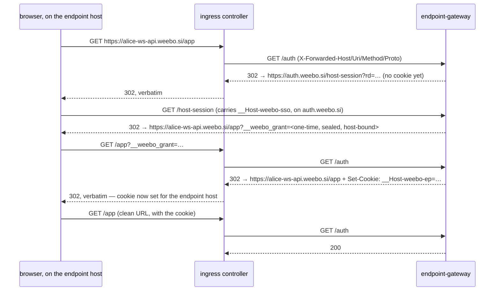
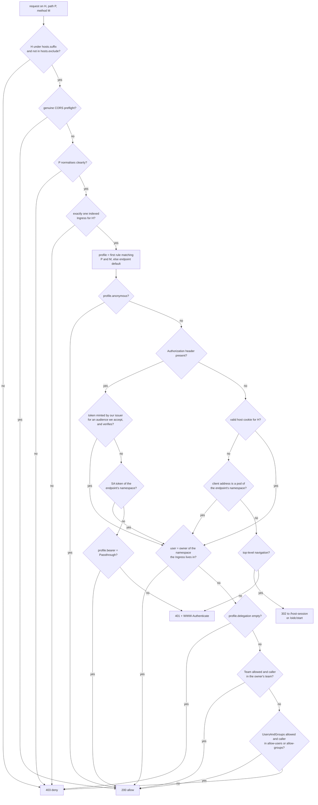

# RFC 0009 — endpoint-auth

## Summary

Workspace endpoints exposed on their own FQDN (`<user>-<workspace>-<endpoint>.<suffix>`) are
reachable by anyone who can resolve the name. This RFC puts an authenticating, authorising gate in
front of every one of them: a single Rust binary — `endpoint-gateway` — that is both the OIDC
relying party (the job `oauth2-proxy` would do) and the per-request authorisation decision, and an
operator feature `endpointAuth` that attaches that gate to every routing object in an Eclipse Che
workspace namespace — whether DevWorkspace Operator generated it or the developer wrote it
themselves — and refuses to let it be detached. The default is whatever the admin granted the
team: owner-only, or reachable by the whole team without either side writing anything. A developer
then widens or narrows access per path, to named users or groups, within the limits their team was
granted; an admin can pin one named user below those limits without touching anyone else. How the gate is attached is a port with one implementation per router —
Traefik first, community `haproxy-ingress` and Nginx behind the same contract, and OpenShift's
`Route` through a second attachment mode, because a router with no external-auth hook has to be
served by carrying the traffic rather than by answering a question. The design does not depend on
which controller the cluster runs; it does not pretend the difference is free either.

Two constraints shape every decision below. The gate is built **for Eclipse Che**: it reads what
Che and DevWorkspace Operator already write — the namespace annotation that names the owner, the
labels DWO stamps on the `Ingress` it generates, the OIDC client Che already owns — and asks a
developer to restate none of it. And it must not become **the reason a developer cannot work**: a
`curl`, an SPA's `fetch`, an HMR WebSocket, a phone on a demo URL, a CI job and an expired session
each get a stated answer here rather than an accidental one. That second constraint has its own
section, *Developer continuity*, and it is as load-bearing as the security argument.

## Motivation

1. **A workspace endpoint on its own FQDN is unauthenticated, and nothing upstream fixes that.**
   Only endpoints that opt into `urlRewriteSupported: true` travel through the Che gateway, which
   is where the `oauth2-proxy` + `kube-rbac-proxy` owner check lives. Everything exposed on a
   dedicated subdomain — the normal case for an application being developed — bypasses it. The
   devfile's `secure: true` reads like the fix and is not one: upstream states plainly that setting
   it adds no authentication (eclipse-che#22676). So today the control a reader assumes exists does
   not, and the attribute that advertises it is a no-op.

2. **The threat is internal, not external.** East–west isolation between workspace namespaces is
   already in place, so dev 2 cannot reach dev 1's pods through the cluster network. The remaining
   path is the front door: dev 2 resolves dev 1's endpoint FQDN and walks in through the ingress
   controller, with all the credentials the app holds — a database seeded with real data, an admin
   panel behind a dev-mode login, a `/debug` route nobody meant to ship.

3. **The obvious composition does not compose.** `oauth2-proxy` authenticates; it cannot answer
   "is *this* user allowed on *this* host", because that answer lives in the `Ingress` object's
   namespace and annotations. Bolting a second service behind it means two hops, two configs, two
   sets of headers to reconcile, and a shared-domain session cookie handed to every workspace
   application on the suffix — see *Security considerations*, the cookie is the interesting part.

4. **A developer must be able to share an endpoint without asking an admin.** Demoing a branch to
   a colleague, letting a designer click through, pointing a teammate's client at your API: if the
   only way to do that is a ticket, the control gets worked around rather than used.

5. **Wiring this with Kyverno would add an engine to carry one mutation.** This repo already
   rejected Kyverno for `dwoc-pin` (RFC 0002) and for the network-policy baseline (RFC 0004), and
   already owns the three pieces this needs: a mutating webhook, a reconciler, and `policy-guard`.
   A sixth feature is a known shape here; a policy engine is a new operational dependency whose
   own `generate`/`mutate` rules would then need guarding too.

6. **A control that stops a developer working is a control that gets removed.** A workspace
   endpoint is not browsed, it is *developed against*: the SPA on one endpoint calls the API on
   another with `fetch`, the HMR socket reconnects every save, `curl` and Postman hit it all day,
   a phone loads the demo URL, a CI job posts to it. A gate that only knows how to redirect a
   browser turns every one of those into an unexplained failure — an opaque CORS error, a hung
   WebSocket, a `302` where JSON was expected. Each has an answer in *Developer continuity*, and
   the answers are part of the contract rather than of the implementation, because this is the
   half of the design that decides whether the feature survives its first week.

### What exists today

Nothing on the FQDN path. `che-gateway` protects subpath endpoints and the IDE; dedicated ingresses
carry no authentication annotation at all. Developers protect what they remember to protect, with
whatever the framework offers.

**Outcome we are buying:** a request to any workspace endpoint FQDN arrives at the application only
if the caller proved a cluster identity — a browser session, a token this cluster's identity
provider minted, or the workspace pod it is calling from — **and** is the workspace's owner or
someone the owner named. Nothing a developer
does to their devfile removes the gate; the only thing they control is who else gets through it.
Applications keep their own authentication working unchanged underneath, and every client a
developer already uses — browser, `curl`, CI, a WebSocket, a phone on the demo URL — keeps working
with at most a token they already have.

## Guide-level explanation

### What the admin installs

One `Deployment` of `endpoint-gateway` (three replicas, a PDB, anti-affinity — *Failure mode* says
why that is not over-provisioning) plus one `Ingress` for it on a dedicated host, and one feature
block:

```yaml
apiVersion: hardening.weebo.io/v1alpha1
kind: WeeboSiConfig
metadata:
  name: cluster
spec:
  teams: # chassis-level, RFC 0002 — identity only, no policy
    - name: team-1
      namespaceSelector:
        matchLabels: { hardening.weebo.io/team: "1" }
  features:
    endpointAuth:
      mode: Enforce # Off | DryRun | Enforce — chassis semantics, RFC 0002
      gateway:
        externalUrl: https://auth.weebo.si # where a browser is sent to sign in
        service: { name: endpoint-gateway, namespace: weebo-si-hardening, port: 4180 }
        dialect: Traefik # Traefik | Nginx | HAProxy | Custom — see Dialects
        enforcement: Enforce # Observe | Enforce — the gate's own verdict, see Rollout
        allowedMiddlewares: [] # Traefik only: entries an Ingress may name *after* ours
      breakGlassIdentities: [] # may set hardening.weebo.io/endpoint-auth: bypass on one Ingress
      owner:
        namespaceAnnotation: che.eclipse.org/username
        # the SA that creates and reconciles the workspace Ingresses
        devworkspaceOperatorIdentity: "system:serviceaccount:devworkspace-controller:devworkspace-controller-serviceaccount"
      hosts:
        suffix: .weebo.si # the only hosts this feature governs
        ownership: # how a host names the user who owns it — first match wins
          - template: "{user}-{workspace}-{endpoint}" # Che's default shape
          - template: "dev.{user}-{workspace}"
        exclude: # hosts the gate never attaches to
          - che.weebo.si # che-gateway: authenticates already
          - auth.weebo.si # the gateway's own host
      catalog:
        - key: private # the owner, and nobody else
          delegation: []
        - key: team # the owner and everyone in the owner's team
          delegation: [Team]
        - key: shared # ...plus whoever the owner names
          delegation: [Team, UsersAndGroups]
        - key: open # no authentication at all; `delegation` is rejected here
          anonymous: true
      default: private # a namespace belonging to no team
      overrides: # ordered, first match wins; an override may only narrow
        - match: { users: [contractor-*] }
          allowed: [private]
          default: private
          delegation: [] # this user may not share an endpoint at all, whatever the profile says
      endpointSelection:
        annotation: hardening.weebo.io/access
        onUnknownKey: Default # Default | Deny — RFC 0002 semantics
      selfOrigin: # a workspace calling its own endpoint is its own owner
        podNetwork: Auto # Auto | On | Off — Auto trusts the client address only while the probe says it can
        serviceAccountToken: true # ...or the caller presents that workspace's SA token
        trustedProxy:
          mode: Auto # Auto | Static | Off
          service: { name: traefik, namespace: traefik } # Auto: the /auth peer must be one of its endpoints
          cidrs: [] # Static: a host-network controller, or a mesh hop in between
        probe:
          enabled: true # turn off where the gateway cannot reach its own public URL
          intervalSeconds: 900
          url: "" # defaults to gateway.externalUrl
---
apiVersion: hardening.weebo.io/v1alpha1
kind: WeeboSiTeam
metadata:
  name: team-1
spec:
  namespaceSelector:
    matchLabels: { weebo.io/team: team-1 }
  features:
    endpointAuth: # this team's own profiles; the cluster `default` stays reachable
      catalog:
        - { key: team, delegation: [Team] }
        - { key: shared, delegation: [Team, UsersAndGroups] }
      default: team # singular: an endpoint resolves to exactly one profile
```

Five fields are worth the sentence they cost.

**`delegation` is a list, not a mode**, and `[]` says "the owner and nobody else" where the first
draft said `Off` — which, unquoted, YAML 1.1 reads as the boolean `false`. An empty list cannot be
misread by a parser or by a person.

**`[Team]` is the answer to "my colleagues should just be able to open it".** A team is already
defined once, chassis-level, as a set of namespaces (RFC 0002); a namespace already names its
owner; so **a team's members are the owners of its namespaces**, computed from the informer cache
with no new source of truth, no IdP group to keep aligned and nothing for a developer to maintain.
With `default: team` a workspace is reachable by the team the day it starts, and the developer
never writes an annotation at all. A caller who owns no namespace belongs to no team — a person
who has never opened a workspace is not a colleague the cluster knows about.

**`overrides` is per-user what a team's own block is per-team**, for the case a team cannot
express: this contractor's endpoints stay owner-only whatever their team may do. It is an ordered
list, first match wins like the teams themselves, it matches on `users` (with a trailing-`*`
prefix form) or on a
`namespaceSelector`, and **it may only narrow**: the effective set is the team's `allowed`
intersected with the override's, so an override can never be the way somebody gets *more* than
their team was granted. `delegation: []` in an override is the hard form — that user may not share
an endpoint at all, whichever catalogue key they reach.

**`default`** is mandatory because RFC 0002 makes every feature answer for a namespace in no team,
and the answer here is the closed one. And **`hosts.exclude`** is where the Che gateway's own
ingress is named, rather than being matched by a hard-coded string in the operator — a cluster
that renamed it stays protected instead of double-gating its IDE.

The gateway's own configuration — issuer, client, claims, cookies — is a file next to it. It reuses
**the OIDC client Che already uses**, so the username it sees is the username Che put in the
namespace annotation, with no mapping table in between:

```yaml
listen: "[::]:4180"
issuer: "https://sso.weebo.si/realms/weebo"
client_id: "che-client" # same client as Che; secret from the environment
redirect_url: "https://auth.weebo.si/oidc/callback"
claims:
  username: preferred_username # must be the claim Che derives its username from
  groups: groups
hosts: # rendered from the WeeboSiConfig by the chart — one source of truth, two readers
  suffix: ".weebo.si" # the only hosts a login may be redirected back to
  ownership:
    - { template: "{user}-{workspace}-{endpoint}" }
    - { template: "dev.{user}-{workspace}" }
  exclude: ["che.weebo.si", "auth.weebo.si"]
session:
  sso_ttl: 12h # the cookie on auth.weebo.si, host-only
  host_ttl: 1h # the per-host cookie, bound to one endpoint host
  host_sliding: true # re-minted in the background past half-life; a working day never expires mid-task
  max_groups: 64 # only groups some endpoint names are sealed; this caps even those
backchannel_logout:
  enabled: true # revokes a session cluster-wide when the IdP says it ended
  store: { configmap: endpoint-auth-revocations } # in the gateway's own namespace
revalidation:
  mode: WhenNoBackchannel # Always | WhenNoBackchannel | Never
  interval: 1h # a session in use re-proves itself against the IdP this often; idle costs nothing
logging:
  denials: All # every refusal, with its reason
  allows: FirstPerHostSession # one line when a session first reaches a host, not per request
  allow_sample: 0 # 1-in-N per-request allow lines, for debugging only
bearer:
  verify_own_issuer: true # a token from `issuer` is *verified* and authorised like a cookie
  audiences: ["endpoint-gateway"] # required: which audience a token must name to be ours
  authorized_parties: [] # compatibility mode; each entry is a warning and a Degraded condition
  introspection: { enabled: false } # for an issuer whose access tokens are opaque
  service_account_token: true # a Kubernetes SA token is resolved with a TokenReview
  foreign: Reject # Reject | Passthrough — what happens to any other Authorization header
self_origin:
  pod_network: Auto # Auto | On | Off
  client_ip_header: X-Real-Ip # set by the controller from the TCP peer, never by the client
  trusted_proxy: { mode: Auto, service: { name: traefik, namespace: traefik } }
  probe: { enabled: true, interval_seconds: 900 } # url defaults to the gateway's own external URL
preflight: true # a genuine CORS preflight is answered without a login redirect
challenge:
  navigation: Redirect # a top-level browser navigation is sent to sign in
  non_navigation: Status401 # everything else gets 401 + WWW-Authenticate, never a 302
rules:
  max_per_endpoint: 16
  reject_unnormalised_path: true # a path that does not survive normalisation is denied
errors:
  reveal_owner: true # the 403 names the owner so the caller knows whom to ask
cache: # identity only, never a verdict — see *Request cost*
  identity: { max_entries: 20000, ttl: 5m } # opened sessions and verified bearers, keyed by hash
  token_review: { max_entries: 5000 } # entries expire with the token they answer for
```

`bearer` is where the difference between a gate and a suggestion is decided. The obvious rule —
pass any request carrying an `Authorization` header through untouched, on the grounds that a
caller with its own credential is the application's business — means
`curl -H 'Authorization: Bearer x'` reaches any endpoint in the cluster, against applications the
*Motivation* describes as having no authentication of their own. So instead: a token **from our own
issuer** is verified and then authorised exactly like a cookie — same owner check, same delegation,
same path rules — which is what makes `curl` and CI work without a browser. Anything else is
rejected by default — `foreign` is the cluster-wide default and a path rule may override it with
`bearer: Passthrough`, which is the escape hatch for an application that genuinely authenticates
its own tokens and wants the gate out of the way on the paths where that is true.

"From our own issuer" is `audiences`, not `issuer` alone, and the difference is a section of its
own: a realm mints tokens for more than one party, and verifying only `iss` accepts every one of
them. *Which tokens are ours* specifies which shapes are accepted, what an admin adds to the Che
client so a developer's own token is one of them, what the compatibility mode for an admin who
cannot costs — and what the IDE actually holds, which is not a token.

`challenge` is the other half of that: the gate must never answer an `XMLHttpRequest` with a
redirect to an identity provider, because the browser turns that into an opaque CORS failure and
the developer sees a bug in their own code. See *Developer continuity*.

### Calling your own endpoint from your own workspace

The case that has to work without anyone signing in to anything: the developer's own code, running
in their own workspace pod, calling their own endpoint. A build step fetching its API, a Playwright
run against the public URL, a `curl` in the terminal panel, a worker polling the service it is
developed against. There is nobody at a browser to redirect, and asking a developer to paste a
token into their own application's configuration to reach their own application is the kind of
friction that ends with the feature switched off.

Three answers, in the order a developer should reach for them:

1. **`localhost:8080` never leaves the pod.** No ingress, no controller, no gate — it is not that
   the gate allows it, it is that the gate is not on that path at all. For one container talking to
   itself this stays the right answer and always was.
2. **The in-cluster Service DNS**, `alice-ws-api.user-alice.svc:8080`, is east–west traffic between
   pods of one namespace, which [RFC 0004](./0004-network-profiles.md)'s baseline already governs.
   Also not this feature's path.
3. **The public FQDN works too, unauthenticated, from that workspace's own pods** — because a
   request whose client address is a pod in the endpoint's namespace *is* the owner. That is the
   part this section adds, and the part below specifies.

The third is not a convenience carved out of the security model; it is the same model applied
honestly. Whoever runs code in alice's workspace pod is alice, or is someone who has already
compromised the process serving the endpoint — they hold the application, its database credentials
and its `localhost`. Requiring them to authenticate to reach the front door of a house they are
standing inside protects nobody.

```console
# in the workspace terminal, no token, no browser, no annotation
$ curl https://alice-ws-api.weebo.si/api/items
[{"id":1,…}]
```

### What the developer writes

Nothing, to be protected — that is the default. To share, one annotation on the endpoint, which
DevWorkspace Operator copies onto the generated `Ingress`:

```yaml
components:
  - name: app
    container:
      endpoints:
        - name: api
          targetPort: 8080
          exposure: public
          # `annotation`, singular — that is the devfile field's name, and the apiserver refuses a
          # workspace that spells it `annotations` rather than ignoring it. Established against
          # DevWorkspace Operator v0.43.0; see the ground-truth spike.
          annotation:
            hardening.weebo.io/access: shared # a catalogue key their team was granted
            hardening.weebo.io/allow-users: "bob,carol"
            hardening.weebo.io/allow-groups: "team-payments"
```

Often not even that. Where the team grant's `default` is `team`, a colleague opens the URL and it
works — the developer wrote nothing, and the two of them never spoke to an admin. `allow-users` is
for the person outside the team: the designer, the client, the colleague on another squad.

One endpoint is rarely one audience, and a single verdict for a whole host is the thing that makes
people turn a control off. Two directions, both needed:

- **Widening**, for callers that cannot sign in: the probe hitting `/healthz`, the third party
  posting to `/api/webhooks/stripe`.
- **Narrowing**, which only matters once delegation exists: having shared the endpoint with a
  colleague, the owner still does not want them in the framework's own back doors — `/actuator/`,
  a database console, a seeded `/dev/reset`. Narrowing is invisible to the owner and the whole
  point for the delegate.

So the profile is refined per path, in an ordered list, each entry naming a catalogue key the team
was granted:

```yaml
hardening.weebo.io/rules: |
  - { path: /healthz,          match: exact,  access: open }
  - { path: /api/webhooks/,    match: prefix, access: open, methods: [POST] }
  - { path: /actuator/,        match: prefix, access: private }
  - { path: /,                 match: prefix, access: shared }
```

First match wins, in the order written. A request matching no rule falls to the endpoint's
`hardening.weebo.io/access`, and a missing final catch-all is therefore not a hole. The list is
bounded (`rules.max_per_endpoint`, default 16) and validated at admission: an unparseable list, an
ungranted key, or a rule whose `access` is `open` when the team holds no `open` grant is rejected
with the reason, not silently dropped. A rule may also carry `bearer: Passthrough`, which is how
an application that authenticates its own API tokens keeps doing so on the paths where that is
true, and only there.

#### An endpoint you wrote yourself

Not every endpoint comes from a devfile. A developer who writes their own `Ingress` — a second
hostname for one service, a manifest they are developing, something DWO does not model — gets the
gate for free and configures it the same way:

```yaml
apiVersion: networking.k8s.io/v1
kind: Ingress
metadata:
  name: my-preview
  namespace: user-alice
  annotations:
    hardening.weebo.io/access: team # same catalogue keys, same grant
spec:
  rules:
    - host: dev.alice-payments.weebo.si # must match a hosts.ownership pattern for alice
```

Nothing else changes: the mutating webhook attaches the gate, the guard pins it, and the object
stays **theirs** — backend, paths, TLS and their own annotations are all still editable, because
they wrote it and no devfile will reconcile it back. The only refusal they can meet is a host that
does not belong to their namespace, and the message names the patterns that would have worked.

#### Two ways in, and which one takes effect when

The annotation above is written in the devfile, and DevWorkspace Operator copies endpoint
annotations onto the `Ingress` it generates — **at workspace start**. So a devfile edit needs a
workspace restart to reach the gate, which is the normal Che loop for anything in a devfile and
not a surprise, but it is the wrong loop for "add my colleague, they are waiting".

The `Ingress` is therefore also editable directly, and `policy-guard` allows exactly that and
nothing else (see *Operator-side*):

```console
$ kubectl annotate ingress alice-ws-api -n user-alice \
    hardening.weebo.io/allow-users=bob,carol --overwrite
ingress.networking.k8s.io/alice-ws-api annotated      # in effect on the next request
```

The cost of having two write paths is stated rather than hidden: **the devfile wins at the next
workspace start.** A direct annotation is a live change to a running workspace, not a permanent
one; DWO regenerates the `Ingress` from the devfile when the workspace restarts and the delegation
goes back to what the devfile says. The rule to give a developer is one line — share now with
`kubectl annotate`, share for good in the devfile — and the gateway logs which of the two the
verdict came from so the surprise is diagnosable.

### What everyone sees

Owner, first visit of the day: one redirect to `auth.weebo.si`, back, and the application. Later
visits to any other endpoint of theirs: one silent redirect, no login screen.

A colleague who was not named:

```text
403 — you are signed in as bob, but this endpoint belongs to alice and is shared
with team-1, which you are not in.
Ask alice to add you: hardening.weebo.io/allow-users on the endpoint.
```

A developer with no browser in the loop — a `curl`, a CI job, a `pytest` suite against their own
endpoint — brings the token they already have from the cluster's identity provider, and the gate
treats it exactly like the cookie:

```console
$ curl -H "Authorization: Bearer $(oidc-token weebo)" https://alice-ws-api.weebo.si/api/items
[{"id":1,…}]
```

The same call without a token, with one this issuer did not mint, or with one it minted for
somebody else's audience, is refused with a sentence that says which of the three it was —
the third being the one *Which tokens are ours* exists for, and the one a developer would
otherwise read as the second:

```text
401 — this endpoint requires a weebo identity.
Browser: open the URL and sign in. Script: Authorization: Bearer <token from https://sso.weebo.si>.
```

```text
401 — that token is from https://sso.weebo.si but was minted for [account], not for this gate.
Ask an admin for an `endpoint-gateway` audience on the client you got it from.
```

An XHR whose session has just expired sees that same `401` — never a `302` to the identity
provider, which the browser would report to the developer as a CORS error in their own code.

The gateway itself being down, which is the failure a developer will meet before any of the
others. That page comes from the ingress controller rather than from the gateway — it is by
definition not answering — so the chart ships it as an error-page middleware pinned into the
chain next to the gate (*Failure mode* has the wiring), and the default controller `500` is what
a cluster gets if the admin skips it:

```text
503 — endpoint-gateway is unavailable, so this endpoint cannot be authorised.
This is the platform, not your workspace. Status: https://status.weebo.si
```

A developer trying to opt out:

```console
$ kubectl annotate ingress alice-ws-api -n user-alice \
    nginx.ingress.kubernetes.io/auth-url- --overwrite
error: admission webhook "ingresses.hardening.weebo.io" denied the request:
  user-alice/Update removes hardening.weebo.io/endpoint-auth managed annotations
```

A developer asking for more than their team was granted:

```console
Warning  EndpointAccessDenied  ingress/alice-ws-api  requested access profile "open" is not in
  team-1's grants; falling back to "private"
```

## Design

### Contract

#### The gate is forward-auth, not a proxy

`endpoint-gateway` never carries application traffic. The workspace `Ingress` keeps pointing at the
workspace `Service`; the ingress controller asks the gateway, per request, whether to proceed.
WebSockets, streamed bodies, large uploads and `Upgrade` handshakes stay on the path they are on
today, and a bug in this brick cannot corrupt an application response.

**With one exception, named here rather than buried**: on a router with no external-auth hook —
the OpenShift router, and any future one like it — there is no question to ask, and the gate
attaches by carrying the traffic instead. That is the `ReverseProxy` mode under *Attaching the
gate*, it applies to `Route` objects on OpenShift, and every sentence above is false for it. The
decision is identical; only the shell around it differs.

#### HTTP surface

| Path                              | Method | Meaning                                                                                      |
| --------------------------------- | ------ | -------------------------------------------------------------------------------------------- |
| `/auth`                           | any    | The forward-auth decision. `200` allow, `302`/`401` sign-in needed, `403` denied.            |
| `/oidc/start`                     | GET    | Begins the authorization-code + PKCE exchange; state is bound to the target host.            |
| `/oidc/callback`                  | GET    | The only registered redirect URI. Mints the SSO cookie, returns to the target host.          |
| `/host-session`                   | GET    | Exchanges the SSO cookie for a **one-time grant** redirected back to the endpoint host.      |
| `/sign_out`                       | POST   | Clears the SSO cookie. `GET` renders the confirmation form that posts to it.                 |
| `/oidc/backchannel-logout`        | POST   | The IdP's OIDC back-channel logout. Revokes a session cluster-wide, for every replica.       |
| `/selftest`                       | GET    | Reports what the gate observed for this request. Reachable only from the gateway's own pods. |
| `/healthz`, `/readyz`, `/metrics` | GET    | Liveness, informer-cache readiness, Prometheus.                                              |

`/selftest` exists for the probe under *Checking that assumption* and answers nothing to anyone
else: it requires a request signed with the session key and, per the same rule it is verifying, a
`/auth` peer the gateway recognises. It reports observations, never secrets — the address the gate
saw, and whether it matched a pod.

`/auth` accepts **any** method, and never reads the method it was called with: Traefik replays the
original request's method to the auth server while `auth_request` in Nginx always uses `GET`, so a
gate that branched on it would decide differently on two dialects. The method under decision is
`X-Forwarded-Method` — the one the controller states — and never the transport's own.

`/sign_out` is `POST` because a `GET` that destroys a session is reachable from any page on the
suffix with one `` tag; the cost of the form is one click and the bug class goes away.

**How a caller is challenged is decided by the request, not by configuration.** Three shapes, not
two:

| The request is                                                              | The gate answers                                                      |
| --------------------------------------------------------------------------- | --------------------------------------------------------------------- |
| a top-level navigation (`Sec-Fetch-Mode: navigate`, or `Accept: text/html`) | `302` to sign in — the flow a person expects                          |
| **framed** (`Sec-Fetch-Dest: iframe` / `frame`)                             | `200`-shaped HTML page: "open in a new tab to sign in", with the link |
| anything else — `fetch`, XHR, a WebSocket upgrade, `curl`                   | `401` + `WWW-Authenticate: Bearer realm="weebo", authorization_uri=…` |

The middle row is Eclipse Che's, and it is not an edge case. Che's dashboard and the IDE's
endpoints view open a workspace endpoint **in an iframe inside the IDE's own origin**, and an
identity provider answers a framed login with `X-Frame-Options`/`frame-ancestors` — so a `302`
there produces a blank panel, no message, and a developer with no way to guess that the thing they
must do is authenticate. A small page with a link is the whole fix, and it is the difference
between "the preview is broken" and one click.

The `401` row exists for the same reason one level down: a redirect answered to an
`XMLHttpRequest` becomes an opaque CORS failure attributed to the developer's own code.
These rules are the difference between "my session expired" and "my app is broken".

**Plain HTTP is not supported, and says so.** Every cookie this design mints carries `__Host-`,
which requires `Secure`, so an endpoint served over `http://` cannot hold a session at all. Rather
than fail in a way that looks like a bug, `X-Forwarded-Proto: http` gets a `421` with a page naming
the reason, and the condition is surfaced three times before anyone meets it: the mutating webhook
returns an **admission warning** on a routing object with no TLS — which `kubectl` prints and DWO
logs — the reconciler records a `Warning` event on the object so the Che dashboard can show it, and
`weebo_si_endpoint_auth_insecure_hosts` counts them for the admin. A control that requires TLS and
only mentions it in an RFC is a control that will be reported as broken.

#### Which `Ingress` answers for a host, and why that question is a security boundary

The decision reads owner and delegation from "the `Ingress` for host `H`". Kubernetes does not make
that phrase unambiguous: nothing stops a second `Ingress`, in a second namespace, from naming the
same host. If the gateway resolved `H` to whichever object it happened to find, dev 2 would open a
hole in dev 1's endpoint with one manifest in their own namespace:

```yaml
# in namespace user-bob — an Ingress for a host that belongs to alice
spec:
  rules: [{ host: alice-ws-api.weebo.si }]
metadata:
  annotations: { hardening.weebo.io/access: open }
```

Traefik would keep routing traffic to alice's service (the routers collide, and the winner is
decided by rule ordering, not by us) while the *verdict* came from bob's object. A complete bypass,
performed with a manifest the cluster considers valid. Three things close it, and all three are
Che-specific in a way that is worth taking advantage of rather than reinventing:

1. **The namespace decides candidacy; provenance decides how much of the object is frozen.** The
   catalogue indexes an `Ingress` — or, on OpenShift, a `Route` — when it lives in an **Eclipse
   Che workspace namespace** and its host is under `hosts.suffix`. Nothing else in the cluster is
   touched: a namespace with no Che owner has no endpoints to govern.

   Indexing only objects carrying `controller.devfile.io/devworkspace_id` would be the obvious
   rule and it has a hole the size of the feature: a developer who preferred no gate would write
   their own `Ingress` for their own `Service` and get an ungated FQDN — the devfile route
   protected and the `kubectl` route not, which is the one asymmetry a control with no opt-out must
   not have. Provenance still matters, but it answers a different question:

| Provenance                                           | Gated | Object shape                                     |
| ---------------------------------------------------- | ----- | ------------------------------------------------ |
| **DWO-generated** — carries the devworkspace label   | yes   | belongs to the devfile; frozen except delegation |
| **User-authored** — anything else in a Che namespace | yes   | belongs to its author; they may edit it freely   |

   A developer writing their own routing object therefore **gets the gate with no opt-in at all**,
   which is both the answer to "I made this `Ingress` myself and I want the authentication" and
   the closing of the bypass above. What they keep is authorship: the gate's own annotations are
   pinned, and everything else about the object — backend, paths, TLS, their own annotations — is
   theirs to change, because they wrote it and no devfile is going to reconcile it back.
2. **The host must belong to the namespace that claims it**, and the shape of a host is
   configuration rather than a constant. Che's default endpoint FQDN is
   `<user>-<workspace>-<endpoint>` under the suffix, but a cluster may well want
   `dev.<user>-<workspace>` or `dev.<user>-<workspace>-<endpoint>`, so `hosts.ownership` is a list
   and a host belongs to a namespace when **any** entry matches:

   ```yaml
   hosts:
     suffix: .weebo.si
     ownership:
       - template: "{user}-{workspace}-{endpoint}" # Che's default
       - template: "dev.{user}-{workspace}"
       - regex: '^preview-(?P<user>[a-z0-9]+)\.' # when a template cannot say it
   ```

   **Templates are the first-class form, and the recommendation**, because they are checked in the
   safe direction: the namespace's own `che.eclipse.org/username` is substituted into `{user}` and
   the result is compared to the host. A regex has to do the opposite — extract a username *from*
   the host — and a username containing a `-`, which Che permits, then makes
   `alice-b-ws-api` ambiguous between two readings. Where a regex is unavoidable it must be
   anchored and carry a named `user` capture, both checked at config load; the `regex` crate's
   linear-time guarantee is what makes accepting an admin-supplied pattern on the admission path
   defensible at all.

   A template is ambiguous too once a username, workspace or endpoint contains the separator:
   `{user}-{workspace}-{endpoint}` reads `alice-bob-ws-api` as `alice` or `alice-bob`, and
   `alice-my-ws-api` as `alice` or `alice-my`. Admission therefore gives a host to the
   namespace's owner when the owner is one of the readings **and no other reading is a user who
   owns a namespace** (by the same owner annotation, across every namespace the webhook
   watches). `alice-bob` gets `alice-bob-ws-api` while no `alice` exists, `alice` keeps her
   hyphenated workspaces while no `alice-my` exists, and when both readings are real people
   neither gets the host. A user created after a colliding host was admitted is the remaining
   case, and lands in the conflict rule below.

   A host matching no entry belongs to nobody: admission refuses it, and the gateway denies, with
   the pattern list named in the message so the answer is "add a template", not "why".
3. **Ambiguity is `deny`, never "pick one".** If two indexed objects still claim one host, the
   catalogue returns a conflict, the gateway answers `403`, and
   `weebo_si_endpoint_auth_host_conflicts` goes above zero with the host in a `WARN`. A control
   that resolves a tie by sort order is a control whose verdict an attacker chooses.

**One object, one endpoint, one host — confirmed and then enforced.** Eclipse Che's DevWorkspace
Operator publishes one routing object per exposed endpoint, which is what makes
`hardening.weebo.io/access` and the delegation annotations meaningful: they are per-object, and
per-object equals per-endpoint. The design depends on that, so it does not merely assume it — an
indexed object carrying more than one host is a **conflict**, denied and counted like any other,
rather than silently applying one endpoint's delegation to another's traffic. If DWO ever groups
endpoints, this feature fails closed and loudly on the first grouped object instead of leaking a
share across endpoints, and the migration is a per-host annotation key
(`hardening.weebo.io/access.<endpoint>`) rather than a redesign.

The same scoping is what makes `hosts.exclude` a second line of defence rather than the only one:
`che.weebo.si` does not live in a workspace namespace, so the Che gateway's own ingress is outside
this feature even if someone deletes it from the list.

#### How a host session is minted

The two-cookie design in *Two cookies, on purpose* is only implementable if a cookie for
`alice-ws-api.weebo.si` can be set while the browser is talking to that host — the gateway's own
host cannot set it. Forward-auth is what makes this work, and it is worth writing the sequence
down because it is the part most easily got wrong:


```mermaid
sequenceDiagram
    participant B as browser, on the endpoint host
    participant C as ingress controller
    participant G as endpoint-gateway
    B->>C: GET https://alice-ws-api.weebo.si/app
    C->>G: GET /auth  (X-Forwarded-Host/Uri/Method/Proto)
    G-->>C: 302 → https://auth.weebo.si/host-session?rd=…  (no cookie yet)
    C-->>B: 302, verbatim
    B->>G: GET /host-session  (carries __Host-weebo-sso, on auth.weebo.si)
    G-->>B: 302 → https://alice-ws-api.weebo.si/app?__weebo_grant=<one-time, sealed, host-bound>
    B->>C: GET /app?__weebo_grant=…
    C->>G: GET /auth
    G-->>C: 302 → https://alice-ws-api.weebo.si/app  + Set-Cookie: __Host-weebo-ep=…
    C-->>B: 302, verbatim — cookie now set for the endpoint host
    B->>C: GET /app  (clean URL, with the cookie)
    C->>G: GET /auth
    G-->>C: 200
```

**The cookie is minted on a redirect, not on an allow**, and that is a deliberate choice rather
than an extra hop. A forward-auth `200` is an instruction to the controller to proceed to the
upstream; what a dialect does with headers on that response is to *the upstream request*, so a
`Set-Cookie` there reaches the application rather than the browser — Traefik needs
`addAuthCookiesToResponse` to do anything else, and not every dialect has an equivalent. A
non-`2xx` is returned to the client, so redeeming the grant with a `302` to the clean URL sets the
cookie *and* strips the parameter in the same response, on every dialect that satisfies the
contract below.

Three properties this sequence has to have, each of which is a test in the conformance suite: the
grant is **single-use, sealed, bound to one host and one path, and valid for 30 seconds**, so a
leaked URL in a `Referer` or a shell history buys nothing; `__weebo_grant` never reaches the
application; and the `Set-Cookie` survives the controller, which is the requirement the contract
below states and the reason the Nginx dialect needs the treatment it gets.

If the browser has no SSO cookie either, `/host-session` sends it through `/oidc/start` first and
the sequence resumes where it left off. A developer signing in once therefore pays one visible
login and, on every other endpoint that day, three redirects nobody notices.

#### Attaching the gate: one contract, several dialects

The controller in front of workspace endpoints is not something this design should depend on.
Traefik is what the reference cluster runs, community `haproxy-ingress` and OpenShift are both
targets this repo already carries elsewhere, and the next one is not knowable now — so *how the
gate is attached* is a port, not a branch, in the same spirit as
[RFC 0003](./0003-preauth-proxy.md): the binary speaks one vocabulary and the deployment names the
product.

That port has to be wider than this RFC first drew it, for a reason OpenShift forces: **not every
router can be asked a question.** The OpenShift HAProxy router has no external-auth hook at all —
no `auth-url`, no forward-auth, no middleware chain — and on OpenShift DevWorkspace Operator
publishes `Route` objects rather than `Ingress`. A port that assumes forward-auth on an `Ingress`
therefore covers Traefik, Nginx and community `haproxy-ingress`, and covers OpenShift not at all.
So a dialect declares three things about itself and answers four:

```rust
// domain/port/gate_attachment.rs
pub enum AttachmentMode {
    /// The router asks the gateway per request; traffic never touches it.
    ForwardAuth,
    /// The router has no auth hook: the route is pointed at the gateway, which
    /// decides and then proxies to the workspace Service.
    ReverseProxy,
}

pub trait GateAttachment {
    fn mode(&self) -> AttachmentMode;
    /// The routing object this dialect attaches to: `ingresses` or `routes`.
    fn target_kind(&self) -> GroupVersionKind;
    /// Annotations to set on that object so the controller consults the gateway.
    fn annotations(&self, gw: &GatewayRef) -> BTreeMap<String, String>;
    /// For ReverseProxy: how the object's backend is repointed, and where the
    /// original backend is recorded so the gateway can reach it.
    fn retarget(&self, obj: &RoutingObject, gw: &GatewayRef) -> Option<Retarget>;
    /// Auxiliary objects the controller needs, owned and reconciled by the operator.
    fn companions(&self, gw: &GatewayRef, ns: &str) -> Vec<CompanionObject>;
    /// The kinds `policy-guard` must therefore protect, and the fields it must pin.
    fn guarded_kinds(&self) -> &[GuardedKind];
}
```

`guarded_kinds()` is the part that is easy to forget and expensive to omit: a dialect that puts the
gate in a side object has moved the thing a developer can edit, and the guard has to follow it
there. It now carries **which fields** as well as which kinds, because a `ReverseProxy` dialect
needs the route's backend pinned and not only its annotations — a developer who repoints
`spec.to` back at their own `Service` has removed the gate by editing a field no annotation guard
would look at. The guard learns both from the dialect rather than from a hard-coded list.

**The domain does not know which mode it is in.** `decide()` answers the same question either way;
what changes is the shell around it — an `/auth` handler in one case, a proxy handler that calls
the same use case and then forwards in the other. That is the property that keeps OpenShift from
forking the design, and it is worth one test asserting the two shells produce the same verdict for
the same request.

**The contract every `ForwardAuth` dialect must satisfy**, identically, or it is not supportable.
A `ReverseProxy` dialect satisfies properties 2 to 4 by construction — it writes the response
itself — and still owes properties 1 and 5, since it too must know the request's real host and
client address. Five properties, not one:

1. **Inbound.** `X-Forwarded-Host`, `X-Forwarded-Uri`, `X-Forwarded-Method`, `X-Forwarded-Proto`
   reach `/auth` verbatim, set by the controller itself and not reachable by anything the
   developer can put in front of the gate.
2. **Outbound on `200`.** `X-Auth-Request-User` / `-Groups` / `-Email` are copied to the upstream,
   overwritten rather than merged so a caller cannot present them itself.
3. **A `3xx` from `/auth`, `Set-Cookie` included, reaches the browser unaltered.** This is not a
   convenience: it is the only mechanism by which a cookie gets minted for an endpoint host, so a
   dialect that drops it cannot implement *How a host session is minted* at all. Traefik returns a
   non-`2xx` auth response verbatim and needs nothing extra; `auth_request` in Nginx synthesises
   its own redirect from `auth-signin` and drops the subrequest's headers, so that dialect lifts
   the cookie with `auth_request_set` and re-emits it with `add_header`.
4. **The non-`2xx` body and status reach the client unchanged**, so the `401`, the `403` naming
   the owner, and the `WWW-Authenticate` header are what the developer actually sees rather than
   the controller's generic error page.

Properties 3 and 4 are the ones an author forgets, and forgetting them yields a two-cookie design
whose cookie has no way to be set and a set of helpful error messages nothing displays.

**Two of the three dialects fail this contract, and the ground-truth spike is what established
it** — `scripts/spike-0009.sh`, with every row recorded in `docs/bricks/endpoint-gateway.md`.
Traefik satisfies all five. **ingress-nginx fails 3 and 4**: `auth_request` discards the
subrequest's body and headers, so the gate's explanatory body and its `Set-Cookie` never reach the
caller; a `3xx` from `/auth` is not merely reshaped but answered `500`, because that module accepts
`2xx`, `401` and `403` and calls everything else a server error; and the `auth-signin` that exists
to paper over exactly this redirects *every* caller, so the challenge selection *Developer
continuity* rests on collapses to one shape. A fourth failure the spike found on this dialect is
**fixed**: the re-minted cookie on an *allow* was forwarded only when the application's own answer
was `2xx`, which signed a developer out mid-task for the crime of working against an endpoint that
was returning 404s. The dialect now writes `auth-always-set-cookie`.

**The other three are accepted rather than fixed, and `Nginx` is `partial` in the table above.**
The remedy for all three is the same one this RFC named when it wrote the contract — lift the
cookie with `auth_request_set`, re-emit it with `add_header` — and it needs `auth-snippet`, which
means `allow-snippet-annotations` on, which is the hardening control ingress-nginx turned off by
default in 1.9 and which this design specifically declined to turn back on. Trading a
cluster-wide control for three per-request niceties is a bad trade, and the alternative — teaching
the gateway its dialect so it answers `401` where it would have answered `302` — buys only 6b
while making the decision depend on deployment configuration, which is the property *The decision*
exists to avoid.

So what a cluster running ingress-nginx gets is: the gate holds, identity is not forgeable, the
sliding session works — and a refused developer sees a bare `401` rather than the sentence
explaining who owns the endpoint, while a browser is redirected by `auth-signin` rather than by
the gate's own challenge. Named here, named on the brick page, and named in the chart where the
dialect is chosen. Revisit it if somebody actually runs this dialect; until then it is a
documented limit rather than a bug with no ticket. **Community `haproxy-ingress` fails 1 and 2 on a
default install**, and differently: it builds the auth request by copying the caller's own headers
onto a fixed path, so the gate is told neither the host nor the path nor (by default) the method, a
caller can state the `X-Forwarded-Host` it is judged against, and a caller's `X-Auth-Request-User`
reaches the application whenever the gate allows without naming somebody. Property 1's clause "set
by the controller itself and not reachable by anything the developer can put in front of the gate"
is not a detail of that dialect — it is the dialect's whole mechanism, inverted.

**That one is closable, and what closes it changes who owns the dialect.** Six lines in the
controller's own ConfigMap — three `del-header` for the identity headers, three `set-header`
deriving `X-Forwarded-Host`, `-Uri` and `-Method` from the request itself — make every one of the
three failures pass, which the spike demonstrates by running the row with the lines and without
them. **An annotation cannot do the same job**: a per-ingress `config-backend` snippet is emitted
*after* the `lua.auth-intercept` line, so it rewrites what the application is handed and never what
the gate was asked. So the prerequisite belongs to whoever installed the controller, and this
operator can neither write it, own it, nor pin it with `policy-guard` — and, because the header a
controller sets and the header a caller sends are the same header, the gateway cannot detect its
absence at runtime either. Its absence does not fail closed: it yields a decision about a host the
caller chose.

`HaproxyIngress` is therefore **conditionally supportable, on an assertion rather than on a check**
— which is precisely the `Custom` dialect's position, where "allowing the dialect *is* the admin's
assertion that it conforms". It is enabled the same way: `gateway.haproxyPrerequisite`, a boolean
an admin sets after installing the seven lines, `Degraded` with the reason while it is `false`, and
the seven lines written out in `docs/weebosiconfig.md` and the brick page. The gate still attaches
when the assertion is missing, because a gate a knowing attacker can bypass refuses everybody who
is not attacking and an unattached gate refuses nobody. Two annotations the dialect had been
missing came out of the same row and are now written: `auth-method: "*"`, without which the gate is
asked about a `GET` whatever the caller sent, and an explicit `auth-headers-request` allow-list,
without which every header the gate reads is one the caller could have written. Nothing here
changes this design; it changes what enabling a dialect means, and the only dialect that needs no
assertion today is `Traefik`.

| Dialect          | Mode           | Target      | How it attaches                                                                                     | Status               |
| ---------------- | -------------- | ----------- | --------------------------------------------------------------------------------------------------- | -------------------- |
| `Traefik`        | `ForwardAuth`  | `ingresses` | `traefik.ingress.kubernetes.io/router.middlewares` → one shared `forwardAuth` `Middleware`          | phase 1              |
| `HaproxyIngress` | `ForwardAuth`  | `ingresses` | `haproxy-ingress.github.io/auth-url` and `auth-headers-succeed`, the community controller's own     | needs a prerequisite |
| `OpenShiftRoute` | `ReverseProxy` | `routes`    | `spec.to` repointed at the gateway; the original backend recorded in a managed annotation           | phase 2              |
| `Custom`         | `ForwardAuth`  | `ingresses` | an operator-written annotation template, `${gateway_url}` and friends substituted                   | escape hatch         |

**`HAProxy` splits into two names on purpose**, because a single row would hide the difference
that decides whether the dialect is buildable at all. Community `haproxy-ingress` has an
`auth-url` annotation and is an ordinary `ForwardAuth` dialect; the **OpenShift router** is also
HAProxy and has no external-auth hook of any kind. Calling both "HAProxy" in one table is how an
RFC promises something nobody can implement.

**`OpenShiftRoute`, and what the reverse-proxy mode costs.** On OpenShift there is no question to
ask the router, so the operator repoints the `Route` at the gateway and records the real backend —
`{service, port}` — in `hardening.weebo.io/upstream`, pinned by the guard like every other managed
field. The gateway then runs the same `decide()` and, on `allow`, proxies to that backend.

**It cannot repoint the `Route` at the gateway's own `Service`, and that is the one place this
dialect is genuinely more expensive.** A `Route`'s `spec.to` is a local object reference: it names
a `Service` in the `Route`'s own namespace and there is no cross-namespace form. So
`companions()` is not empty here — it returns, per workspace namespace, a selector-less `Service`
plus an `EndpointSlice` the controller reconciles from the gateway's own endpoints. That is
exactly the situation *Drawbacks* predicted in the abstract when question 4 chose one shared
Traefik `Middleware` over a per-namespace copy: **a dialect needing a companion object in the
user's namespace brings the problem back in its original form.** The answer is the same one:
`guarded_kinds()` grows `services` and `endpointslices` *for this dialect only*, the guard learns
it from the dialect rather than from a list someone has to remember to update, and a developer
editing the companion is refused the way they are refused an annotation edit. It is more objects
and more reconciliation than Traefik needs, and it is the price of a router that cannot be asked a
question.

Five consequences, stated rather than discovered:

- **This brick is on the data path on OpenShift.** The sentence *The gate is forward-auth, not a
  proxy* holds for three dialects out of four, and the fourth pays for it: WebSocket upgrades,
  streamed responses and large uploads go through the gateway, so it needs body-size and idle
  timeouts aligned with the router's, `Connection: Upgrade` handling, and a capacity budget in
  bandwidth rather than in decisions per second.
- **A bug here can corrupt an application response**, which on the forward-auth dialects it
  structurally cannot. That difference belongs in the risk register, not in a footnote.
- **The cookie mint gets simpler, not harder**: the gateway owns the response, so `Set-Cookie` on
  a `302` is its own to send and contract properties 3 and 4 are satisfied by construction.
- **The guard's job grows one field and two kinds.** `spec.to` and `spec.port` are pinned by value;
  a developer repointing the route back at their own `Service` would otherwise remove the gate with
  an edit no annotation check would see. The companion `Service` and its `EndpointSlice` are
  managed objects in a namespace their user can write, so they are guarded like any other — this
  is the one dialect where RFC 0008's original three-row table applies unchanged, to the
  companions, beside this RFC's own table on the `Route`.
- **The gateway must reach workspace pods across namespaces.** A prerequisite outside this brick,
  and the mirror of the one self-origin needs: RFC 0004's baseline has to admit ingress from the
  gateway to workspace pods on this dialect, where on a forward-auth dialect it never touches
  them.

TLS on OpenShift stays the router's: the `Route` keeps its `edge`/`reencrypt` termination, and the
gateway speaks plain HTTP inside the cluster to the workspace `Service`, exactly as the workspace
`Service` is reached today.

The `Custom` dialect exists so that a fourth controller does not need a release of this operator:
the admin writes the annotations that controller wants, plus any companion object, in the
`WeeboSiConfig`. **The template declares the annotation keys it owns**, because the guard pins
those keys by value and cannot discover them by reading a rendered string; a template writing a
key it did not declare is rejected at config validation rather than becoming an unguarded
annotation. Beyond that it is deliberately unvalidated, and enabling it raises a
`Degraded` condition on the `WeeboSiConfig` naming the dialect as unverified — the feature runs,
and the object says out loud that its gate rests on an admin's assertion rather than on a test run.
The conformance suite is a release gate for the built-in dialects only; for `Custom`, allowing the
dialect *is* the assertion that it conforms, and the `Degraded` condition is what keeps that
assertion visible six months later.

Two things keep this honest rather than aspirational. First, a **dialect conformance suite**: one
test per dialect, run against the real controller, asserting the four inbound headers arrive
verbatim, the three outbound headers reach the upstream, a spoofed `X-Auth-Request-User` is
overwritten, a forged `X-Real-Ip` naming another namespace's pod is ignored, a `Set-Cookie` on a
`302` reaches the browser, a `401` body and its `WWW-Authenticate` arrive unaltered, and a `403`
from the gateway actually blocks. A dialect that
does not pass is not shipped.

Second, the Nginx dialect. `auth_request` alone passes only `X-Original-URL` and
`X-Original-Method`, so the four inbound headers have to be reconstructed — and the obvious way,
an `auth-snippet` built from `$host`, `$request_uri` and `$request_method`, is not available on a
default install: `allow-snippet-annotations` has been `false` by default since ingress-nginx 1.9,
for its own good reasons. Requiring a cluster to turn it back on to use this feature would be
trading one hardening control for another. So the dialect carries the request **in the auth URL
instead**, where ingress-nginx interpolates nginx variables without any snippet:

```yaml
nginx.ingress.kubernetes.io/auth-url: >-
  http://endpoint-gateway.weebo-si-hardening.svc.cluster.local:4180/auth?host=$host&uri=$escaped_request_uri&method=$request_method&proto=$scheme
nginx.ingress.kubernetes.io/auth-response-headers: X-Auth-Request-User,X-Auth-Request-Groups,X-Auth-Request-Email
```

`/auth` therefore accepts its four inputs from either the headers or those query parameters,
**never mixing the two**: a dialect declares which transport it uses, and a request arriving with
both is rejected rather than merged, because "the header says one path and the query says another"
is the path-confusion bug this design spends a whole section closing.

The URL carries the caller's own request URI, so the dialect uses `$escaped_request_uri`, never
`$request_uri`: the raw value holds the caller's `?` and `&`, and `/x?&host=other` would otherwise
state a second `host` in the auth URL. The gateway also refuses any request that states `host`,
`uri`, `method` or `proto` more than once, and one that omits an input the controller always
sends — a missing or unreadable `X-Forwarded-Uri` is a `400`, never a decision about `/`.
`Set-Cookie` propagation
still needs `auth_request_set` plus `add_header` in the controller's own configuration snippet at
the `ConfigMap` level, which is admin-owned and not developer-reachable — that is the Nginx
dialect's real prerequisite, and it is one line in a `ConfigMap` rather than a cluster-wide
snippet policy.

**Traefik specifics**, as the first implementation of that port. The gate is a `Middleware`
(`traefik.io/v1alpha1`) referenced from the `Ingress` by
`traefik.ingress.kubernetes.io/router.middlewares`. This cluster runs Traefik with
`providers.kubernetesCRD.allowCrossNamespace: true`, so the operator keeps **one `Middleware`, in
its own namespace**, referenced by every workspace `Ingress` as
`weebo-si-endpoint-auth@kubernetescrd`. `companions()` is therefore empty for this dialect and
`guarded_kinds()` is `[ingresses]` alone — unlike `OpenShiftRoute`, which cannot be: there is no
object in a namespace the developer can edit,
which is a better outcome than the per-namespace copy this RFC first proposed.

That setting has a price, and it lands on the guard rather than on the design. With cross-namespace
references allowed, the middleware chain on a workspace `Ingress` is an attacker-controlled list
unless something pins it — and the chain runs **before** `forwardAuth`, so a `headers` middleware
prepended by the developer can set `X-Forwarded-Uri` to a path covered by an `open` rule while the
router still serves the real one. That is a complete bypass of this feature, performed with one
annotation, by the person the feature constrains.

So the guard pins the value, not merely its presence — row 6 of *The guard rule*: the chain must be
exactly the gateway's middleware, optionally followed by entries from an admin-configured
`gateway.allowedMiddlewares` list. Anything else is denied at admission. The rule to remember: the
contract above is only trustworthy because nothing runs in front of the gate that we did not put
there.

#### Self-origin: two ways a workspace proves it is itself

Both are **identities, not exemptions** — they resolve to the endpoint's owner and then take the
ordinary road through the owner check, the delegation check and the path rules. A `private`
endpoint stays private; its owner simply also reaches it from its own pod. Nothing here can widen
access beyond what the owner already has, which is the property that makes the whole mechanism
safe to have on by default.

**By pod network address** (`selfOrigin.podNetwork`). The gateway keeps a second informer over
DWO-labelled pods and indexes `pod IP → namespace`. If the client address of a request is a pod in
the namespace the endpoint's `Ingress` lives in, the caller is the owner. Three conditions, and
none of them is optional:

- **The address is the one the controller observed, never one the client stated.** The gate reads
  `self_origin.client_ip_header` — `X-Real-Ip` on both Traefik and Nginx, set from the TCP peer —
  and never the first entry of an `X-Forwarded-For`, which any caller can write. If the controller
  is configured to trust client-supplied forwarded headers, **this mechanism is an escalation
  rather than a convenience**: bob's pod would claim alice's pod address and inherit alice's
  ownership. The dialect contract therefore gains a fifth property, and the conformance suite
  gains the test that sends a forged `X-Real-Ip` from one namespace against another's endpoint and
  requires it to fail.
- **The index is live, and a miss is a miss.** A deleted pod leaves the index with its deletion
  event; an address that resolves to nothing, or to a node rather than a pod, is simply not an
  identity and the request falls through to the ordinary flow. That is the fail-safe direction:
  the mechanism failing means someone signs in, never that someone gets in.
- **The client address has to survive the trip.** A pod reaching its own endpoint's public FQDN
  leaves the cluster and comes back, and a `LoadBalancer` doing SNAT replaces the pod address with
  a node's. Where that happens the gate sees a node, finds no pod, and falls back. The fix is
  cluster configuration rather than code — split-horizon DNS pointing the suffix at the ingress
  controller's in-cluster address, or `externalTrafficPolicy: Local` — and the gateway says which
  world it is in rather than leaving an admin guessing:
  `weebo_si_endpoint_auth_self_origin_total{result}` counts `owner`, `unknown_address` and
  `disabled`, and a cluster where `unknown_address` is every request has SNAT in the path.

#### Checking that assumption rather than configuring it

The third condition above — the controller states the client address rather than repeating it — is
the one thing in this design that cannot be read off the wire. An `X-Real-Ip` the controller
derived from the TCP peer and an `X-Real-Ip` a caller sent and the controller copied are byte for
byte the same header. So the gateway does not try to infer it. It does two things instead, and
both are switchable off, because neither is applicable in every cluster.

**Who the proxy is, detected rather than configured** (`selfOrigin.trustedProxy`). The `/auth`
call's own TCP peer is not spoofable, so with `mode: Auto` the gateway requires it to be an
endpoint of the ingress controller's `Service` — read from `EndpointSlice`, which is why this is
detection rather than a CIDR list an admin maintains and reality drifts away from. `Static` takes
explicit CIDRs, for a controller on the host network or a mesh hop in between, where the endpoint
addresses are not what arrives. `Off` skips the check, for a topology where the peer is
structurally meaningless — and costs the guarantee that the headers came from the controller at
all, which is why it is a value an admin has to write down.

**Whether the header is trustworthy, probed rather than assumed** (`selfOrigin.probe`). The
gateway is itself behind the same controller, so it asks: a request to its own public URL carrying
a forged `X-Real-Ip`, answered by a `/selftest` route that reports back what the gate observed. If
the forged address survives the trip, the controller is repeating what callers tell it and the
pod-network mechanism is an escalation rather than a convenience. The same round trip answers the
SNAT question in the other direction — whether the gateway's own pod address arrived intact — so
one probe settles both halves of *the client address has to survive the trip* and one gauge
reports it. It runs at startup, then on `intervalSeconds`, because a controller's configuration
can change under a running gateway.

| `podNetwork` | Probe result                   | Client-address identity | Condition                                   |
| ------------ | ------------------------------ | ----------------------- | ------------------------------------------- |
| `Auto`       | headers are the controller's   | on                      | none                                        |
| `Auto`       | forgery survived               | **off**                 | `Degraded`, naming the forged address       |
| `Auto`       | probe disabled, or not yet run | **off**                 | `Degraded`: `Auto` has nothing to go on     |
| `On`         | probe disabled                 | on                      | `Degraded`: rests on an admin's assertion   |
| `On`         | forgery survived               | **off**                 | `Degraded`: evidence outranks the assertion |
| `Off`        | any                            | never                   | none                                        |

The rule that table encodes, and the only one worth remembering: **an admin's assertion outranks
the absence of evidence, never evidence to the contrary.** `On` exists for the cluster where the
probe cannot run and someone has checked by hand; it does not exist to overrule a probe that has
positively watched a forged address come back. It is the same shape as the `Custom` dialect
upstream in this RFC — the feature runs, and the object says out loud what it is resting on.

**Where the probe is not applicable**, which is why it has a switch:

- The gateway cannot reach its own public URL — a closed egress baseline, or split-horizon DNS
  that resolves the suffix somewhere the probe would not measure.
- `probe.url`'s host is served by a different entrypoint than the workspace endpoints are, so what
  the probe measures is not what the gate will meet. `auth.weebo.si` is under the same suffix and
  usually the same entrypoint and wildcard certificate, which is why it is the default rather than
  the only option; where it is not, `probe.url` points at a host that is, or the probe goes off and
  `podNetwork: On` becomes the honest setting.
- A cluster that has decided self-origin by address is not for it at all, and runs
  `podNetwork: Off` with the service-account token as the single path.

Auto-detection here can only ever **confirm or revoke**, never enable: no probe result and no
admin assertion means the client address is not an identity. The failure direction is a developer
signing in, which is the cheap half of a deliberately asymmetric pair — getting it wrong the other
way hands one namespace's ownership to another.

**By workspace service-account token** (`selfOrigin.serviceAccountToken`). The network-independent
answer, for the clusters the third condition rules out and for any caller that would rather be
explicit. DevWorkspace Operator already projects the workspace's service-account token into the
container, so the credential exists with nothing to provision:

```console
$ curl -H "Authorization: Bearer $(cat /var/run/secrets/kubernetes.io/serviceaccount/token)" \
    https://alice-ws-api.weebo.si/api/items
```

The gateway resolves it with a `TokenReview`, reads `system:serviceaccount:<namespace>:<name>`,
and accepts it only when `<namespace>` is the endpoint's own. It is the bearer branch of the
decision, one step further down: our issuer first, then this, then `profile.bearer`. `TokenReview`
results are cached against the token's hash until its `exp`, so a polling loop costs one API call,
not one per request — and a token from another namespace resolves to a subject that is not the
owner, which is a `403` and not a special case.

**What this does not extend.** A pod in bob's namespace is bob, on alice's endpoint, and gets the
`403` it would have got from a browser. Delegation is unaffected: self-origin proves *the owner*,
never a delegate. And it grants a workspace pod nothing it did not already have, since the same
pod reaches the same application on `localhost` — which is the one-sentence version of why this is
sound.

**One prerequisite outside this brick:** the network baseline must let a workspace pod reach the
ingress controller. Any cluster where a workspace can already fetch an external URL satisfies it;
a fully closed egress baseline needs one rule, and RFC 0004's catalogue is where it belongs.

#### The decision

For host `H`, normalised path `P` and method `M`:


```mermaid
flowchart TD
    A["request on H, path P, method M"] --> S{"H under hosts.suffix<br/>and not in hosts.exclude?"}
    S -->|no| DENY["403 deny"]
    S -->|yes| B{"genuine CORS preflight?"}
    B -->|yes| OK["200 allow"]
    B -->|no| N{"P normalises cleanly?"}
    N -->|no| DENY
    N -->|yes| D{"exactly one indexed<br/>Ingress for H?"}
    D -->|no| DENY
    D -->|yes| R["profile = first rule matching<br/>P and M, else endpoint default"]
    R --> E{"profile.anonymous?"}
    E -->|yes| OK
    E -->|no| AZ{"Authorization header present?"}
    AZ -->|yes| BI{"token minted by our issuer<br/>for an audience we accept,<br/>and verifies?"}
    BI -->|yes| G
    BI -->|no| SA{"SA token of the<br/>endpoint's namespace?"}
    SA -->|yes| G
    SA -->|no| FB{"profile.bearer = Passthrough?"}
    FB -->|yes| OK
    FB -->|no| C401["401 + WWW-Authenticate"]
    AZ -->|no| F{"valid host cookie for H?"}
    F -->|no| PO{"client address is a pod of<br/>the endpoint's namespace?"}
    PO -->|yes| G
    PO -->|no| CH{"top-level navigation?"}
    CH -->|yes| SIGNIN["302 to /host-session<br/>or /oidc/start"]
    CH -->|no| C401
    F -->|yes| G{"user = owner of the namespace<br/>the Ingress lives in?"}
    G -->|yes| OK
    G -->|no| I{"profile.delegation empty?"}
    I -->|yes| DENY
    I -->|no| T{"Team allowed and caller<br/>in the owner's team?"}
    T -->|yes| OK
    T -->|no| J{"UsersAndGroups allowed and caller<br/>in allow-users or allow-groups?"}
    J -->|yes| OK
    J -->|no| DENY
```

Two branches carry more weight than their size suggests.

**`genuine CORS preflight`** is not "`M` is `OPTIONS`". An `OPTIONS` with no
`Access-Control-Request-Method` is an ordinary request that some frameworks route to ordinary
handlers, and allowing every `OPTIONS` would hand those handlers away. The test is the pair of
preflight headers, and the allow is for the preflight alone — the real request that follows it is
decided on its own merits, as it must be, since a preflight carries no credentials by
construction and could never be authorised anyway.

**Explicit credentials beat implicit ones, and self-origin is checked last.** A request that
brings a cookie or a token is decided on it, even from inside the owner's own pod — so a developer
testing what a colleague will see can do it from their workspace terminal by presenting that
colleague's session, and gets the same answer the colleague would. Pod origin only applies when
nothing else was offered.

**A verified bearer is an identity, not an exemption.** A token this issuer minted takes the same
road as a cookie: owner check, delegation, path rules. That is what makes `curl`, CI and a test
suite work against a `private` endpoint without weakening it, and it is why the branch rejoins the
graph at `G` rather than at `OK`. The claims read are the same two (`claims.username`,
`claims.groups`), so a token and a browser session produce the same verdict for the same person —
a property the conformance suite asserts rather than assumes. Only a token from *somewhere else*
reaches `profile.bearer`, and its default is `401`.

#### Which tokens are ours, and what the IDE actually has

"A token this issuer minted" is the phrase the branch above rests on, and it is not yet a
specification. Two questions hide inside it, and they have different answers: **which** tokens
count as ours, and **who inside a workspace is holding one**.

The second was assumed before it was looked at, and the assumption was wrong — recorded here
because the wrong version of it is the one a reader arrives with. Che's gateway is an OIDC relying
party in front of `che-code`, so the natural guess is that the workspace can see the resulting
access token: `oauth2-proxy` *can* be told to forward one, and handing that to `fetch` against
your own endpoint is the obvious next move. **It is not forwarded.** What reaches the workspace is
a proxied request carrying no `Authorization` of the user's, and the only credential that exists
inside a workspace with nobody provisioning it is the service-account token DevWorkspace Operator
already projects.

So there is no "the IDE's token" for this gate to make first-class, and the answer for a caller
inside a workspace is the one *Calling your own endpoint from your own workspace* already gives:
the pod's own address, or that service-account token. Nothing to configure, nothing to refresh,
nothing that expires in five minutes — and it holds whether or not the realm ever grows an
audience mapper. A developer who wants a *user* identity from inside the IDE rather than the
workspace's own fetches a token from the identity provider like any other script, which is the
caller the rest of this section is about; *Future work* records what it would take to make Che
hand one over instead.

That leaves the question that is a hole regardless of who is asking. `verify_own_issuer: true` is
not an answer to it.

So the check is written out. **"Minted by our issuer" is five claims, not one**, and a token is an
identity here only if it passes all of them:

| Checked                                           | Refused because                                                                            |
| ------------------------------------------------- | ------------------------------------------------------------------------------------------ |
| `iss` equals `issuer`, signature against the JWKS | anything else is somebody else's issuer, which is `profile.bearer`'s business and not ours |
| `aud` (or `azp`) names **this gate**              | a resource server that accepts a token minted for another audience is a confused deputy    |
| not an ID token                                   | an ID token is a statement to a client about a login, and it is the one an SPA holds in JS |
| `exp` / `nbf`                                     | a bearer lives by its own clock; we do not extend one                                      |
| `sid` not revoked                                 | the same revocation set the cookie is checked against, for an issuer that sends the event  |

Rows two and three are new because leaving either out is a hole rather than a simplification. Row
five is new because opening this path made it cheap: the revocation set is already in memory for
the cookie, and a token a developer fetches is minted from exactly the session a back-channel
logout ends — see *Revocation*, which until now owed this feature that gap.

**Audience is the check that was missing, and it is not a formality.** Without it,
`verify_own_issuer: true` means *any token this realm has ever minted, for any client*. A realm
issues tokens to more than one party — Che, the dashboard, a workspace application that registered
its own OIDC client, a device flow somebody wired up for a CLI — and a user who signs in to any of
them hands that party a credential which would then open every endpoint in the cluster as them.
That is not a bypass of the authorisation half: the verdict is still *that* user's. It is a
confused deputy, which is the failure mode audience restriction exists to prevent, and this feature
spends a whole section refusing a much smaller version of it under *Which `Ingress` answers for a
host*.

`bearer.audiences` is therefore an explicit, non-empty list, and a gateway configured with
`verify_own_issuer: true` and no audience at all **refuses to start** — exit `2`, the same answer a
suffix it cannot govern gets, and for the same reason: a gateway that accepts every token in the
realm while looking healthy is worse than one that will not come up.

**Two ways to make Che's token carry an audience we accept, and the recommendation is the first.**

1. **An audience mapper on the Che client**, so every token Che mints names this gate:
   `audiences: ["endpoint-gateway"]`. One change at the identity provider, made once, next to the
   redirect URI *Rollout* already asks for — and after it the check is the ordinary one, nothing is
   relaxed, and a token minted for any other party is refused with a sentence naming why.
2. **`authorized_parties: ["che-client"]`**, for an admin who does not own the realm's client
   configuration and would otherwise be told the feature is not for them. A token whose `aud` names
   nobody we know is accepted when the party that asked for it — `azp`, or `client_id` where the
   issuer puts it there — is on this list.

The second is a compatibility mode, and its cost is stated rather than buried: **the gate accepts a
credential minted for somebody else's audience**, which is exactly the thing (1) fixes. It is
bounded rather than free — the party is named, one entry at a time, and a token minted for the Che
client is by construction held by something the user already trusted with their Che session, which
is the blast radius of the workspace itself. It is not free, because a bearer token can be copied
out of places a pod address cannot: an extension that ships telemetry, a webview that logs its
request headers, a `curl -v` pasted into an issue. So an admin who turns it on is told three times
— a startup `WARN` naming the party, a `Degraded` condition on the feature, and its own metric
label — because "we meant to add the mapper next sprint" is how a compatibility mode becomes the
configuration.

**ID tokens are refused, and the test is structural rather than by vendor.** An ID token's audience
*is* the client id, so under (2) it would otherwise sail through the check above — which would mean
handing a cluster credential to every browser-side thing that has ever seen an ID token, the
population OIDC is explicit about not treating as a resource-server credential. The discriminator
that holds in every direction is `at_hash`: it binds an ID token to an access token, an access
token has nothing to bind, and no issuer has a reason to put one there. Where the issuer also
labels them (Keycloak's `typ: ID` against `typ: Bearer`) that is checked too, but the refusal may
not *depend* on a label the specification does not require, or an issuer that omits it reopens the
hole silently. `nonce` is the third signal and the one to be careful with: it belongs to the ID
token, and some Keycloak versions have put it in the access token as well — so it refuses only
alongside one of the other two, and *which* is a line in the ground-truth spike rather than a
guess made here. The `401` names which of the two tokens arrived, because "you sent the wrong one
of your two" is a five-second fix and an afternoon of guessing.

**Opaque tokens, and the property they cost.** Not every deployment's access token is a JWT. Che on
OpenShift authenticates against the OpenShift OAuth server, whose tokens are opaque strings
(`sha256~…`): there is no signature, no JWKS and no claim — the only way to learn who holds one is
to ask the issuer. A JWKS-only verifier does not merely fail there, it fails *for every non-browser
caller on that platform*, which is the same set this section exists to serve. So a second verifier,
opt-in:

```yaml
bearer:
  audiences: ["endpoint-gateway"] # required when verify_own_issuer is on
  authorized_parties: [] # compatibility mode; every entry is a warning and a Degraded condition
  introspection:
    enabled: false # off unless the issuer's access tokens are opaque
    endpoint: "" # defaults to the discovery document's introspection_endpoint
    negative_ttl: 30s # how long "inactive" is remembered, so a flood costs one call per token
```

Three properties it must not break, and one it genuinely costs:

- **The synchronous port survives.** The introspection call happens in the **inbound adapter,
  before `decide()`** — the same place, for the same reason, as the `TokenReview` of *Self-origin*
  — and fills the same kind of cache. `TokenVerifier` stays cache-only and unable to `await`, so
  *the invariant: no I/O on the request path* keeps being a compile-time property rather than a
  promise renewed per feature.
- **The burst survives.** Two hundred assets present one token. The call is coalesced on the
  token's hash, and its answer is cached until the token's own `exp`, capped by
  `cache.identity.ttl` — so a page load costs one introspection, not two hundred, exactly as it
  costs one AEAD open.
- **A flood of invented tokens is bounded.** An `inactive` answer is cached for `negative_ttl`, and
  the introspection call — not `/auth`, which stays exempt and protected by the peer check — sits
  behind the per-forwarded-address limiter *The login surface is a surface* already puts in front
  of the crypto. Over the limit is the same `401` a foreign token gets.
- **What it costs is offline verification.** *Request cost* argues the JWKS cache from the security
  side: an identity provider that is down must not stop a `curl` holding a valid token.
  Introspection cannot have that property — an opaque token carries no assertion, so there is
  nothing to check without asking — and pretending otherwise with a long cache would mean honouring
  a token the issuer has already revoked. Hence off by default, and where the issuer can be asked
  for JWT access tokens, that is the shape to ask for.

**Lifetime is where this path fails in practice, so the instruction is one line.** An access token
from the realm is short — five minutes is the Keycloak default and Che does not lengthen it — and
the gate refreshes nothing it did not mint. So a caller that brings one must **fetch it per use,
not per run**: a script that takes a token at the top of a twenty-minute job works every time it is
tested and fails somewhere in the middle of the third one, intermittently, in a way that reads like
a network fault rather than like an expiry. This is also the sharpest argument for the paragraph
above — inside a workspace, the pod's own identity has no expiry to get wrong, and reaching for a
user token there buys a failure mode in exchange for nothing.

The two failures the gate *can* tell apart, it names: an expired or inactive token is `401` with
`WWW-Authenticate: Bearer error="invalid_token"`, which tells a client to renew and retry; a valid
token belonging to somebody not allowed here is `403`, which tells it not to. A client that cannot
distinguish those two will loop between a token endpoint and a wall.

**What does not change is everything after identity.** A bearer accepted here is authorised exactly
as a cookie is — owner, delegation, path rules, `enforcement` — per *A verified bearer is an
identity, not an exemption*. The conformance assertion that a token and a browser session produce
the same verdict for the same person now covers three shapes of token rather than one. The
service-account branch is untouched and still checked after ours, because it answers a different
question — which namespace, never which user — and `profile.bearer` still catches everything none
of them recognised.

**The decision's `reason` enum does not grow for this, and that is deliberate.** A refused bearer is
`no_identity`, as it was; which of the five checks refused it goes to
`weebo_si_endpoint_auth_bearer_total{shape,result}` — `shape` is `jwt|opaque|service_account`,
`result` is
`accepted|accepted_authorized_party|wrong_audience|id_token|expired|revoked|inactive|unverifiable|foreign`,
both closed sets with no host, namespace or workspace id. `accepted_authorized_party` is the
compatibility mode's "own metric label" from two paragraphs up, and it is a *second accept* rather
than a deny for exactly that reason: the series an admin alerts on is the one that counts traffic
which only works because the realm's client has no audience mapper yet. The precedent cuts the other way from `preflight`,
which *did* join the enum: there, an allow was becoming indistinguishable from another allow in the
one metric an admin uses to find unauthenticated traffic. Here every one of these is a deny, they
are already indistinguishable to the caller, and the detail an admin wants is "which check, how
often" rather than a wider verdict vocabulary.

**`--check` learns to answer for a token.** It already fetches the discovery document; it now also
refuses a configuration where `verify_own_issuer` is on with both lists empty, warns for every
entry in `authorized_parties`, and fails when `introspection.enabled` is on and the discovery
document advertises no `introspection_endpoint`. And it gains `--explain-token`, which reads a
token on stdin and prints the path the verifier took:

```console
$ endpoint-gateway --check --explain-token < token.jwt
issuer    ok    https://sso.weebo.si/realms/weebo
shape     JWT, typ=Bearer, exp in 4m12s
audience  FAIL  aud=[account] azp=che-client
          not in bearer.audiences ([endpoint-gateway])
          fix: add an audience mapper for `endpoint-gateway` to the che-client,
               or list che-client in bearer.authorized_parties (compatibility mode)
```

That is the whole reason this is a section rather than a config key. The failure it removes is a
developer reading their own `fetch` wrapper for an afternoon because a gate nobody told them about
answered `401` to a token that looked, from where they were standing, entirely valid.

#### Path normalisation, because that is where forward-auth gates are bypassed

The gate and the application must agree on what path a request has, or the gate answers about one
path while the application serves another — the classic forward-auth bypass, and the reason
`reject_unnormalised_path` defaults to on. Before matching, `P` is percent-decoded once, `.` and
`..` segments are resolved, repeated slashes collapse, and a `;`-parameter segment is stripped. If
the result differs from the raw path in a way that changes which rule matches, or if decoding
yields a second `%`, the request is denied rather than matched — a caller with a legitimate need
for `/a%2Fb` is a bug report, not a security exception.

Two corollaries in the contract: prefix rules are matched on segment boundaries (`/actuator/` does
not match `/actuatorial`), and a trailing-slash difference never changes the verdict — `/actuator`
and `/actuator/` resolve to the same rule.

#### What gets logged, because 200 assets is 200 decisions

A decision per HTTP request means a page load is a burst of a few hundred, and a log line per
decision turns the audit trail into an incident of its own — at which point someone lowers the
level and there is no audit trail at all. The policy is therefore **log the exception, count the
norm**:

| Event                                   | Where it goes                                              |
| --------------------------------------- | ---------------------------------------------------------- |
| Every denial, with its reason           | a log line, always, at `INFO`                              |
| A session's **first** request on a host | one log line — "alice reached alice-ws-api at 09:12"       |
| Every other allow                       | a counter, not a line                                      |
| Per-request allow lines                 | `logging.allow_sample`, `0` by default, for debugging only |

That gives roughly one allow line per user per host per session instead of one per asset, keeps
the refusal stream — the part a security review reads — complete and cheap, and leaves the rest to
`weebo_si_endpoint_auth_decisions_total`. Denials are naturally rare when the feature works, which
is what makes "always" affordable; if they are not rare, the volume is itself the signal.

No line ever carries a cookie, a token, an `Authorization` header or a grant. A decision line
carries username, host, verdict and reason, and nothing that would let its reader replay anything.

#### Nothing here is restart-time configuration

This is the substantive difference from the `oauth2-proxy` it replaces, and worth stating as a
property rather than leaving implicit. `oauth2-proxy` is configured by flags at boot, for one
upstream, with `--skip-auth-route` regexes fixed for the process lifetime; protecting N workspace
endpoints means N deployments, or one deployment reconfigured and restarted every time a developer
changes a devfile. Here, one process serves every host in the cluster, and every input to the
decision — owner, profile, delegation, path rules — is read from the informer cache at decision
time. A developer editing the `Ingress` annotation changes behaviour on the next request, with no
restart of anything, no rollout, and no admin in the loop.

The honest boundary of that claim, since *Two ways in* already drew it: the **devfile** path is
still a Che path, and DWO re-reads a devfile when the workspace starts. Nothing in this brick
holds configuration across a restart; what needs the restart is DWO's own copy of the annotation
onto the `Ingress`. The gate is live-configured either way.

The invariant a reviewer should check: **the cookie proves identity, never authorisation.** Every
request re-derives owner and delegation from the `Ingress` currently in the informer cache, so
removing a name from `allow-users` takes effect on the next request rather than at the next session
expiry, and a session obtained on one host grants nothing on another.

#### Two cookies, on purpose

| Cookie             | Set on             | Scope                                           | Contents                                     |
| ------------------ | ------------------ | ----------------------------------------------- | -------------------------------------------- |
| `__Host-weebo-sso` | `auth.weebo.si`    | host-only, `HttpOnly`, `Secure`, `SameSite=Lax` | the identity, signed and encrypted           |
| `__Host-weebo-ep`  | each endpoint host | host-only, `HttpOnly`, `Secure`, `SameSite=Lax` | identity **plus the host it was minted for** |

Both carry the `__Host-` prefix rather than `__Secure-`, and that is the point rather than a
detail: `__Host-` makes "no `Domain` attribute, `Path=/`, `Secure`" a rule the *browser* enforces,
so the host-binding this design rests on cannot be undone by a bug in one code path that sets a
cookie. An invariant a client refuses to break beats an invariant we remember not to break.

No cookie is ever issued with a parent-domain scope. A workspace application therefore receives
only a cookie minted for its own host, and one that names that host in its signed payload — so
replaying it against another developer's endpoint fails the binding check even before the ownership
check runs. This is the single most important departure from `oauth2-proxy`'s `--cookie-domain`
model and the reason the two roles live in one binary: the SSO cookie never leaves the gateway's
own host.

**The host cookie slides, up to a point.** Past half of `host_ttl` a valid cookie is re-minted on
the way through, so an endpoint in use never expires under the person using it — bounded by
`revalidation.interval`, past which the identity itself has to be re-proved rather than merely
extended (see *Revocation*) — which matters because expiry
mid-task is the failure that costs a developer a form they had filled in, and because the security
value of a short `host_ttl` is not in logging out an active user but in bounding how long a stolen
cookie lives after use stops. Revocation does not depend on the TTL at all: *the cookie proves
identity, never authorisation*, so a removed `allow-users` entry takes effect on the next request
regardless.

#### Revocation, and the hour a stateless session would otherwise owe you

A sealed, self-contained cookie is what makes the gateway stateless and a replica restart
invisible. It is also what makes a session outlive the account behind it: nothing re-contacts the
identity provider after login, so disabling a user in Keycloak would leave them working until
`sso_ttl` — up to twelve hours, and the host cookies re-minted from that SSO cookie would not
re-check either. For a control whose purpose is "only the right person reaches this endpoint",
twelve hours is not a rounding error, and "we will shorten the TTL" is a worse answer than the
problem.

So the gateway implements **OIDC back-channel logout**, and the session carries the `sid` claim it
needs to be addressable:

- The IdP `POST`s a signed logout token to `/oidc/backchannel-logout`. It is verified like any
  other token from the issuer — signature, `iss`, `aud`, the `events` claim naming the logout
  event, `sid` or `sub` present, `jti` checked against a replay cache — and anything failing that
  is a `400`, never a revocation.
- The revoked `sid` (or every session of a `sub`) is written to a `ConfigMap` in the operator's
  namespace, and every replica watches it with the informer machinery already there. That is the
  one place this design gives up statelessness, deliberately and in the smallest possible way:
  **the shared store is the API server**, entries carry the expiry they revoke until and are
  swept, so the set is bounded by "sessions revoked in the last `sso_ttl`" rather than growing
  forever.
- Propagation is informer lag, typically under a second, and the same for every replica — which is
  the property a per-replica in-memory set could not give, and the reason this is not one.

The gateway therefore holds exactly one write verb in the cluster, on one named `ConfigMap` in its
own namespace. That is the cost, and it is worth naming because *Privileges* previously said
"no write verb anywhere".

**And where back-channel logout is not available, the session re-proves itself instead.** Not every
identity provider sends the event, and "then `sso_ttl` is the bound" is not an answer for a
control whose whole subject is who may reach an endpoint. So the second mechanism, on by default
exactly when the first is absent (`revalidation.mode: WhenNoBackchannel`):

- The SSO cookie seals the **refresh token** — and only the SSO cookie, which is host-only on the
  gateway's own host and never reaches a workspace application. The host cookie carries no
  refresh token at all, for the same reason.
- A session in use past `revalidation.interval` is re-proved at the token endpoint on its next
  trip through `/host-session`. Refresh succeeds: the session continues, **and its claims are
  renewed** — which is also how a group added at the identity provider reaches the decision within
  the hour rather than at the next login. Refresh fails, because the user was disabled or their
  IdP session ended: the session dies there.
- **Lazily, on use, never on a timer.** An idle session costs zero calls to the identity provider,
  and a cluster of two hundred developers costs at most two hundred refreshes an hour — one per
  active session per replica, since the "validated at" note is a per-replica in-memory fact rather
  than a cookie rewrite the `Set-Cookie`-on-`200` constraint would not allow.
- **The sliding host cookie is capped by this interval.** *Two cookies* promises a session in use
  never expires under the person using it; revalidation promises identity is re-proved hourly. The
  two conflict at exactly one point, and it resolves in favour of the second: sliding extends a
  host cookie freely up to `identity_validated_at + interval`, and no further. What a developer
  meets at that boundary is the ordinary challenge — invisible for a navigation, a `401` for an
  XHR, which *Developer continuity* already owes an answer for.

Neither mechanism available is a state the gateway refuses to be silent about: if the issuer's
discovery document does not advertise `backchannel_logout_supported` **and**
`revalidation.mode: Never`, it raises a `Degraded` condition naming `sso_ttl` as the real
revocation bound, because that is a number an admin should choose rather than inherit.

One thing neither solves in full, stated so nobody assumes otherwise: a **bearer token** is
revoked by its own `exp` and by whatever the issuer does about it. The half we can reach is the
half that matters most here — a token minted from a browser session carries that session's `sid`,
and *Which tokens are ours* checks it against this same revocation set, so back-channel logout
also kills the access tokens that session minted. A token with no `sid` — a client-credentials
grant, an issuer that does not emit the claim — lives by its `exp` alone, which is an argument for
short access-token lifetimes at the identity provider, not for machinery here.

#### Group claims, and why the cookie only carries some of them

Sealing every group a user belongs to into a cookie is how `oauth2-proxy` deployments discover the
4 KB per-cookie browser limit — silently, because a browser that dislikes a cookie simply does not
store it, and what a developer sees is a login loop. The gateway therefore seals **only the groups
that any endpoint in the cluster actually names** in an `allow-groups` annotation. That set is
already in the informer cache, it is typically a handful of entries, and everything outside it
cannot change any verdict, which is what makes the filtering sound rather than merely clever.

The subtlety this buys, and it must be documented because it is the kind of thing that produces a
mystifying `403` six months later: **the interesting set changes when an endpoint does.** A user
who signed in before a group was named anywhere holds a cookie that does not mention it, and would
be denied on an endpoint that has since started to require it. So the sealed session carries the
**generation** of the interesting set, and a request that would be denied *only* because its
cookie predates the current generation triggers one silent re-authentication (`prompt=none`)
rather than a `403`. If the identity provider session is alive, nobody notices; if it is not, the
ordinary challenge applies. Denial remains the fallback, never the first answer.

Two bounds stay in the contract: the filtered set is capped (`session.max_groups`, default 64) and
a session hitting the cap is logged, and the gateway refuses to mint a session whose sealed form
exceeds 3 KB — failing at mint time with a diagnosable error beats failing at store time with
silence.

#### Ownership and delegation

| Input           | Source                                                                              | Trusted because                                                                           |
| --------------- | ----------------------------------------------------------------------------------- | ----------------------------------------------------------------------------------------- |
| is an endpoint  | a routing object in a Che workspace namespace, on a host under `hosts.suffix`       | the namespace label Che writes, which a workspace user cannot set on their own namespace  |
| provenance      | label `controller.devfile.io/devworkspace_id` — present or absent                   | written by DevWorkspace Operator; decides what is frozen, never whether the gate applies  |
| owner           | annotation `che.eclipse.org/username` on the `Ingress`'s namespace                  | written by Che, and workspace users cannot annotate their own namespace object            |
| host ownership  | the host's user prefix matches that annotation                                      | checked at admission, so a namespace cannot claim another user's FQDN                     |
| access profile  | `hardening.weebo.io/access` on the `Ingress`, resolved through the team's grant     | validated at admission; an ungranted key follows `endpointSelection.onUnknownKey`         |
| delegation      | `hardening.weebo.io/allow-users`, `hardening.weebo.io/allow-groups`                 | the owner's own namespace; delegation can only widen access to what the owner already has |
| team            | a `WeeboSiTeam`, chassis-level, lowest `priority` first                             | admin-written, RFC 0002 and RFC 0011                                                      |
| team membership | the owners of the namespaces that team's selector matches                           | derived, not declared: only an admin labels a namespace into a team                       |
| override        | `overrides`, matched on username or `namespaceSelector`, intersected with the grant | admin-written, and may only narrow — never a path to more than the team was granted       |
| self-origin     | the controller-observed client address, or a workspace SA token via `TokenReview`   | a pod of that namespace already holds the application it is calling — see *Self-origin*   |

The selection chain is RFC 0002's, with the first step moved down one level because the grain here
is an endpoint rather than a workspace: **the `Ingress` annotation** (which DWO copied from the
devfile endpoint, or a developer set directly), then **the namespace annotation** as a per-user
default, then **the grant's `default`**, then — for a namespace in no team — the feature's own
`default`. A requested key the team does not hold follows `onUnknownKey`: `Default` degrades and
flags, `Deny` refuses the write at admission. Degrading is the default here for the same reason it
is in `dwoc-pin`, and it is safe in a way it would not be elsewhere: the fallback is *more* closed
than the request, never less.

#### Operator-side: mutate, reconcile, guard

The feature acts on `Ingress` in workspace namespaces in three places, all existing machinery:

1. **Mutating admission** (`weebo-si-webhook`) on `CREATE`/`UPDATE`: writes the dialect's
   forward-auth annotations plus `hardening.weebo.io/endpoint-auth: managed`, and normalises the
   developer's delegation annotations (trim, dedupe, apply `onUnknownKey` to a key the team was
   not granted). This is the rule Kyverno would otherwise hold.
2. **Reconcile** (`weebo-si-controller`): sweeps existing ingresses on config change and on a
   resync, so the feature covers what was created before it was switched on.
3. **Validating admission** (`weebo-si-policy-guard`): host ownership, and the write rules below.

#### Webhook configuration

Two rules, both new, both narrowed by the same `objectSelector` — and that selector is the single
decision that makes a `failurePolicy: Fail` on `ingresses` defensible:

|                      | Mutating                                                                                                                                                  | Validating                                      |
| -------------------- | --------------------------------------------------------------------------------------------------------------------------------------------------------- | ----------------------------------------------- |
| Path                 | `/mutate/v1/ingresses`, `/mutate/v1/routes`                                                                                                               | `/validate/v1/ingresses`, `/validate/v1/routes` |
| Rules                | `CREATE`, `UPDATE` on `networking.k8s.io/v1` `ingresses` and, where the dialect targets them, `route.openshift.io/v1` `routes`, `scope: Namespaced`       | `CREATE`, `UPDATE`, `DELETE`, same resources    |
| `objectSelector`     | none — see below                                                                                                                                          | none                                            |
| `namespaceSelector`  | Che workspace namespaces (`.Values.endpointAuth.namespaceLabel`, default `app.kubernetes.io/part-of: che.eclipse.org`), minus the chassis exclusion label | the same                                        |
| `failurePolicy`      | `.Values.endpointAuth.failurePolicy`, `Fail`                                                                                                              | `Fail`                                          |
| `timeoutSeconds`     | `5`                                                                                                                                                       | `5`                                             |
| `reinvocationPolicy` | `IfNeeded` — the patch is idempotent, so reinvocation costs nothing                                                                                       | n/a                                             |
| `sideEffects`        | `None`                                                                                                                                                    | `None`                                          |
| Gate                 | one rule per kind, rendered from the configured dialect's `target_kind()`                                                                                 | the same                                        |

**One rule per kind, gated on the dialect**, for RFC 0008's reason: a cluster whose apiserver does
not serve `route.openshift.io/v1` must not carry a webhook rule for it, and a vanilla cluster
running Traefik should not be asked about `Route`s that do not exist. The chart renders the rules
the configured dialect declares and no others — which also means switching a cluster from
`Traefik` to `OpenShiftRoute` is a chart value, not a code path.

**Reinvocation and DWO's own writes.** DevWorkspace Operator owns these objects and rewrites them
on its own schedule. If it uses `Update` rather than server-side apply, its write drops our
annotations — and the same admission re-adds them, because the patch is idempotent and the rule
covers `UPDATE`. The feature is therefore self-healing against the exact field-manager asymmetry
RFC 0008 had to correct in `kubearmor-policy`, and for a better reason than luck: nothing here
ever needs `force`, because the guard refuses the edits that would create a competing field
manager in the first place.

**The narrowing is the namespace, not the object.** An `objectSelector` on the DWO label would be
tighter and would leave a developer's own `Ingress` outside the webhook and therefore outside the
gate — the bypass *Which object answers for a host* closes. RFC 0008's rule applies here without
an exception: a guard that must refuse *unmanaged creates* cannot use an ownership selector.

The blast-radius argument survives intact, because the `namespaceSelector` does the same work: a
webhook in front of **every** `Ingress` in the cluster, failing closed, is an outage of every
`kubectl apply` touching ingress in every namespace the day the operator is unhealthy — but scoped
to Che workspace namespaces, a failure can only affect workspace endpoints. DevWorkspace Operator
retries its creation with backoff, so what a developer meets is an endpoint that appears late, not
a workspace that fails to start; and a developer's own `kubectl apply` in their own namespace is
refused with an error naming the webhook, which is a bad minute rather than a mystery. That is the
fail-closed argument this feature can actually afford.

The label is a value rather than a constant because a Che installation can be told to label
workspace namespaces differently, and because a cluster that gets it wrong should discover it as
"the feature covers nothing", visible in `weebo_si_endpoint_auth_cache_synced` and in a startup
check that counts the namespaces the selector matches — not as silent absence.

`DELETE` is validated but **allowed** for the endpoint's own user, which is a deliberate departure
from RFC 0004's "deleting the baseline is the cheapest bypass". The asymmetry is real: deleting a
`NetworkPolicy` removes a restriction and leaves the workload reachable, while deleting the
`Ingress` removes the gate *and the route it sits on* in the same object. There is nothing left to
reach. DWO recreates it, mutated, on its next pass.

#### The guard rule, and why it is not a row in RFC 0008's table

RFC 0008 settled how a new guarded kind joins: a rule in the chart and a variant in
`GuardedResource`. This feature cannot use that path, and saying so plainly is cheaper than
discovering it in review of the implementation. `PolicyGuard::evaluate` decides from
`target_is_managed` alone and is required by RFC 0008 to reach the same verdict for every
resource — `resource` is "a metric label and a log field, never a branch". What this feature needs
is a **field-level** verdict: this annotation may change, that one may not, and this third one may
only hold one specific value. Feeding `ingresses` to the existing table would not merely be
imprecise, it would be wrong in both directions — row 2 would deny the very delegation edit
*Two ways in* promises a developer, and row 3 would deny DevWorkspace Operator's own `CREATE`,
which stops every workspace endpoint in the cluster from existing.

So this is a **third kind of guard rule** living in the same crate, the way RFC 0007's registry
guard is a second kind, with its own subject — one subject for both routing kinds:

```rust
pub struct EndpointRoutingWrite {
    pub namespace: NamespaceName,
    pub actor: String,
    pub operation: WriteOperation,
    /// Which routing kind this is — `Ingress` or `Route`. A metric label, never a branch.
    pub kind: RoutingKind,
    /// Who authored the object: DWO from a devfile, or the namespace's own user.
    pub provenance: Provenance,
    /// Annotation keys whose value differs between old and new.
    pub changed_annotations: BTreeSet<String>,
    /// What the dialect says the managed annotations *and fields* must hold.
    pub expected_managed: BTreeMap<ManagedField, String>,
    /// What the submitted object actually holds for them.
    pub submitted_managed: BTreeMap<ManagedField, String>,
    pub host: Host,
    pub namespace_owner: Option<Username>,
}

/// An annotation key, or — for a ReverseProxy dialect — a field path such as `spec.to`.
pub enum ManagedField { Annotation(String), Path(&'static str) }
```

`provenance` **is** a branch, unlike `kind`, and the distinction is worth being explicit about
since RFC 0008 forbids the other one. `kind` must not branch because the guard's claim is that it
protects the operator's objects identically whatever they are made of. `provenance` changes what
the object *is*: a DWO-generated object's shape is a projection of a devfile and belongs to the
platform, while a user-authored one was typed by the person whose namespace it is. Freezing the
second the way we freeze the first would mean a developer cannot change the backend of an
`Ingress` they wrote themselves — a control forbidding people to edit their own work, which is how
controls get removed.

`ManagedField` is what lets one table serve both modes. A `ForwardAuth` dialect populates it with
annotation keys; `OpenShiftRoute` adds `spec.to` and `spec.port`, because on that dialect the gate
*is* the backend and repointing the backend is how you remove it. `kind` follows RFC 0008's rule
for `resource`: a label and a log field, never a branch — the verdict is the same verdict for an
`Ingress` and for a `Route`.

The table, in order:

| #   | Actor / write                                                                            | Verdict | Why                                                                               |
| --- | ---------------------------------------------------------------------------------------- | ------- | --------------------------------------------------------------------------------- |
| 1   | the operator's own identity                                                              | allow   | it is the writer of the managed annotations                                       |
| 2   | `owner.devworkspaceOperatorIdentity`                                                     | allow   | DWO creates and reconciles these objects; denying it breaks every workspace       |
| 3   | an identity in `breakGlassIdentities`                                                    | allow   | the stated escape hatch, see *Developer continuity*                               |
| 4   | anyone else, a write carrying the **devworkspace label**                                 | deny    | forging a DWO object is how a namespace claims a policy it did not earn           |
| 5   | anyone else, `CREATE` without that label, host owned by the namespace                    | allow   | a developer's own endpoint — it is gated by the mutation, not refused             |
| 6   | anyone else, `UPDATE` where `submitted_managed != expected_managed`                      | deny    | gate pinned **by value** — annotations, and `spec.to` on a `ReverseProxy` dialect |
| 7   | anyone else, `UPDATE` of a **DWO-generated** object, beyond the delegation and rule keys | deny    | that shape is a projection of the devfile, not of `kubectl`                       |
| 8   | anyone else, `UPDATE` of a **user-authored** object                                      | allow   | they wrote it; only the managed fields are not theirs                             |
| 9   | anyone else, `DELETE`                                                                    | allow   | the route dies with the gate; DWO recreates what DWO owns                         |

Rows 4 to 9 are only ever reached by a subject Kubernetes RBAC already lets write in that
namespace — in Che, its own user. The guard narrows that authority; it does not re-implement it,
and "an `Ingress` they own" is therefore a property of the namespace they are writing in rather
than a fourth check.

Row 2 is the one an implementer must not optimise away, row 5 is the one that makes the feature
usable by someone who writes their own manifests, and row 6 is the one an attacker reads first. Together with the host-ownership check they are the whole guard: **a developer may say who
may reach their endpoint, and nothing else about how the request is authorised.**

Row 6 is also where `allowCrossNamespace` is paid for. On Traefik the pinned value is the whole
middleware chain — exactly `weebo-si-endpoint-auth@kubernetescrd`, optionally followed by entries
from `gateway.allowedMiddlewares` — because the chain runs **before** `forwardAuth` and a
`headers` middleware prepended by the developer could set `X-Forwarded-Uri` to a path covered by
an `open` rule while the router still serves the real one. Pinning presence would catch none of
that.

The Che gateway's own ingress is out of scope twice over, which is the right number of times for
something whose failure mode is a second login in front of the IDE: it carries no
workspace namespace, so neither webhook rule selects it, and its host is in `hosts.exclude`, so the
gateway would refuse to govern it even if one did.

### Developer continuity

A gate in front of every workspace endpoint is on the critical path of the working day. This
section is the contract for that, at the same level as the security contract, because a control
that costs a developer an afternoon is a control that gets an exception, then a `namespaceSelector`
excluding a team, then nothing. Every row is a conformance test, not an intention.

| What a developer is doing                        | What the gate does                                                                 |
| ------------------------------------------------ | ---------------------------------------------------------------------------------- |
| Opening their endpoint in a browser              | Three redirects, no login screen after the first sign-in of the day                |
| SPA on one endpoint calling their API on another | Same registrable domain, so the host cookie rides on the `fetch`; no CORS change   |
| HMR / WebSocket reconnect on every save          | Decided on the upgrade request, from the same cookie; `Upgrade` is never proxied   |
| Calling the endpoint from their own workspace    | Nothing to do: the pod's own address is the owner; `localhost` never leaves anyway |
| Same, on a cluster that SNATs the client address | The workspace SA token DWO already mounts, in one `Authorization` header           |
| `curl`, Postman, `pytest`, CI                    | `Authorization: Bearer` with a token the IdP minted for us, then authorised        |
| A task or extension calling out from the IDE     | The pod's own identity — Che passes no user token in; a fetched one expires in 5m  |
| An app that has its own token auth               | `bearer: Passthrough` on the paths where that is true                              |
| A session expiring mid-task                      | Sliding re-mint past half-life; an XHR gets `401`, never a redirect                |
| A probe, an uptime check, a third-party webhook  | An `open` path rule scoped to that path and method                                 |
| Working in the IDE                               | Untouched: the Che gateway is out of scope twice over                              |
| Opening an endpoint in the IDE's preview iframe  | A page with a sign-in link, never a redirect the IdP will refuse to be framed in   |
| An endpoint served over plain HTTP               | Refused, with the reason, and warned about at admission rather than at runtime     |
| Their account disabled while they work           | Cut off within informer lag, not at the end of a twelve-hour session               |
| The gateway being down                           | An error page that says so, plus a break-glass that is one annotation              |

Four of those deserve the detail:

**The `401`-not-`302` rule is the one that saves the most time.** Redirecting an XHR to an identity
provider produces, in a browser, an opaque CORS failure attributed to the developer's own code.
They will read their fetch wrapper, their CORS config and their framework's router before they
suspect a platform component they were never told about. `401` with `WWW-Authenticate` is a thing
every HTTP client already knows how to report.

**Losing a `POST` body to an expiry is the failure people remember.** Sliding the host cookie past
half-life means an endpoint in continuous use never expires under the person using it; a submit
after a long lunch still fails, and fails as a `401` the application can surface rather than as a
redirect that discards the body silently.

**A latency budget, because 200 assets is 200 decisions.** Traefik's `forwardAuth` calls the
gateway once per HTTP request, with no cache of its own, so a page load is a burst. The decision is
an in-memory lookup plus a cookie open: the budget is **p99 under 5 ms** end to end in-cluster —
of which the decision itself is single-digit microseconds and the rest is one round trip — tracked
by `weebo_si_endpoint_auth_decision_seconds` and by the load step of the conformance run. The
deployment starts at three replicas with an HPA on request rate rather than at a fixed size. If
that budget is ever missed the answer is capacity, never a longer session and never an edge cache
of the verdict. *Request cost* is the whole argument, including why there is no Valkey in it.

**Break-glass is a stated procedure, not an improvisation.** An admin annotating one `Ingress`
with `hardening.weebo.io/endpoint-auth: bypass` — a write only the operator's own identity and an
admin in `breakGlassIdentities` may make, per the guard table above — drops the gate for that one
endpoint: the mutation honours the annotation by attaching nothing and the reconciler leaves it
alone, so it survives the next DWO pass instead of being quietly undone. It raises a `Degraded`
condition naming the endpoint and counts in `weebo_si_endpoint_auth_bypassed`. It exists so that
"the platform is blocking one developer" has an answer measured in seconds, and it is visible
enough that nobody leaves it on.

### Request cost

A gate in front of every endpoint is a tax on every request, and the worry this section exists to
settle is the right one: a page that pulls 200 assets pays the tax 200 times, an HMR socket
reconnects on every save, and a developer who can feel the difference will ask for an exemption
long before they file a bug. The claim defended below is that the tax is **single-digit
microseconds of compute plus one in-cluster round trip**, that nothing on the request path talks to
the API server, the identity provider or any store, and that what makes this true is a structural
choice rather than an optimisation: **every input to a decision is already in the process's memory
before the request arrives, put there by a watch rather than fetched by a request**.

It also answers the question that follows naturally from it — whether a shared cache such as
Valkey belongs here. It does not, and the reason is the same one: a network cache in front of data
a watch already delivered replaces a hundred-nanosecond map read with a round trip, and buys a
stateful dependency the fail-closed argument would then have to cover too.

#### The invariant: no I/O on the request path

Stated as a property, because it is the one a reviewer can check and a test can assert: **`/auth`
makes no network call.** Not a fast one, not a cached one — none. Every input the decision reads is
a lookup into memory, and every mechanism that could block lives on a different path.

| Input to a decision              | Read from                                | Kept current by                           |
| -------------------------------- | ---------------------------------------- | ----------------------------------------- |
| policy for host `H`              | the compiled host index                  | `Ingress`/`Route` informer event          |
| owner of the endpoint namespace  | the same index, resolved at compile time | `Namespace` informer event                |
| the owner's team and its members | the same index, resolved at compile time | `Namespace` informer + `WeeboSiConfig`    |
| session cookie → identity        | AES-GCM open, in process                 | the request itself                        |
| bearer → identity                | signature check against the cached JWKS  | background JWKS refresh                   |
| opaque bearer → identity         | the introspection result cache           | one call per token, never per request     |
| SA token → namespace             | the `TokenReview` result cache           | one API call per token, never per request |
| client address → namespace       | the pod index                            | `Pod` informer event                      |
| session revoked?                 | the revocation set                       | `ConfigMap` informer event                |

The two rows that would otherwise be API calls — `TokenReview` and JWKS — are already behind a
cache with a background refresh, argued under *Architecture* from the security side (an identity
provider outage must not stop a `curl` holding a valid token). The latency argument is the same
mechanism read the other way: without it, the two paths CI and scripts use most would pay a round
trip per request, which is exactly where a gate becomes the reason a test suite got slower.

A miss on either is bounded and shaped like a first use: one `TokenReview` for a token the replica
has not seen, one JWKS fetch after a key rotation. Neither is on the hot path of a page load,
because a page load presents the same credential 200 times.

#### Compile at write time, not at read time

The policy for an endpoint arrives as text: `allow-users` is a list in an annotation, the path
rules are a small JSON document, delegation is a set of names. Parsing that per request is the
cost a naive implementation would actually pay — sixteen rules of JSON per asset, times 200 assets,
times every developer in the cluster — and it would be invisible in a unit test and obvious in
production.

So the informer event does the work once. Each indexed routing object is compiled into an
immutable `EndpointPolicy` — owner, namespace, the owner's team, delegation **after** the
`overrides` intersection, the ordered rules as matchers (a segment-boundary prefix matcher plus a
method bitset), the bearer mode, the provenance, and a generation counter — and the host index
holding them is swapped atomically. A request clones an `Arc` and reads; it never parses anything
but its own URL.

Three consequences are worth naming, because each one removes a cost that would otherwise be
per-request:

- **A malformed annotation is a compile-time failure, not a per-request one.** It resolves once to
  a deny, an `Event` on the object and a metric. The request path has no parse step, so it has no
  parse error branch to be slow or inconsistent in.
- **Live configuration survives intact.** Invalidation is the informer event itself, so the
  invariant under *Nothing here is restart-time configuration* still holds exactly: removing a name
  from `allow-users` takes effect at informer lag, not at the expiry of a TTL. A cache with a TTL
  would have traded that property away for nothing; a cache rebuilt by the watch does not.
- **Team membership is not a selector evaluation per request.** The teams are an ordered set of
  `namespaceSelector`s with first-match-wins semantics; evaluating them per request is label
  matching in a loop, for every request in the cluster. Evaluated on the `Namespace` event it is one field
  on the compiled policy, and a `WeeboSiConfig` change recompiles the index once.

#### Cache the identity, never the verdict

The rule that keeps the caching honest is the one *Nothing here is restart-time configuration*
already states for the cookie, applied to memory: **what may be cached is who the caller is; what
may never be cached is whether they are allowed.**

| Cached                         | Key                         | Lifetime                                              | Dropped by                       |
| ------------------------------ | --------------------------- | ----------------------------------------------------- | -------------------------------- |
| verified bearer → claims       | SHA-256 of the token        | the token's own `exp`, capped at `cache.identity.ttl` | JWKS generation bump, revocation |
| opened session cookie → claims | SHA-256 of the sealed value | the cookie's own expiry, capped the same way          | key rotation, revocation         |
| `TokenReview` → namespace      | SHA-256 of the token        | the token's own `exp`                                 | eviction only                    |
| introspection → claims         | SHA-256 of the token        | the token's `exp`, `negative_ttl` when inactive       | eviction only                    |

Everything else is recomputed on every request from the compiled policy: owner check, delegation,
team, path rule, method. That costs a map lookup and a prefix match, and it is what makes delegation
live — a name removed from `allow-users` mid-page-load is removed mid-page-load, for the assets
still in flight.

The asset burst is the exact case this shape is built for. Two hundred requests, one cookie, one
host: the first pays an AEAD open, the other 199 pay a hash and a map read, and all 200 re-derive
the verdict from policy that cannot be stale.

Three properties of these caches, since a cache holding credentials deserves them stated: the key
is a hash and never the credential, the value holds no token and no cookie, and the whole thing is
bounded (`cache.identity.max_entries`, LRU) so a flood of distinct tokens evicts rather than grows.
All of it is per-replica and rebuilt from traffic after a restart, which is why losing it costs a
signature check rather than a login.

**Caching the verdict at the edge is the option this design refuses**, and it is available: nginx
can serve an `auth_request` subrequest from `proxy_cache`, and an admin looking at a latency graph
will find that suggestion before they find this paragraph. It caches *authorisation* — keyed by
whatever the cache key names, blind to the annotation that changed a second ago — and it turns
"delegation takes effect on the next request" into "on the next request after the TTL, on this
node". If the budget below is ever missed, the answer is capacity, never an edge cache of the
verdict.

#### Where the milliseconds actually are

The decision is microseconds; nothing a developer can perceive. What is perceptible, if anything
is, is the round trip the controller makes before forwarding — and being honest about which half
costs what is the difference between tuning the right thing and tuning the fast thing.

| Cost per request                     | Magnitude                          | What answers it                                      |
| ------------------------------------ | ---------------------------------- | ---------------------------------------------------- |
| the extra in-cluster hop             | 0.2–1 ms round trip                | connection reuse, and keeping the hop short          |
| TCP (and mesh TLS) setup on that hop | a millisecond or more, if repeated | keep-alive; the gateway's idle timeout is the longer |
| the decision itself                  | single-digit µs                    | the two sections above                               |
| bytes on the wire                    | the request's headers, no body     | the body is never forwarded; the cookie is capped    |

Four rules follow, stated here rather than left to whoever writes the chart:

1. **Connection reuse is part of the contract, not an optimisation.** A controller that re-dials
   per request pays a handshake where it should pay a round trip, and under a service mesh it pays
   a TLS handshake. The gateway's idle timeout is configured longer than every dialect's, so the
   controller is the side that decides when a connection ends, and the conformance suite asserts
   that a 200-request burst uses a handful of connections rather than 200.
2. **Keep the hop short.** The gateway `Service` sets `trafficDistribution: PreferClose`, so the
   controller's auth request stays in-zone with the controller rather than crossing one. A
   `DaemonSet` would make it node-local, and it is *Future work* rather than the default: it
   multiplies the number of processes holding an informer by the size of the cluster, which trades
   a cheap problem for an expensive one.
3. **The auth request carries headers and never a body.** Traefik's `forwardBody` stays false and
   `auth_request` sends none, so a 2 GB upload costs one small auth request rather than a second
   copy of the bytes. The one part of that request whose size this design controls is the session
   cookie, which rides on all of them — which is the latency half of the argument for filtering
   group claims under *Group claims*, where the security half already lives.
4. **The allow response is empty.** `200`, the three declared headers, no body. Bodies exist on the
   challenge paths, which are per session rather than per request.

Two shapes fall out of the forward-auth design and are worth stating so nobody budgets for them:
a **WebSocket costs one decision for the lifetime of the socket**, because the gate is off the data
path once the upgrade is allowed, and a **streamed or chunked response costs nothing after its
first byte**, for the same reason. The gate's cost scales with requests, not with traffic.

**`ReverseProxy` is a different cost model, and sizing it as if it were this one is a mistake.** On
OpenShift the gateway carries the bytes, so its budget is throughput, buffers and connection count;
`decide()` is noise against the copy loop. Capacity there is planned from the endpoints' traffic
rather than from their request rate, and *Drawbacks* already says the two modes share a decision
and nothing operational.

#### Capacity, in numbers rather than adjectives

The assumptions are written out so a reader can disagree with them rather than with the
conclusion — and the first one is now measured rather than assumed, by
`cargo bench -p weebo-si-endpoint-auth`:

- **a decision is ~130 ns**, and ~270 ns against the sixteen-rule worst case a developer is
  allowed to configure; a 200-asset burst costs ~195 ns per asset. That is an order of magnitude
  under the "single-digit microseconds" this section originally claimed, because the compiled
  policy turned out to make the rule match a prefix comparison rather than a parse;
- call the whole request 50 µs of CPU including HTTP framing, hashing and metrics — still a
  ~300-fold margin over the decision itself, and the honest number to plan with, since the
  decision is no longer the expensive part of the request;
- one core therefore serves on the order of 20 000 requests per second, and the starting
  deployment of three replicas serves ~60 000;
- a heavy page is 200 requests; 200 developers each triggering one every five seconds is 8 000
  requests per second, and that is a pessimistic cluster rather than a typical one.

The default deployment is therefore around seven times a pessimistic peak, and the HPA on request
rate exists for the day one of those numbers is wrong rather than because it is expected to be.
Memory is the smaller half: roughly 2 KB per indexed endpoint and 200 B per indexed pod, so ten
thousand endpoints and twenty thousand pods sit well under 50 MB — which is why the index is
cluster-wide over Che namespaces rather than sharded.

The number that matters more than throughput is the one the control plane sees: **the API server
gets watches, not requests.** A handful per replica, whatever the traffic. A design that resolved
the owner with a `GET` per request, or ran a `SubjectAccessReview` per request — the alternative
*Alternatives considered* rejects on other grounds too — would put a page load's worth of API calls on the apiserver for
every reload in the cluster. That is the shape that melts a control plane, and it is the shape this
one does not have.

A budget nobody measures is a wish, so two things measure it. The first exists:
`benches/decide.rs`, a plain timing harness rather than a statistics library, which prints the
numbers above and **fails the build** if any of them crosses 50 µs — generous by two orders of
magnitude on purpose, because a benchmark that fails on a noisy CI runner is a benchmark somebody
deletes. The second is a load step in the dialect conformance run — a 200-request burst through a
real Traefik with and without the middleware, asserting the added p99 stays inside the budget
under *Developer continuity* — and it waits on a cluster like the rest of that suite.

#### Why not Valkey

| Candidate state                 | Where it lives now                    | What a shared cache changes                                                                                                         | Verdict                                                               |
| ------------------------------- | ------------------------------------- | ----------------------------------------------------------------------------------------------------------------------------------- | --------------------------------------------------------------------- |
| policy, owner, team, path rules | compiled host index, fed by informers | replaces a ~100 ns map read with a round trip on **every** request, and makes the request path depend on a second stateful service  | No, and it would be the worst available regression                    |
| sessions                        | sealed cookies, no server state       | reintroduces the session store this design deliberately does without: a lookup per request, and a restart that signs everyone out   | No                                                                    |
| verified bearers, `TokenReview` | per-replica caches, keyed by hash     | saves at most one API call per token per replica, and puts credential hashes in a second process                                    | No                                                                    |
| revoked session ids             | `ConfigMap` + informer                | faster propagation than informer lag, and no 1 MiB object ceiling — at the price of a new dependency for a set bounded by `sso_ttl` | No, with a trigger, below                                             |
| redeemed grants, logout `jti`s  | per-replica sets                      | makes one-time truly global instead of at-most-once per replica; on the login path, so a round trip would be affordable             | No — *Data and state* argues the seam is worth nothing to an attacker |

The general principle behind every row: **a shared cache earns its place when data is expensive to
compute and cheap to fetch.** Here every input is cheap precisely because a watch already delivered
it, so a socket in front of it is pure loss — latency on the request path, plus a service that must
then be made highly available, secured, upgraded, and folded into the fail-closed story, since a
gateway depending on Valkey is down whenever Valkey is.

**What would change the answer** is state with three properties at once: written on the request
path, required to be consistent across replicas, and not reconstructible from a watch. Nothing in
this design has all three today. Three plausible futures do:

- **global one-time grants**, closing the at-most-once-per-replica seam — on the login path, where
  a round trip costs nothing anyone can feel;
- **rate limiting per endpoint or per identity**, which is a counter written on every request and
  meaningless if each replica keeps its own;
- **a shared identity cache for a large `ReverseProxy` fleet**, if an OpenShift cluster ever runs
  enough replicas that per-replica caches miss more often than they hit.

If one arrives, the shape is already there: the revocation set and the replay set are ports
(`RevocationStore`, `ReplayStore`) with the `ConfigMap` as one adapter, so Valkey lands as a second
adapter and an optional chart dependency, with no change to the domain. One boundary holds in that
future as it does now — **the request path still may not depend on it.** An unreachable store
degrades a mechanism, exactly as an unreachable `ConfigMap` does today; it never becomes a fifth
service that has to be up for a developer to load a page.

#### What is configured, and what is measured

`cache` in the gateway's configuration file is two bounded numbers and one TTL — small on purpose,
because a cache with a rich configuration surface is one whose behaviour differs per cluster:

```yaml
cache:
  identity: { max_entries: 20000, ttl: 5m } # opened sessions and verified bearers, keyed by hash
  token_review: { max_entries: 5000 } # entries expire with the token they answer for
```

Three metrics beside the ones under *Observability*, with the same closed-label rule and no host,
namespace or workspace id anywhere in them:

- `weebo_si_endpoint_auth_identity_cache_total{kind,result}` — `kind` is
  `session|bearer|introspection|token_review`,
  `result` is `hit|miss|evicted`. A miss ratio near 1 on `bearer` is not a capacity problem, it is a
  client minting a fresh token per request: worth telling its owner, and cheap to see here.
- `weebo_si_endpoint_auth_policy_compile_seconds` — the write-side cost, where an expensive
  annotation shows up instead of on the request path.
- `weebo_si_endpoint_auth_indexed_endpoints` — the index's size, which is the input to every memory
  estimate above and the first thing to look at when one of them is wrong.

`weebo_si_endpoint_auth_decision_seconds` keeps its meaning and gains a stated boundary: it is the
in-process decision only. The hop is measured where it happens, in the controller's own metrics,
and the two together are what the load step above compares.

### Architecture

Hexagonal, both sides, against the three criteria in [`../architecture/hexagonal.md`](../architecture/hexagonal.md):
there is a real branching decision, it touches the Kubernetes API and an identity provider, and the
decision must be testable without either.

`crates/weebo-si-endpoint-auth`:

- `domain` — `EndpointIdentity`, `AccessProfile`, `Delegation`, `HostBinding`, and the pure function
  `decide(request: AuthRequest, endpoint: EndpointPolicy, identity: Option<EndpointIdentity>) -> Decision`.
  No `kube`, no `axum`, no `openidconnect`. This is where the flowchart above lives and where the
  table-driven tests point.
- `domain/port` — `EndpointCatalog` (host → `EndpointPolicy`, or a conflict), `IdentityProvider`
  (code exchange), `TokenVerifier` (verify a bearer against the issuer's keys), `WorkloadIdentity`
  (client address → namespace, SA token → namespace), `SessionCodec` (seal/open a session or a
  one-time grant for a given host), `RevocationStore` (revoked session ids) and `ReplayStore`
  (redeemed grants, logout `jti`s). The last two are ports rather than fields for the reason
  *Request cost* gives: their `ConfigMap` and in-memory implementations are the right ones today,
  and the one plausible shared-store future has to be able to land as a second adapter without the
  domain learning that a network exists.
- `application` — `authorize_request`, `begin_login`, `complete_login`, `mint_host_session`,
  `redeem_grant`.
- `adapters/inbound` — the `axum` router listed under *HTTP surface*.
- `adapters/outbound` — `kube` informer over `Ingress` + `Namespace` implementing `EndpointCatalog`;
  a second `kube` informer over DWO-labelled `Pod`s plus a cached `TokenReview` client implementing
  `WorkloadIdentity`; `openidconnect` implementing `IdentityProvider` and `TokenVerifier`; AES-GCM
  implementing `SessionCodec`; a `ConfigMap` + informer implementing `RevocationStore` and a
  bounded in-memory set implementing `ReplayStore`.

`WorkloadIdentity` is a port rather than two fields on the request for the reason the domain cares
about: `decide()` must be able to answer "this caller is the owner, by origin" in a table-driven
test with no cluster, no CNI and no SNAT in the way.

`TokenVerifier` is a port of its own rather than a method on `IdentityProvider` for a reason the
domain cares about: verifying a bearer must not be able to reach the network on the request path.
The adapter holds a JWKS cache refreshed in the background, so a decision is a signature check
against keys already in memory, and an identity provider that is down cannot stop a `curl` that
already has a valid token.

`bins/endpoint-gateway` is the composition root **and the adapters** — flags, config load,
wiring, `main`, plus the `kube`, OIDC, AES-GCM and `axum` implementations of the ports above. The
front-matter names `crates/weebo-si-endpoint-auth` as the brick because that is where every
decision lives; the binary is its shell.

**The adapters moved out of the crate during implementation**, and the reason is the dependency
direction rather than taste: the operator side — `weebo-si-webhook`, `weebo-si-controller`,
`weebo-si-policy-guard` — needs this feature's vocabulary, and would otherwise link `reqwest`,
`aes-gcm`, `jsonwebtoken` and a Kubernetes client to read a type. With the crate holding the
domain and the binary holding the adapters, `weebo-si-endpoint-auth` depends on `serde`,
`serde_yaml_bw` and `sha2` and nothing else, which is the same move RFC 0002's own amendment made
when its dependency rule needed `cargo` to enforce it rather than review.

Operator-side changes are a feature module in the existing crates, not a new brick:
`weebo-si-crd` gains `features.endpointAuth`, `weebo-si-webhook` gains the `Ingress` mutation,
`weebo-si-controller` gains the reconciler and the shared `Middleware`, and
`weebo-si-policy-guard` gains a second subject type — `EndpointRoutingWrite` — beside
`GuardedWrite`, for the reason argued under *The guard rule*.

### Data and state

The gateway is **stateless, with one deliberate exception**. Sessions are self-contained sealed
cookies; there is no session store to lose, and a replica restart signs nobody out. The exception
is the revocation set of *Revocation*, which must be shared across replicas to mean anything and
therefore lives in a `ConfigMap` the API server holds and every replica watches — bounded by
`sso_ttl`, swept, and reconstructible only in the sense that a lost one fails **open for revoked
sessions until they expire**, which is why it is a `ConfigMap` and not a cache.

The in-memory caches, all rebuildable, and all per-replica — *Request cost* argues why none of them
is shared and what would have to become true for one of them to be:

| Cache           | Contents                                               | Lost means                                     |
| --------------- | ------------------------------------------------------ | ---------------------------------------------- |
| informer        | `Ingress`/`Route` in Che namespaces + `Namespace`      | `/readyz` fails until resynced; verdict `deny` |
| compiled policy | host → `EndpointPolicy`, built on the informer event   | rebuilt from the informer, no request affected |
| identity        | token / cookie hash → claims, bounded LRU              | one signature check or AEAD open, not a login  |
| pod index       | address → namespace, DWO-labelled pods only            | self-origin falls back to signing in           |
| `TokenReview`   | token hash → subject, until the token's `exp`          | one API call per token, not per request        |
| introspection   | token hash → claims, for opaque access tokens          | one call per token; an issuer outage denies    |
| revocations     | the `ConfigMap`'s revoked `sid`s, via informer         | revoked sessions work until `sso_ttl`          |
| JWKS            | the issuer's signing keys, refreshed in the background | bearer verification waits for one fetch        |
| redeemed grants | the one-time grant ids still inside their short TTL    | a replayed grant could be redeemed twice       |

Redeemed grants is the only one with a caveat worth stating: it is per-replica, so a grant redeemed
on replica A is not known to replica B. A one-time grant is therefore *at-most-once per replica*
rather than globally, which is why it is sealed, bound to one host and one path, and valid for
30 seconds — the window is one redirect, and what the second redemption would yield is a cookie
for an identity the holder of the grant already had. A shared store would buy strictly nothing and
cost the stateless property.

Until the informer has synced, `/readyz` fails and the decision is `deny` — a cold replica must not
answer "allow" from an empty cache, which is also why the readiness probe and not just the
liveness probe is wired to it.

Keys: one symmetric key for `SessionCodec`, from a `Secret` provisioned by Vault/ESO. Rotation
accepts the previous key for the length of `sso_ttl`, so a rotation costs no logins.

## Security considerations

- **Privileges.** Read-only on `ingresses` — and `routes` where the dialect targets them — plus
  `namespaces`, `pods` and `endpointslices`, cluster-wide. `create` on `tokenreviews`, which is a
  `SubjectAccessReview`-class API granting nothing beyond an answer to "whose token is this". And
  `get`/`list`/`watch`/`update` on **one named `ConfigMap` in its own namespace**, the revocation
  set of *Revocation* — the only write verb the gateway holds anywhere, `resourceNames`-scoped to
  a single object, and what it buys an attacker is the power to revoke sessions, which is a denial
  of service against themselves. `pods` could be narrowed to DWO-labelled pods by a field selector
  but not by RBAC, which is a limitation of Kubernetes rather than a choice; `endpointslices` is
  read only to learn which addresses are the ingress controller's, and only under
  `trustedProxy.mode: Auto`. It reads no `Secret` in a workspace namespace; a full compromise
  leaks the endpoint topology and lets an attacker mint sessions, which is exactly the authority
  it already has.
- **Trust boundary.** Everything on `/auth` is attacker-controlled except what the ingress
  controller sets. `X-Forwarded-Host` is therefore only trusted because the controller
  sets it itself and the chain in front of the gate is pinned; the gateway additionally refuses any
  host not under `hosts.suffix`. Inbound `X-Auth-Request-*` are overwritten, never merged, and
  a request carrying both the header transport and the query transport of a dialect's inputs is
  refused rather than reconciled.
- **Host collision.** Nothing in Kubernetes makes one `Ingress` the answer for one host, so an
  `Ingress` in a second namespace naming a first namespace's FQDN would otherwise supply the
  verdict for an endpoint it does not own — a complete bypass written in valid YAML. Closed three
  ways in *Which object answers for a host*: only objects in a Che workspace namespace are indexed,
  admission refuses a host that no `hosts.ownership` pattern ties to that namespace's owner, and a
  surviving ambiguity is `deny` rather than a choice.
- **Cross-host session replay.** The reason for the two-cookie design: an application in dev 2's
  workspace receives a session cookie minted for its own host only, bound to that host in the
  signed payload. It is useless against dev 1's endpoints, and the SSO cookie it would need to mint
  a new one is never sent to it.
- **Self-origin is the mechanism most worth attacking, and it rests on one assumption.** Trusting a
  client address means trusting that the ingress controller states it rather than repeats it. If
  the controller is configured to honour client-supplied `X-Forwarded-For`, any pod claims any
  address and inherits any namespace's ownership — so that configuration is property 5 of the
  dialect contract, a conformance test, and, because it cannot be read off a header, something the
  gateway **probes rather than assumes**: it revokes the mechanism on its own when it watches a
  forged address come back, and never enables it on the absence of a signal. Two smaller edges: an address that resolves to nothing is not an identity (the
  failure direction is "sign in", never "come in"), and address reuse after a pod dies is bounded
  by informer lag because the index is the live informer rather than a periodic snapshot. What the
  mechanism grants is also bounded by construction — it resolves to the owner and to no one else,
  and the pod it trusts already holds the application on `localhost`.
- **Open redirect.** `/oidc/start` stores the target in the OIDC `state`, sealed, and validates it
  against `hosts.suffix` on the way back. A `?rd=` parameter pointing anywhere else is a `400`,
  not a redirect.
- **Path confusion.** The bypass this class of gate is most often broken by: the gate matches
  `/actuator/` on one spelling of the path and the application routes another. Normalisation happens
  once, before matching, and anything that does not survive it is denied — see *Path
  normalisation*. The rules are prefix-and-method only, so there is no regex whose behaviour
  differs from Traefik's router on a crafted path.
- **Middleware chain.** With `allowCrossNamespace` on, a reference to any middleware in the cluster
  is one annotation away, and the chain runs ahead of the gate. Pinning the chain by value at
  admission is what makes the four inbound headers trustworthy; without it, the gate reads what the
  developer chose to tell it.
- **Bearer tokens.** Passing any request carrying an `Authorization` header straight through, on
  the reasoning that a caller with its own credential is the application's business, is a
  one-header bypass of the whole control against the applications the *Motivation* describes — the
  ones with no authentication, which is why the feature exists:
  `curl -H 'Authorization: Bearer x'` reaches anything. What ships verifies a token
  from our own issuer and then applies the *same* authorisation as a cookie, so the non-browser
  client keeps working and the gate keeps holding. A foreign token is `401` by default, and
  `bearer: Passthrough` is a per-profile, per-path opt-in for an application that really does
  authenticate its own tokens — narrow, deliberate, and visible in the annotation.
- **Audience, and which tokens count as ours.** "From our own issuer" is not "from our own
  issuer, for us": a realm mints tokens for every client registered in it, so verifying `iss` alone
  would let a workspace application that registered its own OIDC client turn any user who signs in
  to it into a caller at every endpoint in the cluster — a confused deputy, performed with a valid
  token. `bearer.audiences` is required and empty means the gateway refuses to start;
  `authorized_parties` is the named, warned, `Degraded`-raising compatibility mode for a cluster
  whose realm client cannot be edited; ID tokens are refused structurally — `at_hash` first, with
  `typ` and `nonce` where the issuer's shape allows — rather than by vendor label, because the
  browser-side population holding them is exactly the one that must not hold a cluster credential. *Which tokens are ours* is the whole argument.
- **Break-glass.** `hardening.weebo.io/endpoint-auth: bypass` is a real hole by design, so it is
  bounded on every axis available: one `Ingress` at a time, writable only by the operator and by
  `breakGlassIdentities`, counted in a metric, and surfaced as a `Degraded` condition naming the
  endpoint. A hole nobody can see is worse than one nobody can use.
- **Bypass.** Six further routes, each closed explicitly: removing the annotations (`policy-guard`,
  pinned by value); **publishing your own `Ingress` instead of a devfile endpoint** — closed by
  scoping candidacy to the namespace rather than to DWO's label; creating a routing object before the feature is enabled (reconcile sweep); reaching the
  `Service` directly from another namespace (east–west policy, already in place); forging a
  DWO-labelled object (guard row 4 plus the host-ownership check); and a path rule widening more
  than the team was granted (rejected at admission, and re-checked at decision time against the
  grant, so a rule that predates a grant being revoked stops working).
- **Delegation cannot exceed the grant, and an override cannot exceed the team.** `[Team]` resolves
  through the `WeeboSiTeam` objects, which only an admin writes, and team membership is derived
  from namespace
  ownership rather than declared — so joining a team means an admin labelling a namespace, not a
  developer editing an annotation. `overrides` intersect with the team's `allowed` rather than
  replacing it, which is what keeps a per-user rule from becoming a per-user privilege.
- **Blast radius.** The gateway is on the request path of every workspace endpoint. Unavailable, it
  takes them all down — see *Failure mode*. On a `ForwardAuth` dialect it cannot modify a response:
  it is given a verdict to return, not a body. **On `OpenShiftRoute` that protection is absent** —
  the traffic goes through it — so the blast radius of a bug there is an application's own bytes,
  and that dialect is the one whose fuzzing and timeout behaviour deserves the extra attention.
- **Secrets.** The client secret and the session key come from the environment and a mounted
  `Secret`. No token, cookie value or `Authorization` header is logged at any level; the decision
  log records username, host and verdict.
- **Session termination and revocation.** `/sign_out` is `POST`, with `GET` rendering the form that
  posts to it, because a `GET` that destroys a session is reachable from any page on the suffix
  with one `` tag. Beyond the user's own logout, an account disabled at the identity provider
  is cut off by **back-channel logout** within informer lag rather than within `sso_ttl` — see
  *Revocation*, which also names the two cases it does not cover: an IdP that does not send the
  event, and a bearer token, which lives by its own `exp`.
- **The login surface is a surface.** `/oidc/start`, `/oidc/callback`, `/host-session` and
  `/oidc/backchannel-logout` are reachable by anyone who can resolve `auth.weebo.si`, and three of
  them do public-key or symmetric crypto per call. Each is rate-limited per client address with a
  small burst, the limiter is in front of the cryptography rather than behind it, and
  `/auth` — the hot path, called by the controller alone — is exempt and protected instead by the
  peer check of *Checking that assumption*.
- **Owner disclosure.** The `403` names the endpoint's owner, so that a colleague knows whom to
  ask. That is a deliberate disclosure of "user X owns host Y" to any authenticated cluster user,
  it is `errors.reveal_owner`, and it is on by default because on an internal Che cluster the same
  fact is one `kubectl get ns` away. A cluster where it is not gets one line of config.
- **What this does not do.** It does not protect an application from its own owner, and it does not
  isolate two endpoints of the same workspace from each other. Owner-level isolation is the grain.

## Operational considerations

- **Failure mode: fail-closed, deliberately, and made survivable rather than made lenient.** With
  the gateway down, the controller's auth call fails and every workspace endpoint stops serving.
  Fail-open is the tempting choice — these are development URLs, an outage is disruptive, and the
  thing being protected is "only" a dev environment. It is still wrong: the feature's entire value
  is that the FQDN path is closed, and a control that opens under load is one an attacker can
  arrange to have open. What that costs has to be paid somewhere else, and the bill is itemised:
  three replicas with anti-affinity and a PDB, `priorityClassName: system-cluster-critical`, a
  rolling update with `maxUnavailable: 0`, no dependency on the request path beyond the API server
  and an in-memory JWKS cache — an identity provider outage does not stop a valid cookie or a
  valid token — an error-page middleware pinned beside the gate so a developer reads
  "the platform is down", not a bare `500`, and the break-glass annotation from
  *Developer continuity* for the case where one endpoint must come back before the fleet does.
  The admission webhooks fail closed too, but only inside Che workspace namespaces, so their worst
  case is a workspace endpoint that appears late rather than a cluster that cannot deploy.
- **Rollout, in four steps, and the third one is the interesting one.** `mode: DryRun` first: the
  mutation runs and is discarded at the edge, per RFC 0002, so what it counts is *how many
  endpoints would be gated* — not who would be denied, because with no annotation written no
  request ever reaches the gateway. Getting the denial number needs the gate attached and silent,
  which is `mode: Enforce` with `gateway.enforcement: Observe`: annotations injected, every
  decision computed, logged and counted, and every verdict answered `200`. That is the step that
  tells an admin which endpoint a probe has been hitting unauthenticated for a year, before the
  probe breaks. Then `namespaceSelector` onto a pilot team with `enforcement: Enforce`, then
  cluster-wide. The IdP needs one new redirect URI on the existing Che client before any of it;
  adding one does not affect Che's own callback. `endpoint-gateway --check` runs the self-origin probe
  once at that point and reports both halves — whether a pod's address survives the trip, and
  whether a forged one is accepted — which is the difference between self-origin working, needing
  the token path, or being unsafe to enable at all. Much cheaper to learn before the pilot than
  during it, and the running gateway then re-checks it on `probe.intervalSeconds`.
- **Rollback.** Set `mode: Off`: the reconciler strips the annotations it owns and the guard stops
  covering `ingresses`. Nothing is persisted, no workspace restart is required. Between those two,
  `gateway.enforcement: Observe` is a rollback that keeps the telemetry — one field, no annotation
  churn on every ingress in the cluster, and every endpoint open again within a request.
- **Observability.** `weebo_si_endpoint_auth_decisions_total{verdict,reason}`,
  `weebo_si_endpoint_auth_decision_seconds`, `weebo_si_endpoint_auth_cache_synced`,
  `weebo_si_endpoint_auth_logins_total{result}`, `weebo_si_endpoint_auth_host_conflicts`,
  `weebo_si_endpoint_auth_bypassed`, `weebo_si_endpoint_auth_self_origin_total{result}`,
  `weebo_si_endpoint_auth_bearer_total{shape,result}` — which of the five checks of *Which tokens
  are ours* refused a token, `shape` being `jwt|opaque|service_account` —
  `weebo_si_endpoint_auth_client_ip_trusted` — the probe's verdict as a gauge, `0` being the state
  in which pod-address identity is off — `weebo_si_endpoint_auth_insecure_hosts`,
  `weebo_si_endpoint_auth_revocations`, and the three from *Request cost*:
  `weebo_si_endpoint_auth_identity_cache_total{kind,result}`,
  `weebo_si_endpoint_auth_policy_compile_seconds` and `weebo_si_endpoint_auth_indexed_endpoints`. **Every label's value set is closed**, which this project
  has now had to correct twice after the fact (RFC 0007 and RFC 0008's changelogs): `verdict` is
  `allow|deny|challenge`, and `reason` is a Rust enum — `owner`, `delegated`, `anonymous`,
  `self_origin`, `bearer_verified`, `bearer_passthrough`, `preflight`, `not_owner`, `no_identity`,
  `host_conflict`, `unnormalised_path`, `no_policy`, `insecure_scheme`, `revoked` — rendered by a
  `&'static str`, never by formatting whatever arrived. The prefix is `weebo_si_`, like every other metric this
  project emits, and **no label carries a namespace, a host or a workspace id** — RFC 0004's
  project-wide rule, which RFC 0006 and RFC 0007 each had to be corrected on after the fact. Which
  host is in conflict is a `WARN`, not a series. Alert on `cache_synced == 0`, on
  `host_conflicts > 0` (always either an attack or a bug, never routine), on `bypassed > 0`
  outliving the incident that justified it, and on a `deny` rate that jumps — usually a
  claim-mapping regression rather than an attack. `self_origin_total{result="unknown_address"}`
  being the whole series is not an alert but a diagnosis: the cluster SNATs, and workspaces should
  be told to use the service-account token path.
- **Upgrade.** Old and new replicas run side by side behind one `Service`; sessions are sealed with
  the shared key and readable by both, so a rolling update is invisible. A change to the session
  payload format must go through one release that reads both forms.

## Alternatives considered

| Alternative                                                             | Why rejected                                                                                                                                                                                                                                                                                                                                                                                                                                                             |
| ----------------------------------------------------------------------- | ------------------------------------------------------------------------------------------------------------------------------------------------------------------------------------------------------------------------------------------------------------------------------------------------------------------------------------------------------------------------------------------------------------------------------------------------------------------------ |
| `oauth2-proxy` + a small authorisation service                          | Two hops, two configs, two header contracts, and `--cookie-domain=.weebo.si` hands a domain-wide session cookie to every workspace application — the cross-host replay this RFC is built to prevent. The authorisation half has to exist anyway.                                                                                                                                                                                                                         |
| Authentik forward-auth, domain-level                                    | Same shared-cookie problem, and the per-host authorisation cannot read an `Ingress` annotation from an expression policy. Also ties the control to an IdP the cluster does not otherwise need, where the Che client already exists.                                                                                                                                                                                                                                      |
| `urlRewriteSupported: true` on every endpoint                           | Free, and correct where it works — the Che gateway already authenticates that path. But it moves every application to a sub-path, which breaks absolute asset URLs, cookies and OAuth callbacks in the applications being developed. Offered as advice, not as the control.                                                                                                                                                                                              |
| Kyverno `mutate` for the annotations                                    | Adds a policy engine as an operational dependency for one rule this repo already has three mechanisms to express, and its own generated objects would then need guarding. Consistent with RFC 0002 and RFC 0004.                                                                                                                                                                                                                                                         |
| `SubjectAccessReview` against the user's token for the owner check      | Reuses Che's RBAC exactly, which is genuinely attractive. Rejected because it cannot express delegation to a non-owner (the whole point of the annotations), costs an API round trip per request, and needs the user's `id_token` forwarded into the decision path. Kept in *Future work* as a second, optional check.                                                                                                                                                   |
| Passing every `Authorization` header through untouched                  | A one-header bypass against applications that have no authentication of their own, which is the population this feature exists for. Verifying our own issuer's tokens keeps every non-browser client working without it.                                                                                                                                                                                                                                                 |
| Fail-open when the gateway is unavailable                               | Keeps developers working during an outage, at the cost of a control an attacker can arrange to have off. Rejected, and the availability bill is itemised under *Failure mode* instead — including a break-glass that reopens one endpoint rather than all of them.                                                                                                                                                                                                       |
| Valkey (or Redis) as a shared cache in front of the decision            | Every input is already in memory because a watch delivered it, so a socket in front of it replaces a map read with a round trip on every request and adds a stateful service the fail-closed argument would then have to cover. Kept as an optional adapter behind `RevocationStore`/`ReplayStore` for the day some state is written on the request path and must be consistent across replicas — *Request cost* names the three candidates and none of them exists yet. |
| Caching the `/auth` verdict at the controller (nginx `proxy_cache`)     | The one cache that would genuinely remove the hop, and the one that cannot be allowed: it caches authorisation, so "delegation takes effect on the next request" becomes "on the next request after the TTL, on this node". Identity is cached instead, which removes the cost without touching the property.                                                                                                                                                            |
| Nginx `auth-snippet` to rebuild the forwarded headers                   | `allow-snippet-annotations` is `false` by default since ingress-nginx 1.9, and turning it back on trades one hardening control for another. The dialect carries the request in `auth-url` nginx variables instead, which needs no snippet.                                                                                                                                                                                                                               |
| Feeding `ingresses` to `policy-guard`'s existing three-row table        | Structurally wrong in both directions: row 2 denies the delegation edit this feature promises a developer, row 3 denies DevWorkspace Operator's own `CREATE`. A field-level verdict is a second subject type, the way RFC 0007's registry guard already is.                                                                                                                                                                                                              |
| Inferring the trusted proxy passively from the headers                  | Cannot be done: a header the controller derived and one it repeated are identical on the wire. An inference would therefore conclude "trusted" from the absence of a signal, which is the one direction whose failure is an ownership escalation. Replaced by a peer check against the controller's endpoints and an active probe, both of which can only revoke.                                                                                                        |
| Allowing any in-cluster source address, unauthenticated                 | Solves the workspace-calling-itself case in one line, and hands every pod in the cluster an unauthenticated path to every endpoint — the east–west isolation of RFC 0004 undone at the front door. The index resolves an address to *one namespace*, which is the whole difference.                                                                                                                                                                                      |
| Injecting a per-workspace shared secret into the pod                    | Works everywhere, including behind SNAT, but provisions and rotates a new credential per workspace for something the workspace's own service-account token already proves. Kept as the fallback path rather than as the mechanism.                                                                                                                                                                                                                                       |
| A per-workspace sidecar doing the gate (the shape of eclipse-che#20190) | One extra container per workspace, multiplied by every workspace, to enforce a rule that is identical everywhere. Central forward-auth costs two pods for the cluster.                                                                                                                                                                                                                                                                                                   |
| Full reverse proxy instead of forward-auth, everywhere                  | Puts this brick on the data path of every WebSocket, upload and streamed response in the cluster. The decision is the valuable part; carrying bytes is not — **except where the router offers no way to ask**, which is why `OpenShiftRoute` is exactly this and the other three dialects are not.                                                                                                                                                                       |
| Not supporting OpenShift                                                | Would contradict the rest of this repo, whose other bricks target OpenShift explicitly (RFC 0001's arbitrary UIDs, RFC 0004's Cilium-less clusters, the chart's `openshift` certificate provider). The cost of supporting it is one attachment mode and one extra guarded field, which is cheaper than a second product.                                                                                                                                                 |
| Requiring community `haproxy-ingress` on OpenShift instead              | Technically the cleanest — it restores forward-auth and `Ingress` — and it asks a platform team to run a second ingress controller beside the one OpenShift ships and supports. Available to anyone who wants it (the `HaproxyIngress` dialect is the same dialect there), but not something this RFC can require.                                                                                                                                                       |

## Drawbacks and risks

- **A new single point of failure on a path that had none.** Mitigated, not removed.
- **Claim mapping is load-bearing and easy to get subtly wrong.** If `claims.username` is not the
  claim Che derives namespaces from, every owner check fails closed and every developer is locked
  out of their own endpoints. It needs an explicit startup check, not a comment.
- **Every ingress controller is a dialect, and a dialect is only as good as its conformance run.**
  The port keeps them from branching the design, but each one is still a real integration against a
  product with its own header behaviour, and `Custom` is by construction unvalidated. A dialect
  nobody exercises is a gate nobody has proven closed.
- **`allowCrossNamespace` moves a risk into the guard.** The shared middleware is the cleaner
  object model, but it is only safe while the chain-pinning row holds. And the dialect that brings
  the problem back in its original form is no longer hypothetical: `OpenShiftRoute` needs a
  companion `Service` in every workspace namespace, because a `Route` cannot target a `Service`
  across one. Two object models, two guard surfaces, one feature.
- **Path rules are a small policy language, and small policy languages grow.** Sixteen ordered
  rules with a normalisation pass is defensible; the pressure to add regexes, header matches and
  negation will arrive. The line held here is: match on method and normalised path prefix, nothing
  else, and the answer to anything richer is that the application authenticates it itself.
- **We now maintain an OIDC relying party.** A small, well-understood one, but the code paths that
  matter — state handling, PKCE, token verification, cookie sealing — are exactly the ones where
  bugs are security bugs rather than outages.
- **Coupling to DevWorkspace Operator, at three points rather than one.** The endpoint annotations
  it copies onto the generated `Ingress` carry delegation; the
  `controller.devfile.io/devworkspace_id` label is what tells a devfile's projection from a
  developer's own manifest; and its service account is row 2 of the guard. If DWO changes any of the three, this feature
  notices — and it notices closed: delegation stops arriving, or the object stops being indexed
  and the gate denies. An upstream label rename is a broken workspace fleet, which is why the
  conformance suite asserts the label against the DWO version the cluster runs rather than trusting
  a constant.
- **Two write paths for one annotation.** `kubectl` is live and the devfile is durable, and the
  devfile wins at the next workspace start. That is a surprise waiting for someone who shared an
  endpoint on Friday, restarted on Monday and cannot see why the sharing is gone. Mitigated by the
  log line naming which source the verdict came from, and by saying it out loud in the developer
  documentation — not removed, because removing it means either no live sharing or no durable
  sharing.
- **Two attachment modes is two products wearing one name.** `ForwardAuth` and `ReverseProxy`
  share `decide()` and share nothing else operationally: one cannot corrupt a response and the
  other can, one scales with decisions and the other with bandwidth, one is exercised every day on
  the reference cluster and the other only where OpenShift is. The port keeps the design from
  forking; it does not keep the *operational* surface from being twice what a reader of the
  Summary expects.
- **Back-channel logout is a second source of truth about a session.** It buys revocation in
  informer time instead of in `sso_ttl`, and it costs the gateway its only write verb, a
  `ConfigMap` that must be swept, and a failure mode where losing it silently un-revokes sessions
  until they expire. A `Degraded` condition when the store is unreachable is the mitigation; it is
  not a fix.
- **Group filtering is a correctness/size trade with a visible seam.** Sealing only the groups some
  endpoint names keeps cookies small and is provably verdict-neutral at a point in time — but the
  set moves, and the generation-plus-`prompt=none` machinery that hides the seam is one more path
  that can be wrong in a way that looks like a `403` nobody can explain.
- **Self-origin's usefulness depends on the cluster's network path, not on this code.** Where a
  `LoadBalancer` SNATs, the pod-address mechanism silently degrades to "sign in", and the honest
  answer is the service-account token path with a documentation line rather than a fix. The metric
  makes the degradation visible; nothing makes it go away.
- **The identity cache is one edit away from being a correctness bug.** Caching who the caller is
  is verdict-neutral; caching what they may do is not, and the two look identical in a profile and
  nearly identical in a diff. The day someone widens the cache key to include the host and the path
  to "avoid recomputing the rule match", delegation stops being live and nobody finds out until a
  developer cannot revoke a share. The invariant is written down in *Request cost*, the domain's
  `decide()` takes the policy by reference rather than a memoised verdict, and there is a test that
  a policy change alters the next request's outcome with the same credential — none of which stops
  a determined optimisation, which is why it is here rather than only there.
- **A gate on the critical path of the working day.** Every property under *Developer continuity*
  is a promise that can regress silently: a `302` where a `401` belonged breaks every SPA on the
  cluster and looks, to each developer, like their own bug. Those rows are conformance tests for
  that reason, and they are the tests most likely to be the ones deleted when they get in the way.

## Unresolved questions

### Resolved

| #   | Question                                                                              | Decision                                                                                                                                                                                                                                                                                                                                                                                                                                                                       |
| --- | ------------------------------------------------------------------------------------- | ------------------------------------------------------------------------------------------------------------------------------------------------------------------------------------------------------------------------------------------------------------------------------------------------------------------------------------------------------------------------------------------------------------------------------------------------------------------------------ |
| 1   | Which router is the gate attached to?                                                 | **Traefik first; then community `haproxy-ingress` and Nginx as further forward-auth dialects, and OpenShift as a `ReverseProxy` dialect over `Route`.** "HAProxy" was one row hiding two products: the community controller has an `auth-url`, the OpenShift router has no external-auth hook at all.                                                                                                                                                                          |
| 2   | Does the Che OIDC client emit a groups claim?                                         | **Yes**, so `allow-groups` ships in phase 1 rather than being deferred.                                                                                                                                                                                                                                                                                                                                                                                                        |
| 3   | Is the owner readable from the namespace, with the same string as the username claim? | **Yes** — `che.eclipse.org/username` matches `claims.username`. The startup check stays anyway: it is one API call and it turns a cluster-wide lockout into a refused start.                                                                                                                                                                                                                                                                                                   |
| 4   | One `Middleware` per workspace namespace, or one shared?                              | **One shared**, in the operator's namespace: `allowCrossNamespace` is already true on this cluster, so the per-namespace copy buys nothing and costs an editable object in every user namespace. The setting's own cost is paid in the guard, which pins the middleware chain by value.                                                                                                                                                                                        |
| 5   | Is `Custom` gated on a recorded conformance run?                                      | **No — `Degraded`.** Allowing the dialect is the admin's assertion that it conforms; the condition keeps that assertion visible. Blocking the feature on a test result this operator cannot itself run would be theatre.                                                                                                                                                                                                                                                       |
| 6   | Is a request carrying its own `Authorization` the gate's business?                    | **Yes, when we minted the token *for us*.** A bearer from our issuer, naming an audience in `bearer.audiences`, is verified and authorised like a cookie; anything else is `401` unless a rule opts into `bearer: Passthrough`. Blind passthrough is a one-header bypass of the whole feature, and `iss` without `aud` is a confused deputy — *Which tokens are ours* has both.                                                                                                |
| 7   | Which object is the policy for a host, when two claim it?                             | **Only objects in a Che workspace namespace are indexed, admission refuses a host no ownership pattern ties to that namespace, and a surviving ambiguity denies.** Resolving a tie by sort order lets an attacker pick the verdict.                                                                                                                                                                                                                                            |
| 8   | Can the Ingress guard be a row in RFC 0008's table?                                   | **No.** That table is resource-agnostic by construction and decides from `target_is_managed` alone; this needs a field-level verdict and a DWO exemption. It joins as a second subject type in the same crate, as RFC 0007's registry guard did.                                                                                                                                                                                                                               |
| 9   | Does `mode: DryRun` produce the "who would be denied" number?                         | **No, and it never could** — no annotation means no traffic to the gateway. That number comes from `gateway.enforcement: Observe`, which is why the field exists and why *Rollout* has four steps rather than three.                                                                                                                                                                                                                                                           |
| 10  | Does a webhook on `ingresses` risk the cluster?                                       | **Not with a `namespaceSelector` on Che workspace namespaces.** Only those reach it, so a failure closes workspace endpoints rather than every `kubectl apply` in the cluster. An `objectSelector` on the DWO label would have been narrower and would have left the developer's own `Ingress` ungated.                                                                                                                                                                        |
| 11  | Is one routing object one endpoint?                                                   | **Yes, on Eclipse Che, by default** — DWO publishes one per exposed endpoint, which is what makes per-object annotations mean per-endpoint policy. Enforced rather than assumed: an indexed object with more than one host is a conflict and denies.                                                                                                                                                                                                                           |
| 11b | What about a routing object the developer wrote themselves?                           | **Gated like any other, with no opt-in**, because candidacy is the namespace rather than DWO's label — otherwise "write your own `Ingress`" was an opt-out. Provenance only decides how much of the object is frozen: a devfile's projection, or its author's own work.                                                                                                                                                                                                        |
| 12  | Does OpenShift get this feature?                                                      | **Yes, through a second attachment mode.** Its router cannot be asked a question, so the `Route` is repointed at the gateway, which decides and proxies. The domain is unchanged; the operational surface is not, and *Drawbacks* says so.                                                                                                                                                                                                                                     |
| 13  | How long does a disabled account keep working?                                        | **Informer lag where back-channel logout exists; at most `revalidation.interval` where it does not.** A session in use re-proves itself at the token endpoint hourly, lazily and only on use, which also renews its claims. Both absent is a `Degraded` condition, not a default.                                                                                                                                                                                              |
| 13b | Can an admin force one user's endpoints to stay closed?                               | **Yes — `overrides`**, matched on username or `namespaceSelector`, intersected with the team's grant so it can only narrow. `delegation: []` there means that user may not share an endpoint at all, whichever profile they reach.                                                                                                                                                                                                                                             |
| 13c | Can a whole team reach a developer's endpoints by default?                            | **Yes — `delegation: [Team]` with `default: team`.** A team's members are the owners of its namespaces, derived from the team objects and the namespace annotation, so nobody maintains a second list and only an admin can change who is in one — derived, or declared on a `WeeboSiUser` since RFC 0011.                                                                                                                                                                     |
| 14  | Are all of a user's groups sealed into the session?                                   | **No, only those some endpoint names**, with a generation and a silent `prompt=none` re-auth when that set has moved. Sealing every group is how a 4 KB cookie limit turns into a login loop nobody can diagnose.                                                                                                                                                                                                                                                              |
| 15  | Is plain HTTP supported?                                                              | **No.** `__Host-` cookies require `Secure`, so an `http://` endpoint cannot hold a session. Refused with a `421`, and warned about three times before anyone meets it: an admission warning, an Event on the object, and a metric.                                                                                                                                                                                                                                             |
| 17  | Does the per-request cost need a shared cache — Valkey or similar?                    | **No.** Every input is in memory before the request arrives, put there by a watch: the decision is single-digit microseconds and the only measurable cost is one in-cluster hop. A network cache in front of that is slower than the thing it caches, and a new dependency for a fail-closed component. It stays available as an adapter behind the revocation and replay ports for state that is written on the request path and must be shared — none of which exists today. |
| 16  | Does a developer have to authenticate to call their own endpoint from their own pod?  | **No.** A request from a pod of the endpoint's namespace resolves to the owner, and where the address does not survive the network path the workspace's own service-account token does the same job. Both are identities, not exemptions: they grant the owner's access and nothing wider.                                                                                                                                                                                     |

### Still open

**None.** Nothing blocks acceptance, and the questions that were open but did not block it have
moved to *Future work*, where this repo's process puts them at `Accepted`. What remained unverified
rather than undecided was the *Ground truth spike* at the head of the implementation plan; six of
its nine rows have since been read off a real cluster, two of them contradicting this RFC, and the
three still open — the Che user-namespace label, the OIDC client, the shape of a token — need the
Che installation this feature is for rather than any further decision.

## Future work

**`Nginx`'s three remaining contract failures.** Rows 6a–6c of the ground-truth spike: the gate's
message body and its `Set-Cookie` are dropped from a refusal, a `302` from the gate is answered
`500`, and `auth-signin` redirects every caller including the ones that asked for JSON. All three
need `auth_request_set` + `add_header` in an `auth-snippet`, which needs `allow-snippet-annotations`
— a cluster-wide control this design declined to re-enable for three per-request improvements. The
dialect is marked `partial` and the limits are documented where an admin picks it. Worth reopening
if a cluster actually runs ingress-nginx and a developer hits the bare `401` often enough to care,
and worth reopening *first* if ingress-nginx ever grows a non-snippet way to forward an auth
response's body.

Five of these arrived as open questions and are recorded here rather than dropped, because each is
a decision someone will want to revisit with operating experience that does not exist yet.

- **Whether a developer may reach the `open` (anonymous) profile at all**, or whether it stays
  admin-only per team through the team's own catalogue. The schema allows both; the recommendation
  is to grant it
  to no team by default and to treat each grant as a deliberate act.
- **Whether sixteen path rules per endpoint is the right bound**, and whether `methods` should
  narrow any rule rather than an `open` one only.
- **A TTL on delegation** — `allow-users` expiring after N days rather than being removed by hand.
- **A per-endpoint shared secret**, for non-interactive callers that can send neither a session nor
  a bearer: a third party's webhook with no credential of its own. An `open` path rule scoped to
  the path and method answers the common case today.
- **A *user* identity inside the IDE**, which today does not exist: Che forwards no access token in,
  so code in a workspace is the workspace, never the person at the keyboard. Three ways to change
  that, and none is free. Configuring Che's gateway to forward the token puts a user credential in
  every container of every workspace, where a compromised dependency reads it — a worse trade than
  the one this feature is making. A device-code flow from the terminal is the status quo and costs
  a prompt. The gateway minting its own short-lived, audience-scoped token for a signed-in session
  would be the cleanest for the caller and would make this gate an issuer, which is a different
  brick. The answer until somebody needs it is the service-account token, which is already there.
- **Whether `host_ttl: 1h` with sliding re-mint is the right pair of numbers.** Nobody has measured
  the re-mint rate on a real page load; the security value of the short TTL is bounding a stolen
  cookie *after* use stops, which sliding does not weaken.
- **`enforcement: Observe` per team** rather than cluster-wide, so a pilot team can enforce while
  the rest stays observed. `namespaceSelector` covers the common case by excluding everyone else,
  at the cost of no telemetry for them.
- **Self-origin across a user's own workspaces** — "a pod of any namespace this user owns" rather
  than "a pod of this namespace". Same person either way, but it turns a namespace comparison into
  an owner lookup on the caller's side, and that case has a token answer already.
- **`SubjectAccessReview` as an optional second check**, for clusters that would rather express
  ownership in RBAC than in a namespace annotation.
- **A UI**: "who can see my endpoint", read out of the same annotations, in the Che dashboard.
- **Audit trail** of delegation changes, as events on the `DevWorkspace` rather than only in logs.
- **A node-local gateway** (`DaemonSet` rather than `Deployment` with `PreferClose`), if the
  in-cluster hop ever shows up in a real latency graph. It removes a network round trip and
  multiplies the number of processes holding an informer by the size of the cluster, which is why
  it is not the default.
- **Valkey-backed `RevocationStore` / `ReplayStore`**, if revocation volume approaches the
  `ConfigMap` ceiling, if a cluster wants revocation to propagate faster than informer lag, or if
  per-endpoint rate limiting arrives — the three cases *Request cost* names. The request path stays
  independent of it in every one of them.
- **Gateway API `HTTPRoute`** as a further dialect, once the cluster's ingress story settles there.
- **HAProxy and further dialects**, each landing as a `GateAttachment` implementation plus a
  conformance run, with no change to the domain.

## Implementation plan

**Step zero, and it gates the rest.** Every item below rests on facts about Eclipse Che,
DevWorkspace Operator and three ingress controllers that this RFC asserts from documentation
rather than from the cluster. None of them changes the design; each of them breaks an
implementation if it is wrong, and all of them are a day's work to settle against a test cluster —
which is the cheapest day in this plan. Each is recorded in `docs/bricks/endpoint-gateway.md` with
the command that established it, so the next reader is not asked to take this RFC's word either.

- [x] **Ground truth spike** — `scripts/spike-0009.sh`, `task spike:live` and `task spike:che:*`,
      results in `docs/bricks/endpoint-gateway.md`. Every row is answered: six against a kind
      cluster running the three ingress controllers and DevWorkspace Operator, three against a
      second rig running Eclipse Che itself (`scripts/kind-che.yaml`), and the tenth — OpenShift —
      moved to [RFC 0010](./0010-endpoint-auth-openshift.md) with the dialect it belongs to. Two
      rows contradicted this RFC and one contradicted its example configuration:
  - [x] DevWorkspace Operator's service-account name, the value `owner.devworkspaceOperatorIdentity`
        defaults to — guard row 2 is inert if it is wrong, and every workspace endpoint stops being
        created. **Exactly as assumed**, against DWO v0.43.0
  - [x] the label Che puts on user namespaces (`app.kubernetes.io/part-of: che.eclipse.org` is the
        assumption) — the webhook `namespaceSelector` and the whole index scope hang on it, and
        getting it wrong shows up as "the feature covers nothing". **Exactly as assumed**, on a
        namespace Che provisioned itself. **But the annotation beside it is not what this RFC
        assumed**: `che.eclipse.org/username` held `Alice Example`, the user's *display name*,
        where the token's `preferred_username` was `alice`. The owner check compares those two
        strings, so the example configuration in *What the admin installs* would have refused every
        owner on their own endpoint — and the startup check cannot catch it, because
        `preferred_username` is advertised in `claims_supported` and is simply not the claim this
        annotation was written from. The brick page now says to read a real namespace before
        choosing `claims.username`
  - [x] one routing object per exposed endpoint, and that DWO copies endpoint annotations onto it
        — the per-object annotation model and the devfile path both assume it. **Both hold**: two
        exposed endpoints produced two `Ingress` objects, one rule and one host each, carrying the
        endpoint's `hardening.weebo.io/*` keys verbatim. **And the field is `annotation`,
        singular** — this RFC's own snippet said `annotations`, which the apiserver refuses
        outright, so every developer following it would have had their workspace rejected. Fixed
        in *What the developer writes* above
  - [x] on OpenShift: that DWO publishes `Route`s, that the router serves a selector-less `Service`
        with an operator-managed `EndpointSlice`, and that `spec.to` is local-only as this RFC
        claims. **Moved to [RFC 0010](./0010-endpoint-auth-openshift.md)** with the dialect it
        belongs to — `scripts/spike-0009.sh --row 4` reads all three and skips itself where
        `route.openshift.io/v1` is not served, so the row runs unchanged on the cluster that RFC
        finds
  - [x] community `haproxy-ingress`: the exact `auth-url` / `auth-headers-succeed` annotation names
        and whether it returns a non-`2xx` auth response verbatim. **The names are right and the
        refusal does come back verbatim.** On a default install the dialect then fails properties 1
        and 2 of *the contract every `ForwardAuth` dialect must satisfy*, because this controller
        builds its auth request by copying the *caller's* headers: no host, no path, no method, a
        caller-stated `X-Forwarded-Host`, and a caller's own `X-Auth-Request-User` reaching the
        application on any allow the gate does not put a name on. **All three close with six lines
        in the controller's own ConfigMap**, run both ways by the spike — and no annotation can
        substitute, since a per-ingress snippet is emitted after the auth call. Two annotations the
        dialect must write itself came out of the same row: `auth-method: "*"`, without which every
        request reaches the gate as a `GET`, and a narrowed `auth-headers-request`
  - [x] ingress-nginx: that `$host`, `$request_uri`, `$request_method` and `$scheme` interpolate
        in `auth-url` without `allow-snippet-annotations`. **They do** — the dialect's reason for
        carrying the request in the URL holds. What does not: the gate's body and `Set-Cookie` are
        dropped from a refusal, its `302` navigation challenge becomes a `500` (`auth_request`
        accepts `2xx`/`401`/`403` and nothing else), `auth-signin` answers *every* caller with a
        redirect including `curl`, and the sliding re-mint's cookie is dropped whenever the
        application's own answer is not `2xx` — properties 3 and 4 of the same contract, which this
        RFC flagged as the risk and whose remedy needs the snippet annotation the implementation
        declines to use
  - [x] the Che OIDC client: `backchannel_logout_supported` in discovery, a `sid` claim in the ID
        token, a refresh token for this client, and the groups claim — each decides whether a
        mechanism in *Revocation* is the primary one or the fallback. **All present**:
        back-channel logout with session support, an `introspection_endpoint`, `refresh_token` in
        `grant_types_supported`, and a `sid` in the token. So *Revocation*'s primary mechanism is
        the primary one. One nuance worth the line: `groups` is **not** in `claims_supported` and
        **is** in the token — `claims_supported` is advisory on Keycloak, which is why the startup
        check warns rather than refuses
  - [x] the shape of a token a developer can actually fetch from this realm: `aud`, `azp`, JWT or
        opaque, lifetime, and whether the JWT carries `nonce` — the five facts *Which tokens are
        ours* turns into `audiences`, `authorized_parties`, `introspection.enabled`, the ID-token
        discriminator and one line of advice. **A JWT**, `aud` and `azp` both naming the gateway's
        own client, a five-minute lifetime, no `nonce`, no `at_hash`, and a `sid` — so
        `bearer.audiences` is satisfiable as specified, `authorized_parties` is not needed, opaque
        introspection can stay off, and the `sid` revocation check has something to check. The
        sixth, **whether Che's gateway
        forwards the user's access token into the workspace, was looked at and is "no"** —
        recorded in the section rather than left as an assumption, and worth re-confirming on the
        cluster this lands in, because it is the difference between the IDE having an identity of
        its own and having the workspace's
  - [x] Traefik: that a non-`2xx` from `forwardAuth`, `Set-Cookie` and body included, reaches the
        browser unaltered — the one property the two-cookie design cannot work without. **It
        does**, `WWW-Authenticate` included. This is the row the conformance suite named and could
        not reach, because the cookie half needs a session and the suite has no identity provider;
        a stub that always refuses needs neither
- [x] `crates/weebo-si-endpoint-auth`: domain model and `decide()`, table-driven tests, no I/O
- [x] Path normalisation and rule matching, with a table of bypass attempts as the test corpus
- [x] Ports and in-memory fakes; `authorize_request` use case against the fakes
- [x] OIDC adapter: code + PKCE, `TokenVerifier` with a background JWKS cache, startup claim
      check against `claims_supported`. Built on `jsonwebtoken` + `reqwest` rather than the
      `openidconnect` crate — see the changelog
- [x] **Audience restriction on the bearer branch**: `bearer.audiences` as a required, non-empty
      list when `verify_own_issuer` is on, the `azp`/`client_id` fallback behind
      `authorized_parties` with its startup `WARN` and metric label, and the
      structural ID-token refusal (`at_hash` always, `typ` too; `nonce` refuses only alongside one
      of those, so today it corroborates and the spike decides whether it should discriminate). A
      domain-side decision with its own test table — `crates/weebo-si-endpoint-auth/src/bearer.rs`,
      eleven rows plus the row asserting that a token minted for another client of the same realm
      is **not** an identity — and a second table at the wire level, against a throwaway ES256
      realm, so the same claim is asserted about a token this realm's own key signed. Plus the
      `sid` check against the existing revocation set, on the cached path too, so a back-channel
      logout kills a session's access tokens and not only its cookies. **Not** in: the `Degraded`
      condition — see the changelog
- [x] **Opaque access tokens**: an introspection verifier (RFC 7662), the call made
      in the inbound adapter before `decide()` so the port stays synchronous, coalesced on
      the token hash, cached until `exp` capped by `cache.identity_ttl_secs`, `negative_ttl_secs`
      for `inactive`, rate-limited per forwarded address, and off by default. Plus the startup
      refusal when it is on and the discovery document advertises no `introspection_endpoint`.
      Not in: a run against a real opaque-token issuer, which is the OpenShift line below
- [x] `--check` extensions: the empty-audience refusal (at config load, so startup and `--check`
      refuse identically), the `authorized_parties` warning, the
      introspection-endpoint check, and `--explain-token` reading a token on stdin and printing
      which check refused it and what would have to change. No automated test: it needs an issuer
- [x] **The login surface's rate limiter**, which *Security considerations* claimed and no code
      had: a per-address token bucket in front of the cryptography on `/oidc/start`,
      `/oidc/callback`, `/host-session` and `/oidc/backchannel-logout`, with `/auth` exempt. The
      introspection call sits behind the same shape
- [x] `SessionCodec`: sealed cookies, host binding, one-time host grants, key rotation with a
      previous key
- [x] `kube` informer adapter over `Ingress` in Che namespaces + `Namespace` + `WeeboSiConfig`,
      host index with conflict detection and provenance; `/readyz` gated on cache sync. The
      `Route` watch lands with the `OpenShiftRoute` proxy half below
- [x] Policy compiled on the informer event — rules, delegation after `overrides`, team resolution —
      into an immutable index swapped atomically, with a test that a malformed annotation fails at
      compile time and that a change is visible on the next request rather than at a TTL (the
      domain half: `compile()`, `HostIndex` and its conflict rule; the `kube` watch that calls
      them is the informer-adapter item above)
- [x] Identity caches (opened sessions, verified bearers, `TokenReview`), keyed by hash, bounded,
      with the test that says a policy change alters the verdict for an already-cached identity
- [x] A benchmark on `decide()` that fails the build past its threshold (`task rust:bench`) —
      and it measured the decision an order of magnitude faster than this RFC assumed, which is
      recorded under *Capacity*. Still absent: the load step of the conformance run, which needs
      a real Traefik
- [x] `WorkloadIdentity`: pod-address index over DWO-labelled pods, cached `TokenReview` for
      workspace service-account tokens — the review itself in the inbound adapter, before the
      decision, so the request path keeps its no-I/O invariant
- [x] `/selftest` (behind this process's own probe token), the periodic probe, a forged address
      that survives the trip revoking pod-address identity at runtime, and the `Static` CIDR mode
      as `trusted_proxy: {cidrs: […]}` — which a `ReverseProxy` deployment is *required* to set.
      Still absent: the `Auto` peer check against the controller's own `EndpointSlice`, and
      `--check` running the probe once
- [x] Challenge selection: `302` for a navigation, `401` + `WWW-Authenticate` for everything else,
      as a domain decision with its own test table
- [x] `bins/endpoint-gateway`: composition root, config file, `--check`
- [x] Chart: deployment (3 replicas, anti-affinity, `system-cluster-critical`), PDB, ingress,
      `Secret` wiring, revocation `ConfigMap` and its scoped RBAC, metrics, webhook rules
      rendered per the dialect's `target_kind()`, and the error-page middleware — which points at
      a service the admin names, because a page for "the gateway is down" cannot be served by the
      gateway
- [x] Multi-stage `Containerfile` (scratch, static-PIE, non-root), per-brick CI workflow, and
      `task audit` covering the new binary. No `.hardened` variant — no brick in this repo has
      one, which is a repo-wide gap rather than this feature's
- [x] Logging policy: every denial and every challenge with its reason, one line per session per
      host for allows, `allow_sample` for debugging, and a signature that cannot carry a cookie, a
      token or a grant
- [x] `weebo-si-crd`: `features.endpointAuth`, catalogue, grants — the last since moved onto
      `WeeboSiTeam` by RFC 0011 —, `default`, `endpointSelection`,
      `hosts`, `enforcement`, `breakGlassIdentities`, validation
- [x] Challenge selection's third shape: the framed-request page, alongside `302` and `401` — the
      domain half; the page itself is the inbound adapter's
- [x] Back-channel logout: logout-token verification, the `ConfigMap` revocation store and its
      informer, the sweep, the discovery-document startup check. The replay set is the
      one-time-grant cache; a `jti`-specific one is not separate yet
- [x] Periodic revalidation: refresh token sealed into the SSO cookie only, lazy re-proof on use
      at `/host-session`, claim renewal, and a startup warning when neither mechanism is on
- [x] Delegation as a list, `Team` resolved from the team objects through namespace ownership, and
      the `overrides` intersection — with a test that an override can never widen
- [x] Group filtering: the interesting-set index (the union of every `allow-groups` in the
      cluster), its generation, the sealed-size ceiling, and a silent re-proof at the token
      endpoint when a session predates the current generation
- [x] The attachment port with `AttachmentMode` and `target_kind()`, Traefik dialect, `Custom`
      templating dialect with declared keys
- [x] `HaproxyIngress` dialect (community controller) and `Nginx` dialect — annotations and
      guard coverage; neither has been through a conformance run
- [x] **`OpenShiftRoute` is written, deferred, and now [RFC 0010](./0010-endpoint-auth-openshift.md)'s.**
      In the tree and staying there: `Route` retargeting and its sweep,
      `hardening.weebo.io/upstream`, the per-namespace companion `Service` + `EndpointSlice`,
      `guarded_kinds()` growing two kinds, and the proxy shell around the same `decide()` —
      streaming both ways, `Upgrade` honoured on both sides, hop-by-hop headers dropped, the gate's
      own cookie kept out of the application, plus the test asserting both shells build the same
      request, and the admission half proven against a real apiserver. **Not** in: a single request
      served through a real OpenShift router, which needs a cluster this project has never had. It
      is moved rather than dropped because an item that cannot be closed for a reason unrelated to
      this RFC's design turns the plan into a ticket: RFC 0010 carries it, the `task test:openshift`
      tier and the startup warning stay exactly as they are, and this box is ticked for what it
      actually covers — the code, and the decision to defer it
- [x] **The `Nginx` dialect writes `auth-always-set-cookie`**, so *Developer continuity*'s "an
      endpoint in continuous use never expires under the person using it" is true on this dialect
      and not only on Traefik. The spike measures it both ways — the default drops the cookie when
      the application answers `404`, the annotation restores it — so the row cannot quietly rot
      back into measuring only the default
- [x] **`gateway.haproxyPrerequisite`, and the condition that says it is missing.** The assertion
      field on `GatewayRef`, its validation violation, the two annotations the spike established
      the dialect must write (`auth-method: "*"` and the `auth-headers-request` allow-list, the
      latter listing exactly what `decide()` reads), and — found while wiring it —
      **`EndpointAuthConfig::validate()` had never been called by anything**, so every violation
      this RFC specifies was reaching nobody. `endpoint-auth` now reports its own `FeatureStatus`
      alongside `dwoc-pin` and `registry-config`, proven through a real reconcile in
      `crates/weebo-si-controller/tests/envtest.rs`
- [x] Host-ownership patterns: templates, anchored regexes with a named `user` capture,
      config-load validation, and the refusal naming the namespace
- [x] `weebo-si-webhook`: routing-object mutation through the port, host-ownership validation,
      rule-list validation against grants **through the gateway's own compiler** rather than a
      second implementation of it, `namespaceSelector` on Che workspace namespaces
- [x] Dialect conformance suite, run against a real Traefik — `bins/endpoint-gateway/tests/conformance.rs`,
      `task test:conformance`: Traefik in front of the real gateway binary in front of a real
      backend, its file-provider middleware a mirror of the one the controller writes. In: the
      four inbound headers (through their consequences — two paths, two methods and a scheme that
      decide differently on one connection), the `401` body **and** its `WWW-Authenticate`
      surviving the hop verbatim, a spoofed `X-Auth-Request-User` that does not reach the
      application, a forged `X-Real-Ip` that does not become an identity even though the gateway
      is configured to trust one, and a `403` that blocks with the application never called.
      **Not** in, and named in the suite rather than dropped: the three *outbound* headers
      carrying a real username, and `Set-Cookie` on a `302`. Both need a session this gateway
      minted, which needs an identity provider it will talk to — and it will not talk to a local
      one, because `issuer` must be `https` and its client trusts the bundled roots rather than a
      certificate a test can hand it. Relaxing either to make a test pass would be trading the
      property for the test of it. Nginx and HAProxy dialects still behind it
- [x] `weebo-si-controller`: the shared `Middleware`, reconcile sweep, annotation stripping on
      `Off`
- [x] `weebo-si-policy-guard`: `EndpointRoutingWrite` subject and its nine-row table, DWO
      exemption, chain pinning by value, break-glass identities
- [x] envtest: the mutation attaching the chain, DWO's own create surviving, a user-authored
      `Ingress` gated and still editable, a host another namespace owns refused, the chain pinned
      by value, an unusable rule list refused with its reason, break-glass allowed for a listed
      identity and refused for a developer, `DELETE` allowed. Still absent there: reconcile
      convergence and the `podNetwork`/probe table, which need the controller and a network
- [ ] End-to-end: owner allowed, non-owner denied, teammate allowed by `[Team]` and denied once an
      override narrows them, delegated user allowed, verified bearer allowed,
      foreign bearer `401`, a same-realm token for another audience `401`, an ID token `401`,
      the IDE's own access token allowed once the audience mapper exists, cross-host cookie replay denied, `/healthz` open while `/actuator/` is
      not, path-confusion corpus, a prepended header-rewriting middleware refused at admission, a
      second namespace claiming the same host refused.
      **Most of these rows now exist somewhere, and this line is still open**, because the thing
      it asks for is all of them *at once, through the real stack, against a real identity
      provider* — which is what catches the disagreements between layers that each layer's own
      suite cannot. Where they are today: owner/non-owner, `/healthz` open while `/actuator/` is
      not, and the path-confusion corpus through a real router are in the conformance suite; the
      four token rows are in `bins/endpoint-gateway/src/adapters/oidc.rs` against a throwaway
      ES256 realm; the delegation and override rows are in the domain's tables; cross-host cookie
      replay is in `adapters/session.rs`; the prepended middleware and the contested host are in
      `endpoint_auth_envtest.rs`. The one row with no home at all is the IDE's own access token,
      which *Which tokens are ours* establishes does not exist
- [x] *Developer continuity* as an executable table —
      `crates/weebo-si-endpoint-auth/tests/developer_continuity.rs`, one test per row, with the
      four wire-level rows it cannot cover named in the suite rather than dropped
- [x] envtest on OpenShift-shaped objects: `Route` mutation, `spec.to` pinning, the retarget
      surviving a DWO update — `crates/weebo-si-webhook/tests/openshift_envtest.rs`, against a
      real apiserver with a `Route` CRD installed and the admission rules on
      `route.openshift.io/v1`. The host-ownership check on `spec.host` came with it, since that
      is the other field this kind puts somewhere else. **This does not close the
      `OpenShiftRoute` line above**: admission and serving a request are different facts, and no
      router has served one yet
- [x] Docs updated: `docs/weebosiconfig.md`, `docs/bricks/endpoint-gateway.md`
- [ ] RFC flipped to `Implemented`

## References

- [RFC 0002 — weebo-si-operator](./0002-weebo-si-operator.md): feature shape, modes, selection chain
- [RFC 0003 — preauth-proxy](./0003-preauth-proxy.md): prior art for a forward-auth-adjacent brick
- [RFC 0004 — network-profiles](./0004-network-profiles.md): the east–west half of this isolation
- [RFC 0007 — registry-config](./0007-registry-config.md): the precedent for a second kind of guard
  rule, with its own subject and its own selector decision
- [RFC 0008 — policy-guard-coverage](./0008-policy-guard-coverage.md): how a new guarded kind joins,
  and why this one joins differently
- [`../architecture/hexagonal.md`](../architecture/hexagonal.md)
- eclipse-che#22676 — `secure: true` on an endpoint adds no authentication
- eclipse-che#19707, eclipse-che#20190 — upstream's two levels of workspace protection
- DevWorkspace Operator [`pkg/constants`](https://pkg.go.dev/github.com/devfile/devworkspace-operator/pkg/constants)
  — `controller.devfile.io/devworkspace_id`, the label that tells provenance apart
- Traefik `forwardAuth` and `authResponseHeaders`; ingress-nginx `auth-url` with nginx variables,
  and `allow-snippet-annotations` defaulting to `false` since 1.9; community `haproxy-ingress`'s
  `auth-url`; the OpenShift router's absence of any external-auth hook
- [OpenID Connect Back-Channel Logout 1.0](https://openid.net/specs/openid-connect-backchannel-1_0.html)
- [RFC 7662](https://www.rfc-editor.org/rfc/rfc7662) — OAuth 2.0 token introspection, for the
  opaque-token verifier; [RFC 9068](https://www.rfc-editor.org/rfc/rfc9068) — the JWT access-token
  profile, which is the shape to ask an issuer for instead; and the OAuth 2.0 Security Best
  Current Practice on audience restriction, which is *Which tokens are ours* in one paragraph
- `route.openshift.io/v1` `Route`, as published by DevWorkspace Operator on OpenShift

## Changelog

| Date | Change |
| ---- | ------ |
| 2026-10-04 | **The `Nginx` dialect is removed.** ingress-nginx is archived upstream, and this project no longer runs or supports it. The variant, its annotations and the `auth-keepalive` pin are gone from the CRD; the kind E2E rig and the Che spike rig now run Traefik, and the ground-truth rows 6 to 6e went with the dialect. The decisions above that mention `Nginx` are kept as the record of what was decided at the time. What the removal found on its way out: `auth-keepalive` is silently ignored while ingress-nginx serves HTTP/2, its default, so the connection reuse that annotation was written to buy had never happened on a default install. |
| 2026-09-29 | **Second hardening pass on the gateway.** (1) **`TokenReview` is bounded in front of the call, not by the negative cache**: the cache is keyed per token while "worth a review" was an unsigned payload containing `kubernetes.io`, so varying one byte flooded the apiserver. A review now needs the token's unverified `iss` to be the cluster's service-account issuer (read from the gateway's own mounted token) and a claimed `exp` in the future; concurrent requests with one token share one call; and a concurrency cap (16) plus token buckets — cluster-wide and per client key — sit in front of it. Over a limit the token fails closed, uncached. (2) **The self-origin probe could not reach its own replica**: its token was random per process and the probe returns through the public `Ingress` to whichever replica the `Service` picks, so two times in three it got a `404` and was inconclusive — while `Auto` had started *trusted* and a revocation held on one replica only. The token is now HMAC-SHA256 of the shared session key over `weebo selftest` (any key is accepted, for rotations); `Auto` starts **untrusted** and only a conclusive probe (the forged address stripped or overwritten) turns it on — which reverses *Checking that assumption*'s "the probe never turns it on" for `Auto` specifically, because starting on was trusting an unverified network; a forgery is recorded as an annotation on the revocation `ConfigMap`, turning it off on every replica until an admin removes it; an inconclusive probe retries with backoff and a trust not re-confirmed for three intervals lapses. (3) **Identity headers come from the decision**: `identity_of` re-resolved the caller cookie-first, accepting grants, ignoring revocation — so the name an application was told could differ from the one authorised. `Gateway::authorize_resolved` returns the credential `decide()` read and the headers are set from exactly it. (4) A failed first JWKS fetch is retried with backoff instead of after ten minutes of `503`. (5) Back-channel logout has its own, higher limit and answers `503` over it — the identity provider's single egress address made a realm-wide logout `429` against the sign-in bucket, and it does not retry. (6) The limiter keys on the client-address header only from a `trusted_proxy` peer, and evicts by sweeping at most 16 of the oldest buckets instead of a full scan under the lock. (7) An unknown `kid` requests a JWKS refresh (and is `unverifiable`) only when the unverified `iss` is ours — it fired for every service-account token. (8) `/sign_out` is same-origin only. (9) The callback clears the state cookie on the `error=access_denied` branch too. (10) `backchannel_logout.enabled: false` now answers `404` and the chart stops routing it; `rules.reject_unnormalised_path: false` is a refusal to start (the decision always enforces it); `rd` refuses fragments and non-443 ports; a grant redemption with a forwarded URI that is not a path is `400`; the revocation `ConfigMap` is merge-patched (server-side apply under one shared field manager removed the previous revocation on every write), pruned on every write and capped at 10 000 live entries, refusing loudly past it. |
| 2026-09-29 | **Hardening pass on the gateway, two of whose findings were authentication bypasses.** **B1 — the sign-in state cookie was a session.** `/oidc/start` sealed its state as an SSO payload (the return URL in `username`, the PKCE verifier in `groups`) against the SSO cookie's own associated data, so replaying `__Host-weebo-state` as `__Host-weebo-sso` made `/host-session` mint a grant for a "user" named after whatever `rd` the caller chose — `revalidate` passed it, having no refresh token to re-prove. The state is now its own type (`LoginState`) sealed against its own binding (`weebo-si/login-state`), and neither value opens as the other; `rd` at `/oidc/start` goes through the same closed-redirector check `/host-session` applies (an `https://` URL on a governed host, or empty); the callback clears the state cookie on every answer once read, and compares `state` in constant time. *Behaviour change:* a callback with an empty `rd` now answers `200 Signed in.` instead of redirecting to a `/host-session` that refused the gateway's own host; sign-ins in flight across the upgrade fail once with "no state cookie; start again". **B2 — a cached session answered for any host.** `resolve_session` keyed the identity cache by the cookie's hash alone and a hit skipped `open_host_session`, so a cookie opened once for host A was an identity on host B. The key is now `Fingerprint::scoped(host, cookie)`. **M1 — sliding had no ceiling.** A host cookie in continuous use was re-minted at `now + host_ttl` forever; grants and host cookies now carry the originating SSO session's expiry (`se`, optional, ignored by older replicas), redemption and sliding are both capped at it, and a host cookie without it is not slid (it expires and is re-minted through the SSO cookie). **Shutdown and boot:** SIGTERM/SIGINT now mark the replica not-ready, wait 5 s, stop accepting and drain for at most 20 s (H2); discovery that fails at boot is retried in the background with backoff until it succeeds, and the JWKS refresh starts then, instead of sign-in staying off and `/readyz` staying `503` for the life of the pod (H3). **Surface (H7, H13):** the chart's `Ingress` routes only `/oidc/start`, `/oidc/callback`, `/oidc/backchannel-logout`, `/host-session`, `/sign_out` (exact) and `/selftest` while the self-origin probe runs — no longer `/` as a prefix, which published `/auth`, `/healthz`, `/readyz` and `/metrics`; `/metrics` moves to its own listener (`metrics_listen`, chart port `9090`, empty keeps the old behaviour); an optional values-gated `NetworkPolicy` admits only the ingress controller's and monitoring's namespaces; the deployment gains a `startupProbe`, explicit probe timeouts and `terminationGracePeriodSeconds: 30`. **Cost bounds:** failed `TokenReview`s are cached (60 s for a refusal, 5 s for an unreachable apiserver, bounded like the positive cache) and the call has a 5 s timeout, so an unsigned token shaped like a service-account token no longer costs one apiserver call per request (H8); the login limiter no longer clears every bucket when full — it forgets only fully-refilled buckets and refuses *new* keys while still full, so a flood of fresh addresses cannot reset anybody's limit (M2); an unknown `kid` triggers an on-demand JWKS refresh at most once per 30 s, and a refresh that fetched the same key set no longer bumps the generation that drops the verified-bearer cache (M3). **Correctness:** `self_origin.trusted_proxy.cidrs` entries are parsed as real networks — CIDR, bare address, or the legacy whole-octet prefix (`"10.128."` = `10.128.0.0/16`) — and matched by mask with IPv4-mapped peers canonicalised; under the old string prefix `"10.1"` trusted `10.10.x.x`–`10.199.x.x`, and it now refuses to load (M2). `/selftest`'s token comparison is constant-time (L2); redeeming a grant removes only `__weebo_grant` from the URL rather than the whole query string (L3). **`/sign_out`** clears the state cookie too and deliberately records no revocation — the only id it holds is the provider's `sid`, and revoking it would refuse the next sign-in that re-uses the same provider session; host cookies end at their (now capped) expiry, and ending a session everywhere remains back-channel logout's job (L1). The OpenShift reverse-proxy shell is untouched and still deferred. |
| 2026-09-24 | **Eclipse Che runs locally now, and the first thing it said was that the owner check would have locked every owner out.** The spike's three remaining rows needed Che itself, so the rig is a second kind cluster — `scripts/kind-che.yaml`, `task spike:che:up` — with the apiserver as an OIDC relying party, a Keycloak realm shaped like Che's, DWO, and Che on top. **Row 2 is settled and its neighbour is not**: the namespace label is `app.kubernetes.io/part-of: che.eclipse.org` exactly as assumed, and the annotation beside it, `che.eclipse.org/username`, held `Alice Example` — the *display name* — where the token's `preferred_username` was `alice`. The owner check compares those two strings, so the example configuration in *What the admin installs* would have refused every owner on their own endpoint; and the startup check is silent about it, because `preferred_username` is advertised in `claims_supported` and is simply not the claim Che wrote that annotation from. The brick page now tells an admin to read a real namespace before choosing `claims.username`, because which claim matches depends on the provider and on whether its users have display names at all. **Rows 7 and 8 settled as specified**: back-channel logout with session support, an introspection endpoint, refresh tokens, and an access token that is a JWT with `aud` and `azp` naming the gateway's own client, a five-minute life, no `nonce`, no `at_hash`, and a `sid` — so *Revocation*'s primary mechanism is the primary one and `bearer.audiences` works as written. **What the rig cost in findings about somebody else's software**, all of it now in the config's comments so the next person does not re-derive it: kind needs more inotify instances than a desktop default provides and fails by reporting that systemd never reached multi-user; a `hostPort` of 443 makes the CNI claim that port *inside* the node, so every pod's connection to `kubernetes.default` is refused and anything holding an in-cluster API client dies at startup with no error of its own; `*.127.0.0.1.nip.io` is the right answer for the apiserver and the wrong one for every pod, so cluster DNS rewrites it and the node gets one hosts entry; and Che's own components reach the *bare* domain to decide whether the certificate is self-signed, which a rewrite matching only subdomains leaves reconciling against its own loopback forever. Taught us that a rig for reading somebody else's behaviour spends most of its effort on the rig, and that this is still cheaper than shipping the guess — the owner-check row alone would have been a support ticket per user. |
| 2026-09-24 | **OpenShift moves to RFC 0010, and `Nginx` is `partial` on purpose.** Two decisions about dialects, taken together because they are the same decision twice: what to do with a dialect that is written and cannot be finished. **OpenShift** becomes [RFC 0010](./0010-endpoint-auth-openshift.md) — the code stays exactly where it is, the deferred test tier and the startup warning stay, and what moves is the *obligation*, because an implementation plan holding one box that nobody can tick for a reason unrelated to this RFC's design stops being a record and becomes a ticket. It also deserves its own security section rather than a paragraph in somebody else's: it is the only mode where a bug corrupts an application response instead of answering a question wrongly. **`Nginx`** stays and is marked `partial`: its three remaining contract failures all need `auth-snippet`, which needs `allow-snippet-annotations`, which is a cluster-wide hardening control ingress-nginx disabled by default in 1.9 — trading it for a message body, a redirect shape and an error page is a bad trade, and the alternative (teaching the gateway its dialect) buys one of the three while making the decision depend on deployment configuration, which is the property *The decision* exists to avoid. Both limits are now stated where an admin picks a dialect rather than only where an implementer reads. Taught us that "deferred" and "partial" are different promises and that a dialect table with one `Status` column had been eliding which one it was making. |
| 2026-09-24 | **The `Nginx` dialect writes `auth-always-set-cookie`, and the bug it fixes was the quietest one in the feature.** RFC 0009's *Developer continuity* promises that "an endpoint in continuous use never expires under the person using it", and the sliding re-mint that implements it puts a `Set-Cookie` on the gate's own `200`. ingress-nginx forwards that cookie only when the *application's* answer was also `2xx` — so a developer working against an endpoint that happened to be returning 404s stopped having their session extended and was signed out partway through, by a rule about somebody else's status codes, with nothing anywhere saying why. One annotation closes it. What is worth keeping is the shape of the miss rather than the fix: every other failure this dialect has is loud — a `500`, a redirect where JSON was expected, a missing message — and this one is a promise silently not kept, which is exactly the class a conformance suite full of single requests cannot see, because it needs a *second* request to notice the session was not extended. The spike's row now measures the default and the annotation in the same run, so it cannot rot back into asserting only what the default does. |
| 2026-09-24 | **`HaproxyIngress` ships on an assertion, and wiring it found that `endpointAuth`'s validation had never been called.** The spike's answer — the dialect is safe only with six lines in the ingress controller's own ConfigMap, which nothing here can write, own, pin or read back — has exactly one honest shape in configuration: `gateway.haproxyPrerequisite`, a boolean an admin sets to say they installed it, `Degraded` with the reason while it is `false`, and the gate attaching either way, because a gate a knowing attacker can bypass still refuses everybody who is not attacking. That is the `Custom` dialect's bargain applied to a dialect that looks ordinary, which is why it needed a field rather than being left implicit in the choice of dialect. Two annotations the dialect had been missing landed with it: `auth-method: "*"` (without it the gate is asked about a `GET` whatever the caller sent, so any rule naming a method decided about a method nobody used) and an explicit `auth-headers-request` allow-list carrying exactly what `decide()` reads — the session, the bearer, the client address, the four forwarded inputs, the three headers challenge selection branches on and the two that make a preflight a preflight. **And the thing worth writing down:** `EndpointAuthConfig::validate()` existed, had unit tests, was documented in this RFC — and no caller. The controller reported `dwoc-pin` and `registry-config` and had never reported `endpoint-auth`, so every violation this RFC specifies was being computed nowhere and shown to nobody. Fixed, with an envtest that proves the condition reaches the object through a real reconcile. Taught us that "validated" is two claims — the function exists, and something calls it — and that a feature added to a chassis needs the chassis's own checklist walked, not just its own. |
| 2026-09-24 | **The ground-truth spike ran, and two of the three forward-auth dialects do not satisfy the contract this RFC wrote for them.** `scripts/spike-0009.sh` (`task spike:live`, rig in `scripts/spike-0009-rig.sh`) reads the RFC's assumptions back off a cluster: six of nine rows are settled, the three that are not need the Che installation itself and the script runs there unchanged. **Settled and unremarkable:** DevWorkspace Operator's identity is exactly the value `owner.devworkspaceOperatorIdentity` defaults to; two exposed endpoints produce two `Ingress` objects with one rule and one host each; DWO carries the endpoint's annotations onto them verbatim; the nginx variables `auth-url` needs do interpolate with `allow-snippet-annotations` off; and Traefik returns a refusal with its body, its `Set-Cookie` **and** its `WWW-Authenticate` intact — the row the conformance suite named and could not reach, settled here because a stub that always refuses needs no identity provider. **The documentation bug with a hard failure:** the devfile field is `annotation`, singular, and this RFC's own developer-facing snippet said `annotations` — which the apiserver refuses outright with `strict decoding error`, so every developer following the document would have had their workspace rejected rather than gated wrongly. **ingress-nginx fails properties 3 and 4:** `auth_request` drops the gate's body and `Set-Cookie` from a refusal, answers `500` to the gate's `302` (it accepts `2xx`, `401` and `403` and nothing else), the `auth-signin` that exists to compensate redirects `curl` and browsers alike, and the sliding re-mint's cookie is dropped whenever the application's own response is not `2xx` — the last of which costs one annotation to fix and the rest of which needs the snippet this dialect was designed to avoid. **Community `haproxy-ingress` fails properties 1 and 2 on a default install**: it builds the auth request by copying the *caller's* headers onto a fixed path, so the gate learns neither host nor path, a caller can state the host it is judged against, and a caller's `X-Auth-Request-User` reaches the application on any allow the gate does not put a name on. **All three close with six lines in the controller's own ConfigMap**, and the spike runs the row both ways to prove it — the first read of this row was "not supportable", and the second was the one that mattered: an annotation cannot substitute, because a per-ingress `config-backend` snippet is emitted *after* the `lua.auth-intercept` line and so rewrites what the application is handed rather than what the gate is asked. That moves the dialect from "broken" to "conditional on something this operator cannot write, own, pin, or detect the absence of" — the `Custom` dialect's position, where enabling it *is* the admin's assertion that it conforms. Taught us two things. That "the controller has an `auth-url` annotation" and "the controller can carry a forward-auth contract" are different claims, and the dialect table had been treating them as one. And that a spike's first answer is worth a second question: "not supportable" and "supportable on a prerequisite" are different enough to change what ships, and the distance between them was two experiments. |
| 2026-09-23 | **Traefik conformance, run rather than asserted — and the gateway refused the key its own documentation tells you to generate.** `task test:conformance` stands up an ephemeral apiserver, the `endpoint-gateway` binary, a backend that reports the headers it was handed, and a real Traefik whose file-provider middleware mirrors the `Middleware` the controller writes. Two of its rows are the ones that could not be settled any other way, because both are claims about somebody else's software: a client's `X-Auth-Request-User` **is** stripped before the application sees it (Traefik removes every header named in `authResponseHeaders` from the inbound request and re-sets it from the auth response), and a client's `X-Real-Ip` **is** overwritten with the address Traefik saw on the connection — which the suite proves the hard way, by configuring the gateway with `trusted_proxy: any` so that a header reaching it *would* be believed, and watching the request be refused anyway. *Self-origin* had been resting on both. Found on the way: `SealedCodec` decoded session keys with the url-safe unpadded alphabet alone, so `openssl rand -base64 32` — standard, padded, and effectively what the brick page and the chart tell an admin to run — produced `a session key is not base64` and a gateway that would not start. A key never travels on the wire, so the strict alphabet bought nothing; it now accepts all four spellings and the error names the command. What the suite deliberately does **not** cover is the two rows needing a user identity, for a reason worth keeping: reaching them means either letting `issuer` be plain HTTP or letting the gateway's HTTP client trust a certificate a test hands it, and both are the property this feature sells rather than an obstacle to testing it. |
| 2026-09-23 | **The OpenShift-shaped envtest tier, and the two admission bugs it found in its first two runs.** The suite is `crates/weebo-si-webhook/tests/openshift_envtest.rs`: a `Route` CRD installed into a real apiserver, the admission rules on `route.openshift.io/v1`, and the four facts the plan asked for — the retarget, the `upstream` record, the pin on `spec.to`, and the reattach after DevWorkspace Operator regenerates the object from the devfile. **First run: `render_patch` was losing annotations.** The JSON Patch is applied in order, so the operation that creates a missing `metadata.annotations` makes it present for every operation after it — but the renderer kept asking the *original* object, so it emitted a whole-map `add` per annotation and each one replaced the map the previous one built. An object submitted with no annotations at all came back carrying exactly one of them, the alphabetically last, which on **both** the Traefik and the OpenShiftRoute dialect is the one that is not `hardening.weebo.io/endpoint-auth: managed`. So a developer-authored endpoint — the case *What the developer writes* exists for — was gated but unmarked, which is the marker the guard computes what-should-be-here from and the reconciler finds its own objects by. **Second run: the retarget had none of the asymmetry the annotations have.** The mutation reapplied `spec.to` unconditionally, so a developer repointing their gated endpoint back at their own application had the edit silently corrected and was told nothing, and the guard's pin could never fire — which is, to the letter, the bug the 2026-09-15 entry above records fixing for annotations, made again in the one field that is not an annotation. On this dialect the gate *is* `spec.to`, and that is exactly why it was missed: the rule was reasoned about in terms of annotations, and `ReverseProxy` had moved the gate out of them. Taught us that a guard rule and the mutation in front of it have to be re-examined together every time the *thing being guarded* moves, not every time the guard changes. |
| 2026-09-23 | **The bearer branch is implemented, and writing a test that mints a real token found two bugs that made the whole branch dead code.** In: `bearer.rs` in the domain — the five checks as a pure function with `BearerRules`, `PresentedToken` and the closed `BearerResult` set — with the adapter reduced to the half that genuinely needs cryptography, so `jsonwebtoken`'s own `aud`/`exp`/`nbf` validation is *off* and there is one implementation of "which check refused this". Also in: `bearer.audiences` required at config load (empty refuses to start, the same exit a suffix we cannot govern gets), `authorized_parties` with its `WARN` and its own metric label, the structural ID-token refusal, the `sid` revocation check on the cached path as well, the RFC 7662 introspector with single-flight coalescing and a negative cache, `--check --explain-token`, and the per-address limiter *Security considerations* had been claiming for the login surface. **The two bugs.** First, `jsonwebtoken` 10 was pulled in on default features, which enable *neither* crypto provider — the provider it then resolves panics on the first signature it is asked about, so the gateway would have aborted on the first bearer token any endpoint in the cluster ever saw. Second, `validation.algorithms` was set to the whole four-entry allow-list, and that crate requires every entry to share the key's family, so a list mixing RSA and EC refuses *every* token on *every* issuer with the same error a forged one gets. Both had been in the tree since the adapter was written, both were invisible to a suite whose only verifier was a fake, and neither is a flaw in the design this RFC argues. Taught us that "the adapter is thin, the domain holds the tests" is true right up to the point where the thin part is the only thing that ever touches a real key. **What is deliberately not done:** the `Degraded` condition for `authorized_parties`. Conditions are the controller's, the controller reads `WeeboSiConfig`, and this setting lives in the gateway's own file under the same "the gateway's file holds only what is *its*" rule an earlier entry established — so the honest options were to move the setting or to leave the third signal unbuilt, and the `WARN` plus the metric label are two of the three. Landed while nearby, because it was one claim check each: a logout token must carry the back-channel-logout event and must not carry a `nonce`, so an ID token cannot be replayed at an unauthenticated endpoint as an instruction to end somebody's session. **And one entry in `deny.toml`**, which is the first this repo has: enabling `jsonwebtoken`'s `rust_crypto` pulls `rsa`, which carries RUSTSEC-2023-0071 — a timing sidechannel in RSA *private-key* operations. This process holds no RSA private key and only verifies against the issuer's published ones, the advisory's exposure is unreachable from here, and the other provider is a C library that would break both musl builds — so the exception is written out with what unblocks it rather than the audit being left red. |
| 2026-09-16 | **The bearer branch says which tokens are ours — and the IDE is not holding one.** *The decision* rested on "a token this issuer minted", and `verify_own_issuer: true` was the whole specification, which means on any realm with more than one client *every* token that realm ever minted: a workspace application that registered its own OIDC client could turn anyone who signs in to it into a caller at every endpoint in the cluster. Now five checks, with `bearer.audiences` required (empty refuses to start), `authorized_parties` as the named compatibility mode for an admin who cannot edit the realm's client — warned, `Degraded`, labelled in a metric — a structural ID-token refusal (`at_hash` first; `nonce` is unreliable, some Keycloak versions put it in the access token) so that mode does not quietly hand a cluster credential to everything browser-side, and an opt-in introspection verifier for issuers whose access tokens are opaque, which is every Che on OpenShift. The introspection call goes where the `TokenReview` already goes, above `decide()`, so the synchronous-port invariant holds; what it costs, and this is the honest half, is that an identity-provider outage now stops a caller holding a valid opaque token — there is nothing to check offline. One consequence reaches back into *Revocation*, which said a bearer lives by its `exp` and nothing else: a token minted from a browser session carries that session's `sid`, so checking it against the revocation set already in memory makes back-channel logout kill access tokens too. **And the premise this section was first written on was wrong**: Che's gateway does not forward the user's access token into the workspace, so there is no IDE token to make first-class — the answer inside a workspace stays the pod's own identity, the section says so where the wrong guess is made, and *Future work* holds what changing it would cost. Taught us twice over that "verified" and "verified as being for us" are different claims, and that a premise about somebody else's component is worth ten minutes of looking before it becomes a section. |
 | 2026-09-15 | **Implemented, except the parts that need a cluster and the `OpenShiftRoute` proxy half.** In: the decision core and its caches; the gateway binary with its OIDC relying party, sealed cookies, informer-backed catalogue, pod/`TokenReview` self-origin, revocation store, probe and metrics; `features.endpointAuth` on the CRD with validation; the mutating and validating webhooks; the reconcile sweep and the shared Traefik `Middleware`; the nine-row guard; the `endpoint-gateway` chart and the operator's webhook rules per dialect; the `Containerfile` and its CI workflow; both docs pages. Not in, and listed rather than implied: the ground-truth spike, the dialect conformance suite, the envtest tier, the `criterion` benchmark, the `ReverseProxy` shell that would let the `OpenShiftRoute` dialect carry traffic, the trusted-proxy peer check, group filtering beyond a cap, and the per-session allow log line. The plan above is ticked to match. |
| 2026-09-15 | **`jsonwebtoken` + `reqwest` rather than the `openidconnect` crate.** *Architecture* named one crate for both halves; the implementation splits them, because the two halves have opposite requirements. `TokenVerifier` must be **synchronous and unable to reach the network** — that is how "no I/O on the request path" becomes a compile-time property — and a crate whose verification API is built around an async client cannot express that. The login path is three HTTP calls against a spec (discovery, token, refresh) written out in about two hundred lines, which is a smaller surface than the generic client it replaces and one where the PKCE and state handling are visible rather than configured. |
| 2026-09-15 | **The adapters live in `bins/endpoint-gateway`, not in the brick crate** — *Architecture* above says why, and the short version is that the operator would otherwise link the gateway's whole dependency tree to read an enum. |
| 2026-09-15 | **`Mutation::SetString` is new in the chassis.** The `ReverseProxy` dialect attaches the gate by writing `spec.to.name`, which neither existing variant can express. Deliberately string-valued and path-segmented: a variant carrying arbitrary structure would be a way for a feature to rewrite an object rather than to annotate one, and the chassis still does not know what a JSON Pointer is. |
| 2026-09-15 | **A service-account `TokenReview` happens in the inbound adapter, before `decide()`, never inside it.** The port stays synchronous and cache-only; the handler fills that cache on a miss. This is the one place where RFC 0009's no-I/O invariant met a mechanism that genuinely needs an API call, and putting the call *above* the decision — visible in the handler, once per token — was the only resolution that did not weaken the invariant into a convention. |
| 2026-09-25 | Amended for [RFC 0011](./0011-teams-and-users.md): **what a team reaches moved onto the team's own object**, and membership gains a declared form. The `grants` map is gone from the wire; a `WeeboSiTeam` carries that team's own access profiles and its `default`, while the cluster keeps the `default` a namespace in no team resolves to — which this RFC already required, and which stays reachable by every team without being redeclared. The gateway watches the team objects alongside the singleton and resolves both before it answers, so the *live configuration* property above is unchanged. Two things this RFC decided are explicitly **not** amended: `overrides` remains per-user narrowing only, and team membership remains derived from namespace ownership — RFC 0011 adds a `WeeboSiUser` that may declare it, and where both exist the declared answer wins, which is the answer an admin wrote down. |
| 2026-09-15 | **The gateway watches `WeeboSiConfig` itself** rather than being handed a chart-rendered copy of the catalogue and the grants. *What the admin installs* implied the chart would render both readers' configuration; in practice that makes a grant edit a redeploy, and two files that can disagree about who may reach what. The gateway's own file now holds only what is *its* — issuer, claims, cookies, caches — and everything shared comes from the object, at informer lag. |
| 2026-09-15 | **Sliding re-mint needs Traefik's `addAuthCookiesToResponse`**, which the RFC did not name. Without it a `Set-Cookie` on the gate's own `200` never reaches the browser, so *Developer continuity*'s "an endpoint in continuous use never expires under the person using it" would have been false on the reference dialect. The controller now sets it on the shared `Middleware`, and the cookie is re-minted only past half-life so a two-hundred-asset page load mints one cookie rather than two hundred. |
| 2026-09-15 | **OpenShift is deferred, and the base test suite says so.** The `ReverseProxy` dialect is in the tree and no OpenShift router has ever served a request through it, which are two different facts that a green test suite would have blurred into one. So the suite does not assert it: its thirteen tests are an opt-in tier (`task test:openshift`, which runs exactly the ignored ones), the dialect table in the base test covers `Traefik`, `Nginx` and `HaproxyIngress` only, the chart's default dialect is `Traefik`, and the gateway logs a warning at startup when the mode is on. This is the same distinction the `Custom` dialect's `Degraded` condition makes — "allowing the dialect *is* the admin's assertion that it conforms" — applied to a dialect this repo wrote itself. |
| 2026-09-15 | **The mutation was quietly making the guard's row 6 unreachable, and the envtest is what found it.** Mutating admission runs *before* validating admission, so a mutation that overwrote a conflicting managed annotation meant the guard never saw the tampering: a developer prepending a `headers` middleware in front of the gate had their edit silently corrected and was told nothing, and row 6 — the row an attacker reads first — could not fire at all. The rule is now asymmetric and the asymmetry is the whole relationship between the two webhooks: **absent means attach, present-but-different means leave it to the guard**, except on `CREATE`, where there is no previous gate to compare against and the mutation does own the value outright. DevWorkspace Operator dropping our annotations is "absent", so the self-healing property is untouched. Taught us that "the patch is idempotent" and "the patch cannot mask a refusal" are different claims, and this RFC only argued the first. |
| 2026-09-15 | **What the guard expects is computed from the object that already exists, never from the submitted one.** Found while writing the same suite: reading the proposed object let an `UPDATE` write `hardening.weebo.io/endpoint-auth: bypass` and, in the same request, make the guard compute "this endpoint expects no gate" — the one-annotation bypass, performed by the person the feature constrains. The same mistake RFC 0007's registry guard documents about `target_is_managed`, made again in a different shape, in a feature whose own RFC quotes that guard. |
| 2026-09-15 | **Second pass: the `ReverseProxy` shell, and the measurements.** `OpenShiftRoute` can now carry traffic — the same `decide()`, then a streaming forward to the backend recorded in `hardening.weebo.io/upstream`, with `Upgrade` honoured on both sides so an HMR socket still reconnects, hop-by-hop headers dropped, and the gate's own cookie stripped before the application sees it. The `Route` sweep and the per-namespace companion `Service` + `EndpointSlice` came with it. **Written is not supported**: see the entry below. Also landed: the identity-cache and logging policies as configured rather than implied, group filtering with a generation, rule-list validation at admission through the gateway's own compiler, the benchmark, the *Developer continuity* table as tests, the error-page middleware, and an envtest tier over real `Ingress` admission. |
| 2026-09-15 | **The decision is ~130 ns, not "single-digit microseconds".** The benchmark this RFC asked for was written and immediately corrected the section that asked for it: compiling the policy on the informer event turned rule matching into a prefix comparison, so the worst case a developer can configure — sixteen rules, matched last — is ~270 ns, and a 200-asset burst is ~195 ns per asset. *Capacity* now plans from the request (~50 µs of CPU) rather than from the decision, because the decision stopped being the expensive part. |
| 2026-09-15 | **A `ReverseProxy` deployment may not believe a client-address header from any caller, and the gateway refuses to start if told to.** On a forward-auth dialect the only thing that ever calls `/auth` is the ingress controller, so trusting `X-Real-Ip` is sound. In reverse-proxy mode every caller reaches the process directly, and the same trust would let any pod that can open a connection claim any namespace's identity with one header. `trusted_proxy` gained `any` / `cidrs` / `off`, and the unsafe combination is a startup refusal rather than a documentation note — this is the one place where the two modes' security properties genuinely differ, and *Attaching the gate* did not say so. |
| 2026-09-15 | **Admission validates the developer's annotations by calling the gateway's own compiler.** RFC 0009 promised "rejected with the reason, not silently dropped", and the obvious implementation — a second parser in the webhook — is how admission ends up accepting what the gate then refuses. `weebo-si-webhook` therefore depends on `weebo-si-endpoint-auth`, which is exactly what keeping that crate at three dependencies bought. One difference is deliberate: admission uses `onUnknownKey: Deny` where the gateway uses the cluster's setting, because at admission there is a person watching and a typo is worth naming, while at runtime an endpoint that stops answering is worse than one that is more closed than its author meant. |
| 2026-09-15 | **First implementation slice: the decision core, with no adapters.** `crates/weebo-si-endpoint-auth` now holds the domain (`decide()`, path normalisation, policy compilation, the host index and its conflict rule), the ports, the identity caches and the in-memory fakes — 84 tests, no cluster, no identity provider, no network. What is *not* here and is the next slice: every adapter (`kube` informers, `openidconnect`, the AES-GCM `SessionCodec`, the `axum` router), the `endpoint-gateway` binary, the chart, and the whole operator side (CRD, webhook, reconciler, guard). The plan above is ticked accordingly rather than optimistically. |
| 2026-09-15 | **The first bug the tables caught was narrowing, and it was silent.** `authorise()` read `policy.profile` — the *endpoint's* profile — where it had to read the profile the *path* resolved to, so an endpoint shared with a colleague delegated on `/actuator/` as readily as on `/`. Every unit test on delegation passed; the one test written from *What the developer writes* — "narrowing is invisible to the owner and the whole point for the delegate" — failed. Taught us that per-path narrowing needs a test whose owner-side and delegate-side assertions sit in one function: each half alone looks correct. |
| 2026-09-15 | **`preflight` joins the `reason` enum.** *The decision* allows a genuine CORS preflight before any identity is considered, and the closed label list in *Observability* had no word for that allow — the first implementation reached for `anonymous`, which would have made a preflight indistinguishable from an `open` path rule in the one metric an admin uses to find unauthenticated traffic. The list is amended above rather than the code bent to fit it. |
| 2026-09-15 | **"No I/O on the request path" is now a compile-time property, not a convention.** Every port the decision reaches for is a *synchronous* trait (`EndpointCatalog`, `SessionCodec`, `TokenVerifier`, `WorkloadIdentity`, `RevocationStore`, `Teams`), so an adapter that wanted to call the apiserver while a request waits has nowhere to `await` it. `IdentityProvider` — the code exchange, once per sign-in — is the one boxed-future port. *Request cost* argued this as an intention; the type system is where it stops being one. |
| 2026-09-15 | **Cached identities carry no team.** *Request cost* says "cache the identity, never the verdict", and team membership turned out to sit on the wrong side of that line: it is derived from namespace ownership, it moves when an admin edits a team's selector, and sealing it into a cache entry would have made "add Bob to the team" take effect at the cache TTL instead of on the next request. The cached value is username, groups and `sid`; the team is resolved per request through the `Teams` port, which is a map read from the same informer. |
| 2026-09-15 | **A compile failure fails closed *with an owner*.** The RFC says an unparseable annotation is refused at admission and recorded; it did not say what the gateway indexes for an object that reaches it broken anyway — a grant narrowed after the annotation was written, or a webhook that was off at the time. Leaving it out of the index denies identically, and leaves the developer no way to reach their own application and read the Event explaining why. `EndpointPolicy::closed` keeps the owner and drops everything else. |
